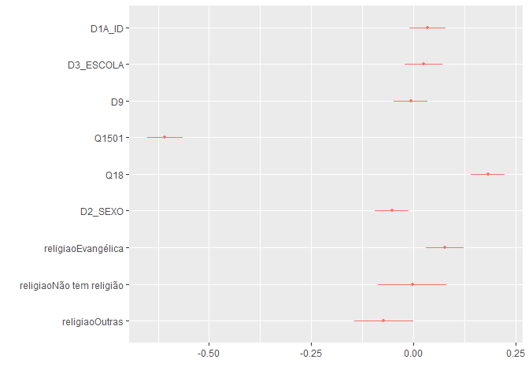
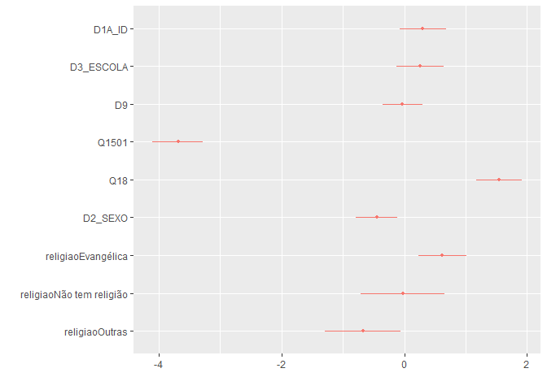

Exercicio 10
================

### Continuaremos com a utilização dos dados do ESEB2018. Carregue o banco da mesma forma que nos exercicios anteriores

``` r
library(tidyverse)
library(haven)
library(dotwhisker)
library(margins)
library(InformationValue)
library(pscl)

link <- "https://github.com/MartinsRodrigo/Analise-de-dados/blob/master/04622.sav?raw=true"

download.file(link, "04622.sav", mode = "wb")

banco <- read_spss("04622.sav") 

banco <- banco %>%
  mutate(D10 = as_factor(D10)) %>%
  filter(Q18 < 11,
         D9 < 9999998,
         Q1501 < 11,
         Q12P2_B < 3) %>%
  mutate(Q12P2_B = case_when(Q12P2_B == 1 ~ 0, 
                             Q12P2_B == 2 ~ 1))

#Quem votou em Haddad = 0
#Quem votou em Bolsonaro = 1
```

### Crie a mesma variável de religião utilizada no exercício anterior

``` r
Outras <- levels(banco$D10)[-c(3,5,13)]

banco <- banco %>%
  mutate(religiao = case_when(D10 %in% Outras ~ "Outras",
                              D10 == "Católica" ~ "Católica",
                              D10 == "Evangélica" ~ "Evangélica",
                              D10 == "Não tem religião" ~ "Não tem religião"))
```

### Faça uma regressão linear utilizando as mesmas variáveis do exercício 9 - idade(D1A\_ID), educação (D3\_ESCOLA), renda (D9), nota atribuída ao PT (Q1501), auto-atribuição ideológica (Q18), sexo (D2\_SEXO) e religião (variável criada no passo anterior) - explicam o voto em Bolsonaro (Q12P2\_B).

``` r
regressao <- lm(Q12P2_B ~ D1A_ID + D3_ESCOLA + D9 + Q1501 + Q18 + D2_SEXO + religiao, banco)
                    
summary(regressao)
```

    ## 
    ## Call:
    ## lm(formula = Q12P2_B ~ D1A_ID + D3_ESCOLA + D9 + Q1501 + Q18 + 
    ##     D2_SEXO + religiao, data = banco)
    ## 
    ## Residuals:
    ##      Min       1Q   Median       3Q      Max 
    ## -1.05532 -0.19854  0.01565  0.16182  0.96682 
    ## 
    ## Coefficients:
    ##                            Estimate Std. Error t value Pr(>|t|)    
    ## (Intercept)               7.067e-01  6.469e-02  10.924  < 2e-16 ***
    ## D1A_ID                    1.140e-03  7.539e-04   1.512  0.13074    
    ## D3_ESCOLA                 5.547e-03  5.226e-03   1.061  0.28873    
    ## D9                       -9.837e-07  3.196e-06  -0.308  0.75832    
    ## Q1501                    -7.728e-02  2.799e-03 -27.610  < 2e-16 ***
    ## Q18                       2.651e-02  3.093e-03   8.570  < 2e-16 ***
    ## D2_SEXO                  -5.286e-02  2.089e-02  -2.530  0.01154 *  
    ## religiaoEvangélica        7.684e-02  2.363e-02   3.251  0.00118 ** 
    ## religiaoNão tem religião -2.746e-03  4.238e-02  -0.065  0.94835    
    ## religiaoOutras           -7.263e-02  3.678e-02  -1.975  0.04855 *  
    ## ---
    ## Signif. codes:  0 '***' 0.001 '**' 0.01 '*' 0.05 '.' 0.1 ' ' 1
    ## 
    ## Residual standard error: 0.3489 on 1138 degrees of freedom
    ## Multiple R-squared:  0.5028, Adjusted R-squared:  0.4989 
    ## F-statistic: 127.9 on 9 and 1138 DF,  p-value: < 2.2e-16

``` r
confint(regressao)
```

    ##                                  2.5 %        97.5 %
    ## (Intercept)               5.797291e-01  8.335766e-01
    ## D1A_ID                   -3.390684e-04  2.619271e-03
    ## D3_ESCOLA                -4.706619e-03  1.579994e-02
    ## D9                       -7.254959e-06  5.287609e-06
    ## Q1501                    -8.277435e-02 -7.179045e-02
    ## Q18                       2.044034e-02  3.257857e-02
    ## D2_SEXO                  -9.385894e-02 -1.186744e-02
    ## religiaoEvangélica        3.046538e-02  1.232064e-01
    ## religiaoNão tem religião -8.589165e-02  8.039968e-02
    ## religiaoOutras           -1.447902e-01 -4.633807e-04

``` r
dwplot(regressao)
```

<!-- -->

### Interprete o resultado dos coeficientes

Em relação ao voto em Bolsonaro (Q12P2\_B), as variáveis que mostraram
ter um maior impacto são as de nota atribuída ao PT -Q1501- (magnitude
negativa, quanto maior a nota, menor o voto em Bolsonaro),
auto-atribuição ideológica (Q18), o sexo (D2\_SEXO) -vale a pena notar
que na regressão o gênero de referência ficou o feminino- e ser
evangélico (no caso, ser evangélico explicaria positivamente o voto em
Bolsonaro). Os R² tiveram um valor bastante aceitável (na faixa de 0.5),
sugerindo que há uma boa explicação do modelo ao voto em Bolsonaro.
Em relação ao gráfico do dwplot, vemos que as variáveis que cortam o 0 tem em seu intervalo de confiança esse valor.
Isso significa que interceptar o 0 no eixo X sugere que essas variáveis não tem relevância estatística. 

### O resultado difere dos encontrados anteriormente, quando a variavel dependente era a aprovação de Bolsonaro?

Houve uma mudança relativa entre a regressão com a aprovação de
Bolsonaro e a regressão com o voto em Bolsonaro. As variáveis Q1501,
Q18, D2\_SEXO tiveram significância em ambas as regressões. Entretanto,
a variável D3\_ESCOLA, que no modelo de avaliação a bolsonaro tinha
significância estatística, deixou de ter no modelo de explicação de voto
a Bolsonaro. A variável da religião Evangélica também deixou de ter
significância entre os modelos. Por fim, em relação aos R², o primeiro
modelo teve valores menores que o segundo modelo. Assim, teoricamente, o
modelo deste exercício explica melhor que o modelo do exercício passado.

### Faça uma regressão logistica com as mesmas variaveis

``` r
regressao_logistica <- glm(Q12P2_B ~ D1A_ID + D3_ESCOLA + D9 + Q1501 + Q18 + D2_SEXO + religiao, data = banco, family = "binomial")

summary(regressao_logistica)
```

    ## 
    ## Call:
    ## glm(formula = Q12P2_B ~ D1A_ID + D3_ESCOLA + D9 + Q1501 + Q18 + 
    ##     D2_SEXO + religiao, family = "binomial", data = banco)
    ## 
    ## Deviance Residuals: 
    ##     Min       1Q   Median       3Q      Max  
    ## -2.7529  -0.5625   0.2518   0.4744   2.5830  
    ## 
    ## Coefficients:
    ##                            Estimate Std. Error z value Pr(>|z|)    
    ## (Intercept)               8.209e-01  5.298e-01   1.550  0.12124    
    ## D1A_ID                    1.001e-02  6.337e-03   1.580  0.11405    
    ## D3_ESCOLA                 5.634e-02  4.358e-02   1.293  0.19602    
    ## D9                       -4.635e-06  2.396e-05  -0.193  0.84660    
    ## Q1501                    -4.678e-01  2.666e-02 -17.545  < 2e-16 ***
    ## Q18                       2.242e-01  2.748e-02   8.159 3.37e-16 ***
    ## D2_SEXO                  -4.497e-01  1.739e-01  -2.586  0.00971 ** 
    ## religiaoEvangélica        6.217e-01  1.985e-01   3.132  0.00173 ** 
    ## religiaoNão tem religião -2.106e-02  3.478e-01  -0.061  0.95172    
    ## religiaoOutras           -6.736e-01  3.122e-01  -2.158  0.03096 *  
    ## ---
    ## Signif. codes:  0 '***' 0.001 '**' 0.01 '*' 0.05 '.' 0.1 ' ' 1
    ## 
    ## (Dispersion parameter for binomial family taken to be 1)
    ## 
    ##     Null deviance: 1557.84  on 1147  degrees of freedom
    ## Residual deviance:  862.45  on 1138  degrees of freedom
    ## AIC: 882.45
    ## 
    ## Number of Fisher Scoring iterations: 5

``` r
confint(regressao_logistica)
```

    ##                                  2.5 %        97.5 %
    ## (Intercept)              -2.142372e-01  1.8651175312
    ## D1A_ID                   -2.356414e-03  0.0225104510
    ## D3_ESCOLA                -2.904377e-02  0.1419781422
    ## D9                       -5.246385e-05  0.0000439274
    ## Q1501                    -5.216537e-01 -0.4170089828
    ## Q18                       1.712127e-01  0.2790743125
    ## D2_SEXO                  -7.919817e-01 -0.1094958073
    ## religiaoEvangélica        2.343309e-01  1.0132294124
    ## religiaoNão tem religião -7.028094e-01  0.6619336806
    ## religiaoOutras           -1.287535e+00 -0.0625502790

``` r
dwplot(regressao_logistica)
```

<!-- -->

``` r
pR2(regressao_logistica)
```

    ## fitting null model for pseudo-r2

    ##          llh      llhNull           G2     McFadden         r2ML         r2CU 
    ## -431.2245843 -778.9190068  695.3888450    0.4463807    0.4543292    0.6118347

### Transforme os coeficientes estimados em probabilidade

``` r
margins(regressao_logistica)
```

    ##    D1A_ID D3_ESCOLA         D9    Q1501     Q18 D2_SEXO religiaoEvangélica
    ##  0.001171  0.006589 -5.421e-07 -0.05471 0.02622 -0.0526            0.07346
    ##  religiaoNão tem religião religiaoOutras
    ##                 -0.002521       -0.08172

``` r
summary(margins(regressao_logistica))
```

    ##                    factor     AME     SE        z      p   lower   upper
    ##                    D1A_ID  0.0012 0.0007   1.5849 0.1130 -0.0003  0.0026
    ##                   D2_SEXO -0.0526 0.0202  -2.6078 0.0091 -0.0921 -0.0131
    ##                 D3_ESCOLA  0.0066 0.0051   1.2949 0.1953 -0.0034  0.0166
    ##                        D9 -0.0000 0.0000  -0.1935 0.8466 -0.0000  0.0000
    ##                     Q1501 -0.0547 0.0009 -57.9079 0.0000 -0.0566 -0.0529
    ##                       Q18  0.0262 0.0030   8.8434 0.0000  0.0204  0.0320
    ##        religiaoEvangélica  0.0735 0.0235   3.1280 0.0018  0.0274  0.1195
    ##  religiaoNão tem religião -0.0025 0.0417  -0.0605 0.9517 -0.0842  0.0791
    ##            religiaoOutras -0.0817 0.0379  -2.1574 0.0310 -0.1560 -0.0075

### Quais foram as diferenças no resultado entre usar a regressão linear e a logistica?

Em relação a correlação das variáveis -Q1501, Q18, D2\_SEXO, Religião
Evangélica- e aos R² e ao pseudo R² os resultados foram bem similares,
mudou-se algum grau (ou magnitude) de correlação entre algumas
variáveis, mas não mudou o sinal dos coeficientes. Em relação a coluna AME, 
que traduz a razão de chance de um evento ocorrer, os coeficientes foram muito baixos. 
Diferente da Regressão Linear, na logística não podemos dizer que o aumento em 
uma unidade na escolaridade ocasionaria um efeito positivo (0.0066) no voto em Bolsonaro. 
A interpretação deve seguir da seguinte forma: o aumento de uma unidade na escolaridade,
aumenta em 0.0066 a chance de explicar o voto em Bolsonaro. Essa lógica deve ser aplicada 
para todas as outras variáveis. Por exemplo: o aumento de uma unidade na auto atribuição 
ideológica (Q18), aumentaria em 0.0262 (ou 2%) a chance de explicar o voto em Bolsonaro.
Em relação ao gênero, passar de um respondente masculino para um feminino diminui em 5.26% a probabilidade
desse respodente votar em Bolsonaro.
O valor McFadden que representa o pseudo R² foi muito similar ao R². Os intervalos de
confiança de todas as variáveis também foram muito similares (havendo
mudanças em sua magnitude, mas não em sua natureza). O SE (erro padrão) é uma medida de eficiência 
da estimativa. Quanto maior o erro, pior. A variável com o maior erro é a de Não ter religião.
Assim, as variáveis com o maior p-valor é a de Não ter religião e a da renda. Isso significa
que o pesquisador não pode rejeitar a hipótese nula de independência estatística entre Não ter religião
e o voto em Bolsonaro, tendo em vista que o erro padrão é relativamente alto. 
Por fim, a variável idade tem relação positiva e cada ano a mais de vida, a probabilidade de votarem Bolsonaro
é aumentada em 0.0012 (ou 12%).


### Verifique a quantidade de classificações corretas da regressao logistica e avalie o resultado

``` r
predicted_prob <- predict(regressao_logistica, type = "response")
predicted_prob
```

    ##           1           2           3           4           5           6 
    ## 0.951963330 0.955626830 0.925982161 0.959532118 0.979596623 0.112221847 
    ##           7           8           9          10          11          12 
    ## 0.926727395 0.959774927 0.937923687 0.711306560 0.855033185 0.956050512 
    ##          13          14          15          16          17          18 
    ## 0.926600100 0.969748465 0.483832952 0.930229495 0.926053039 0.942574098 
    ##          19          20          21          22          23          24 
    ## 0.975932558 0.911999574 0.241057089 0.873807804 0.050253490 0.950359311 
    ##          25          26          27          28          29          30 
    ## 0.569938061 0.695286488 0.657456041 0.795211247 0.671981756 0.022462831 
    ##          31          32          33          34          35          36 
    ## 0.030195360 0.964166292 0.143099314 0.802832203 0.931666731 0.221386444 
    ##          37          38          39          40          41          42 
    ## 0.859132244 0.101939155 0.203092640 0.718148899 0.811303157 0.047503042 
    ##          43          44          45          46          47          48 
    ## 0.513095149 0.351065383 0.980717948 0.862815591 0.824402353 0.972027568 
    ##          49          50          51          52          53          54 
    ## 0.969511187 0.855360476 0.027298138 0.106479745 0.315666093 0.875740644 
    ##          55          56          57          58          59          60 
    ## 0.944537985 0.016125461 0.131806603 0.179367613 0.113721830 0.361803946 
    ##          61          62          63          64          65          66 
    ## 0.156746513 0.206920297 0.941982755 0.070751174 0.493493718 0.027828181 
    ##          67          68          69          70          71          72 
    ## 0.792280264 0.231971828 0.915121717 0.965807567 0.447511656 0.601916984 
    ##          73          74          75          76          77          78 
    ## 0.362834965 0.938697512 0.211352090 0.886482162 0.785783653 0.284826848 
    ##          79          80          81          82          83          84 
    ## 0.288156755 0.792002170 0.962755775 0.080313132 0.913662638 0.926983142 
    ##          85          86          87          88          89          90 
    ## 0.042828830 0.235816972 0.974660842 0.049072459 0.439858365 0.126170740 
    ##          91          92          93          94          95          96 
    ## 0.897868085 0.951231440 0.966736131 0.330557928 0.966638583 0.260090639 
    ##          97          98          99         100         101         102 
    ## 0.204541841 0.956908644 0.113140761 0.978279587 0.958111122 0.925250354 
    ##         103         104         105         106         107         108 
    ## 0.930795677 0.899070417 0.922861187 0.976622286 0.883455281 0.962900911 
    ##         109         110         111         112         113         114 
    ## 0.422623487 0.857295374 0.871042179 0.970575466 0.802790361 0.147234282 
    ##         115         116         117         118         119         120 
    ## 0.025352320 0.220497742 0.129640398 0.087027068 0.830101034 0.097372287 
    ##         121         122         123         124         125         126 
    ## 0.735003228 0.120198760 0.019034257 0.896210088 0.023088377 0.165595493 
    ##         127         128         129         130         131         132 
    ## 0.197516949 0.126832522 0.150370626 0.026463015 0.060121948 0.692119211 
    ##         133         134         135         136         137         138 
    ## 0.123646912 0.756442067 0.024460155 0.451018546 0.977724715 0.021702784 
    ##         139         140         141         142         143         144 
    ## 0.438523363 0.020920718 0.843523214 0.149286623 0.056453056 0.125595037 
    ##         145         146         147         148         149         150 
    ## 0.124196909 0.206182881 0.204462509 0.203920792 0.028829864 0.527199830 
    ##         151         152         153         154         155         156 
    ## 0.180360910 0.722725883 0.902748827 0.633707393 0.952843402 0.361402836 
    ##         157         158         159         160         161         162 
    ## 0.091882288 0.593707743 0.355065890 0.084657889 0.209395987 0.279508580 
    ##         163         164         165         166         167         168 
    ## 0.708078266 0.829051932 0.925153886 0.087088589 0.209704256 0.096122446 
    ##         169         170         171         172         173         174 
    ## 0.299940294 0.024739519 0.145886911 0.127590902 0.698799294 0.954271965 
    ##         175         176         177         178         179         180 
    ## 0.097686380 0.120403797 0.980529525 0.061466692 0.604377754 0.501430432 
    ##         181         182         183         184         185         186 
    ## 0.939777007 0.660362196 0.939341017 0.960168076 0.519359717 0.874581503 
    ##         187         188         189         190         191         192 
    ## 0.976988863 0.016912109 0.129785130 0.014991709 0.701563962 0.853894255 
    ##         193         194         195         196         197         198 
    ## 0.102881844 0.845209636 0.488629782 0.888353708 0.612111197 0.015790162 
    ##         199         200         201         202         203         204 
    ## 0.018519682 0.970466625 0.087493619 0.018962349 0.335387435 0.009649322 
    ##         205         206         207         208         209         210 
    ## 0.549639954 0.900865166 0.578480889 0.966024235 0.174677695 0.941488503 
    ##         211         212         213         214         215         216 
    ## 0.693610503 0.030892229 0.114753101 0.672759365 0.968276053 0.156854201 
    ##         217         218         219         220         221         222 
    ## 0.757454653 0.495886155 0.966492980 0.092897702 0.966192157 0.013433972 
    ##         223         224         225         226         227         228 
    ## 0.277920262 0.512588533 0.079650714 0.415664192 0.395452783 0.888470424 
    ##         229         230         231         232         233         234 
    ## 0.345786718 0.188019663 0.153839259 0.543238963 0.124249055 0.903950728 
    ##         235         236         237         238         239         240 
    ## 0.598801996 0.189403555 0.969699810 0.171499008 0.884122096 0.978334935 
    ##         241         242         243         244         245         246 
    ## 0.341851266 0.044604231 0.974096520 0.892872457 0.366149875 0.464759924 
    ##         247         248         249         250         251         252 
    ## 0.070831892 0.026796269 0.127873750 0.867619921 0.382750809 0.283133184 
    ##         253         254         255         256         257         258 
    ## 0.690492887 0.381141344 0.200045796 0.261303645 0.542272930 0.735642233 
    ##         259         260         261         262         263         264 
    ## 0.881497805 0.167644958 0.366955929 0.940885241 0.943886250 0.886203180 
    ##         265         266         267         268         269         270 
    ## 0.137706971 0.554022947 0.030684334 0.126610874 0.212052351 0.341639456 
    ##         271         272         273         274         275         276 
    ## 0.912886264 0.965235993 0.958681121 0.937283807 0.121263727 0.179720728 
    ##         277         278         279         280         281         282 
    ## 0.012659187 0.809792206 0.042115854 0.980640125 0.122442521 0.342054912 
    ##         283         284         285         286         287         288 
    ## 0.948820645 0.309299122 0.244801620 0.363262936 0.008683464 0.365479011 
    ##         289         290         291         292         293         294 
    ## 0.932195288 0.162249541 0.019676769 0.101502597 0.155919779 0.804349443 
    ##         295         296         297         298         299         300 
    ## 0.013201657 0.919508962 0.026594504 0.067453142 0.098725633 0.329866117 
    ##         301         302         303         304         305         306 
    ## 0.931029389 0.174598560 0.019419024 0.107815976 0.192094072 0.843218178 
    ##         307         308         309         310         311         312 
    ## 0.580103834 0.056057902 0.186967632 0.372428130 0.968441071 0.222153113 
    ##         313         314         315         316         317         318 
    ## 0.749571592 0.412924797 0.623013027 0.266543539 0.177133783 0.029693920 
    ##         319         320         321         322         323         324 
    ## 0.134082650 0.202200250 0.627920652 0.946176625 0.910685660 0.163692624 
    ##         325         326         327         328         329         330 
    ## 0.299589247 0.447645620 0.680106219 0.113152213 0.182150191 0.091438730 
    ##         331         332         333         334         335         336 
    ## 0.286085756 0.190246078 0.958762834 0.418502070 0.918217476 0.248358761 
    ##         337         338         339         340         341         342 
    ## 0.686868823 0.758795992 0.215488973 0.161097728 0.230812867 0.023985151 
    ##         343         344         345         346         347         348 
    ## 0.043251751 0.702290159 0.136547023 0.976623304 0.629438027 0.944775299 
    ##         349         350         351         352         353         354 
    ## 0.926779968 0.359534929 0.042324859 0.904638339 0.030898648 0.155804535 
    ##         355         356         357         358         359         360 
    ## 0.478389209 0.164612628 0.979552821 0.246582850 0.611519548 0.162983110 
    ##         361         362         363         364         365         366 
    ## 0.666687708 0.785290100 0.731686624 0.080990966 0.954416002 0.916784805 
    ##         367         368         369         370         371         372 
    ## 0.683750063 0.964393135 0.035584570 0.945311517 0.182256821 0.503360666 
    ##         373         374         375         376         377         378 
    ## 0.282459013 0.401638435 0.155783717 0.910355698 0.162455497 0.211821769 
    ##         379         380         381         382         383         384 
    ## 0.167522274 0.896044435 0.146004338 0.112891783 0.937336163 0.126349200 
    ##         385         386         387         388         389         390 
    ## 0.193981324 0.162181314 0.192110034 0.270677827 0.270213240 0.951960053 
    ##         391         392         393         394         395         396 
    ## 0.784147726 0.087662683 0.041908365 0.951510305 0.756003861 0.966988581 
    ##         397         398         399         400         401         402 
    ## 0.340165072 0.157944216 0.323907090 0.063744899 0.468757090 0.058351565 
    ##         403         404         405         406         407         408 
    ## 0.941238216 0.329756686 0.932216899 0.038407239 0.972152307 0.496369911 
    ##         409         410         411         412         413         414 
    ## 0.042613039 0.501891362 0.158659607 0.238746368 0.133817206 0.251615048 
    ##         415         416         417         418         419         420 
    ## 0.924581446 0.063508740 0.893012034 0.218007911 0.597012912 0.171340531 
    ##         421         422         423         424         425         426 
    ## 0.986140840 0.092316002 0.617847911 0.047203910 0.568603476 0.150765638 
    ##         427         428         429         430         431         432 
    ## 0.967313540 0.304103832 0.125595037 0.957087248 0.948960566 0.089280367 
    ##         433         434         435         436         437         438 
    ## 0.977546312 0.769655144 0.621108509 0.104011271 0.878063685 0.677531645 
    ##         439         440         441         442         443         444 
    ## 0.041484866 0.962265786 0.264615354 0.747228092 0.965628849 0.268044042 
    ##         445         446         447         448         449         450 
    ## 0.329720765 0.145320219 0.169103912 0.155937330 0.032631762 0.359534093 
    ##         451         452         453         454         455         456 
    ## 0.220318870 0.646498358 0.948253832 0.778363070 0.952353223 0.558026255 
    ##         457         458         459         460         461         462 
    ## 0.942472163 0.327825486 0.940306008 0.851267532 0.153069053 0.102861958 
    ##         463         464         465         466         467         468 
    ## 0.018452975 0.389750658 0.914648157 0.651780260 0.626403676 0.974331643 
    ##         469         470         471         472         473         474 
    ## 0.806405240 0.547968416 0.936480854 0.910528511 0.810092507 0.609387717 
    ##         475         476         477         478         479         480 
    ## 0.225733936 0.944571857 0.025341056 0.222043822 0.980625396 0.214798244 
    ##         481         482         483         484         485         486 
    ## 0.697644962 0.959926218 0.908103441 0.955667834 0.928303570 0.084274175 
    ##         487         488         489         490         491         492 
    ## 0.917339090 0.044773127 0.967078268 0.437195397 0.100844786 0.069606436 
    ##         493         494         495         496         497         498 
    ## 0.082535895 0.181634887 0.894038532 0.885040904 0.932390383 0.735606391 
    ##         499         500         501         502         503         504 
    ## 0.968972813 0.974295401 0.911202455 0.505343114 0.965745975 0.925109909 
    ##         505         506         507         508         509         510 
    ## 0.096365992 0.981038580 0.958115546 0.249129105 0.924007732 0.977389155 
    ##         511         512         513         514         515         516 
    ## 0.692893830 0.748240828 0.972461315 0.295078071 0.263865661 0.982116927 
    ##         517         518         519         520         521         522 
    ## 0.980106720 0.374335748 0.978021087 0.806186131 0.584341796 0.769560009 
    ##         523         524         525         526         527         528 
    ## 0.654215586 0.562669476 0.308144969 0.277143467 0.061900873 0.166094452 
    ##         529         530         531         532         533         534 
    ## 0.918340442 0.902237134 0.166265143 0.965611072 0.104409589 0.029547312 
    ##         535         536         537         538         539         540 
    ## 0.924126699 0.930248767 0.256717049 0.923700645 0.561115593 0.919554852 
    ##         541         542         543         544         545         546 
    ## 0.154963202 0.883124513 0.144471604 0.035403293 0.897460289 0.921200877 
    ##         547         548         549         550         551         552 
    ## 0.962066591 0.114988180 0.947677682 0.960503810 0.030098139 0.977083192 
    ##         553         554         555         556         557         558 
    ## 0.255480855 0.950970926 0.558878680 0.133319254 0.760007857 0.632487598 
    ##         559         560         561         562         563         564 
    ## 0.618102988 0.966248038 0.959994531 0.956998970 0.171156196 0.949956943 
    ##         565         566         567         568         569         570 
    ## 0.059654959 0.944503638 0.964884336 0.094272071 0.751693511 0.207900616 
    ##         571         572         573         574         575         576 
    ## 0.202389808 0.624193863 0.278514209 0.144444437 0.942462166 0.643133533 
    ##         577         578         579         580         581         582 
    ## 0.158505568 0.830139355 0.465303371 0.588571854 0.290785320 0.941315275 
    ##         583         584         585         586         587         588 
    ## 0.134020397 0.386801953 0.971326506 0.305432562 0.285468936 0.730474091 
    ##         589         590         591         592         593         594 
    ## 0.154028373 0.969089126 0.946715263 0.844700436 0.769467750 0.896676093 
    ##         595         596         597         598         599         600 
    ## 0.908131408 0.971591285 0.921216004 0.136795458 0.920710028 0.086096751 
    ##         601         602         603         604         605         606 
    ## 0.585770837 0.845557473 0.960696734 0.975044028 0.954609017 0.938821225 
    ##         607         608         609         610         611         612 
    ## 0.933616115 0.895729983 0.967410253 0.943255730 0.960811862 0.968916100 
    ##         613         614         615         616         617         618 
    ## 0.939571514 0.953743044 0.142887101 0.868539037 0.790085294 0.755065877 
    ##         619         620         621         622         623         624 
    ## 0.200976860 0.958439178 0.119355649 0.135281078 0.857534825 0.977882397 
    ##         625         626         627         628         629         630 
    ## 0.282608697 0.980596077 0.945348204 0.971323394 0.707621595 0.978641479 
    ##         631         632         633         634         635         636 
    ## 0.793624819 0.970339687 0.794985306 0.936875815 0.214805628 0.962688520 
    ##         637         638         639         640         641         642 
    ## 0.939443524 0.320441072 0.986687513 0.700877606 0.471737573 0.954696259 
    ##         643         644         645         646         647         648 
    ## 0.971022922 0.981554698 0.947882548 0.900965499 0.969674133 0.823812282 
    ##         649         650         651         652         653         654 
    ## 0.589981628 0.521591054 0.797024042 0.978915528 0.984184748 0.944410576 
    ##         655         656         657         658         659         660 
    ## 0.118603326 0.956926150 0.964216510 0.974978982 0.035583311 0.010904840 
    ##         661         662         663         664         665         666 
    ## 0.932291662 0.704285113 0.736775239 0.965800130 0.863310490 0.161556024 
    ##         667         668         669         670         671         672 
    ## 0.278057379 0.951046214 0.972773137 0.967159896 0.899845036 0.964787796 
    ##         673         674         675         676         677         678 
    ## 0.113387263 0.971655185 0.074706182 0.971453103 0.157577711 0.663371024 
    ##         679         680         681         682         683         684 
    ## 0.969769333 0.866690999 0.006678847 0.975806137 0.489469331 0.065587669 
    ##         685         686         687         688         689         690 
    ## 0.985797912 0.256820181 0.388474648 0.781589890 0.871334603 0.929962224 
    ##         691         692         693         694         695         696 
    ## 0.846950670 0.262875229 0.023169251 0.973887390 0.973379671 0.858945799 
    ##         697         698         699         700         701         702 
    ## 0.863732008 0.978600003 0.956955453 0.943580985 0.971767646 0.473650603 
    ##         703         704         705         706         707         708 
    ## 0.947514901 0.667871877 0.959363142 0.928092732 0.984361280 0.129639592 
    ##         709         710         711         712         713         714 
    ## 0.980609000 0.963139066 0.262293153 0.126891243 0.027608305 0.920803744 
    ##         715         716         717         718         719         720 
    ## 0.618857176 0.081321010 0.047296222 0.014806889 0.195334648 0.904113038 
    ##         721         722         723         724         725         726 
    ## 0.894014040 0.426895857 0.624702453 0.608670317 0.692176902 0.095945718 
    ##         727         728         729         730         731         732 
    ## 0.828375594 0.081273254 0.707859727 0.111020692 0.980151857 0.906655031 
    ##         733         734         735         736         737         738 
    ## 0.051294295 0.310541045 0.118021155 0.067519968 0.536575080 0.939966588 
    ##         739         740         741         742         743         744 
    ## 0.866427762 0.893676076 0.981654128 0.968688525 0.066143181 0.717234835 
    ##         745         746         747         748         749         750 
    ## 0.927339997 0.766595445 0.018070473 0.027157617 0.920244735 0.924486761 
    ##         751         752         753         754         755         756 
    ## 0.337183755 0.511456511 0.965903195 0.386732008 0.078081551 0.590665793 
    ##         757         758         759         760         761         762 
    ## 0.728519845 0.978408880 0.953108319 0.301314978 0.967972762 0.766659260 
    ##         763         764         765         766         767         768 
    ## 0.366046451 0.880336884 0.320765782 0.902730107 0.916402978 0.494178237 
    ##         769         770         771         772         773         774 
    ## 0.983004785 0.164235871 0.227977460 0.966172322 0.970837038 0.953936301 
    ##         775         776         777         778         779         780 
    ## 0.981147148 0.937238248 0.737700728 0.111210687 0.840554122 0.310494443 
    ##         781         782         783         784         785         786 
    ## 0.952043201 0.855691170 0.977791282 0.940120888 0.025643487 0.964978459 
    ##         787         788         789         790         791         792 
    ## 0.925808974 0.932036112 0.963816270 0.958013571 0.119700306 0.788016916 
    ##         793         794         795         796         797         798 
    ## 0.510855468 0.779323060 0.931314291 0.907300292 0.956834774 0.632955917 
    ##         799         800         801         802         803         804 
    ## 0.014152208 0.180815882 0.040787224 0.948948559 0.768883974 0.942659138 
    ##         805         806         807         808         809         810 
    ## 0.658933489 0.269528119 0.665874465 0.893263053 0.962554068 0.803571671 
    ##         811         812         813         814         815         816 
    ## 0.965820920 0.679553710 0.228323648 0.801601594 0.756169179 0.979376185 
    ##         817         818         819         820         821         822 
    ## 0.545366091 0.191229245 0.230794271 0.278657876 0.933330726 0.684000412 
    ##         823         824         825         826         827         828 
    ## 0.976773678 0.923815518 0.959848172 0.952891681 0.879131444 0.855260335 
    ##         829         830         831         832         833         834 
    ## 0.769899692 0.934189769 0.214397524 0.942259003 0.872016171 0.944653757 
    ##         835         836         837         838         839         840 
    ## 0.861722775 0.976343619 0.983733581 0.905245157 0.856527286 0.175672175 
    ##         841         842         843         844         845         846 
    ## 0.587121081 0.217173135 0.438777054 0.829534049 0.980074125 0.664679331 
    ##         847         848         849         850         851         852 
    ## 0.907843699 0.969339034 0.602247203 0.019630882 0.966675462 0.923487545 
    ##         853         854         855         856         857         858 
    ## 0.893032674 0.954713051 0.914311682 0.211301245 0.936338941 0.327151348 
    ##         859         860         861         862         863         864 
    ## 0.581995737 0.964101050 0.509439351 0.742255848 0.614737804 0.913084070 
    ##         865         866         867         868         869         870 
    ## 0.008736041 0.807649827 0.763822915 0.935126083 0.966367484 0.041649638 
    ##         871         872         873         874         875         876 
    ## 0.922001537 0.975874055 0.855897552 0.900880444 0.954950931 0.889601442 
    ##         877         878         879         880         881         882 
    ## 0.940181618 0.461283172 0.912605177 0.876779382 0.763956140 0.915976672 
    ##         883         884         885         886         887         888 
    ## 0.971008265 0.361677936 0.465294009 0.685700511 0.807045029 0.950654777 
    ##         889         890         891         892         893         894 
    ## 0.975437292 0.973459480 0.967428193 0.746420398 0.978856726 0.134504039 
    ##         895         896         897         898         899         900 
    ## 0.856494558 0.288402414 0.391272416 0.964945246 0.954067446 0.069568342 
    ##         901         902         903         904         905         906 
    ## 0.041956867 0.941509690 0.729856405 0.024405316 0.284948749 0.843656617 
    ##         907         908         909         910         911         912 
    ## 0.961656176 0.886470600 0.234502847 0.936283118 0.254500025 0.971581245 
    ##         913         914         915         916         917         918 
    ## 0.973428466 0.620090703 0.012739992 0.479391052 0.941611685 0.947236431 
    ##         919         920         921         922         923         924 
    ## 0.955086259 0.310617327 0.964078597 0.963203669 0.944594493 0.970397422 
    ##         925         926         927         928         929         930 
    ## 0.942394611 0.832344806 0.905874451 0.359072080 0.905231734 0.972122415 
    ##         931         932         933         934         935         936 
    ## 0.757844287 0.948769466 0.887255465 0.612814688 0.944356447 0.965414970 
    ##         937         938         939         940         941         942 
    ## 0.825656641 0.966040501 0.823199391 0.822999283 0.682366442 0.961621979 
    ##         943         944         945         946         947         948 
    ## 0.739155416 0.018024139 0.135344136 0.979348739 0.966056774 0.948906871 
    ##         949         950         951         952         953         954 
    ## 0.931145943 0.973937756 0.892749115 0.970612410 0.968431301 0.942691445 
    ##         955         956         957         958         959         960 
    ## 0.090554000 0.908585049 0.936213623 0.932717893 0.744581482 0.232244171 
    ##         961         962         963         964         965         966 
    ## 0.752016259 0.029004584 0.026367479 0.174510781 0.348664017 0.553389241 
    ##         967         968         969         970         971         972 
    ## 0.948626843 0.893274402 0.538154019 0.966952215 0.164636287 0.391414695 
    ##         973         974         975         976         977         978 
    ## 0.601781494 0.094667332 0.919861008 0.258269026 0.967147230 0.383097604 
    ##         979         980         981         982         983         984 
    ## 0.927874440 0.023638145 0.109163932 0.412252085 0.487078460 0.627257803 
    ##         985         986         987         988         989         990 
    ## 0.109395454 0.299769073 0.692680092 0.971651012 0.865097159 0.374697326 
    ##         991         992         993         994         995         996 
    ## 0.463151633 0.947841537 0.040309255 0.961218967 0.285941903 0.963378623 
    ##         997         998         999        1000        1001        1002 
    ## 0.923527217 0.424007149 0.819790881 0.889809427 0.858158910 0.795647093 
    ##        1003        1004        1005        1006        1007        1008 
    ## 0.666158486 0.239430654 0.202911251 0.034397717 0.710922696 0.961267954 
    ##        1009        1010        1011        1012        1013        1014 
    ## 0.103600610 0.982090797 0.039654993 0.817811826 0.278895568 0.949632965 
    ##        1015        1016        1017        1018        1019        1020 
    ## 0.958519845 0.346789049 0.954211555 0.280927388 0.815662873 0.933472334 
    ##        1021        1022        1023        1024        1025        1026 
    ## 0.963318448 0.950652356 0.906254134 0.937396691 0.961101680 0.771980078 
    ##        1027        1028        1029        1030        1031        1032 
    ## 0.958486208 0.830179594 0.074691137 0.510114325 0.761068186 0.800967770 
    ##        1033        1034        1035        1036        1037        1038 
    ## 0.883489801 0.211899088 0.820220542 0.105743340 0.036753327 0.457733231 
    ##        1039        1040        1041        1042        1043        1044 
    ## 0.939958750 0.137818827 0.332048317 0.905750453 0.064266925 0.935301145 
    ##        1045        1046        1047        1048        1049        1050 
    ## 0.025639833 0.942937403 0.185444011 0.567927197 0.147856060 0.277340102 
    ##        1051        1052        1053        1054        1055        1056 
    ## 0.465238766 0.366665627 0.310316650 0.245164494 0.760601557 0.283328488 
    ##        1057        1058        1059        1060        1061        1062 
    ## 0.979739123 0.090588220 0.531571675 0.143505990 0.980590752 0.966184368 
    ##        1063        1064        1065        1066        1067        1068 
    ## 0.928239836 0.007271683 0.967066851 0.954895383 0.982703251 0.673328495 
    ##        1069        1070        1071        1072        1073        1074 
    ## 0.970545569 0.965104644 0.475647628 0.102372380 0.912047661 0.961889760 
    ##        1075        1076        1077        1078        1079        1080 
    ## 0.914562275 0.380114316 0.214457320 0.961362153 0.925169101 0.395489457 
    ##        1081        1082        1083        1084        1085        1086 
    ## 0.359103757 0.160567853 0.946986212 0.057404353 0.219358054 0.852158663 
    ##        1087        1088        1089        1090        1091        1092 
    ## 0.947158833 0.789283708 0.495781029 0.932134452 0.928303631 0.755222045 
    ##        1093        1094        1095        1096        1097        1098 
    ## 0.542239132 0.859146911 0.897728859 0.900760042 0.789263842 0.240784229 
    ##        1099        1100        1101        1102        1103        1104 
    ## 0.816165977 0.905045703 0.934204578 0.947025197 0.923135335 0.833509049 
    ##        1105        1106        1107        1108        1109        1110 
    ## 0.941169882 0.007478490 0.956200111 0.473808733 0.697113997 0.326890269 
    ##        1111        1112        1113        1114        1115        1116 
    ## 0.165257203 0.817130721 0.745756785 0.656838961 0.933806028 0.512372513 
    ##        1117        1118        1119        1120        1121        1122 
    ## 0.171277665 0.974830893 0.555087880 0.052849980 0.453305163 0.070947750 
    ##        1123        1124        1125        1126        1127        1128 
    ## 0.017458405 0.144419911 0.325125229 0.598444694 0.233140391 0.270734791 
    ##        1129        1130        1131        1132        1133        1134 
    ## 0.841160527 0.980037255 0.518024999 0.279542090 0.153701073 0.831818007 
    ##        1135        1136        1137        1138        1139        1140 
    ## 0.632799406 0.971125472 0.945866623 0.979229590 0.216022569 0.745071823 
    ##        1141        1142        1143        1144        1145        1146 
    ## 0.955425713 0.965315847 0.280324959 0.978791484 0.183895412 0.782553844 
    ##        1147        1148 
    ## 0.239608529 0.091988066

``` r
1 - misClassError(banco$Q12P2_B, 
                  predicted_prob,
                  threshold = 0.5566875)
```

    ## [1] 0.8362

``` r
opt_cutoff <- optimalCutoff(banco$Q12P2_B, predicted_prob)

confusionMatrix(banco$Q12P2_B, 
              predicted_prob, 
              threshold = opt_cutoff)
```

    ##     0   1
    ## 0 393 105
    ## 1  83 567

``` r
prop.table(confusionMatrix(banco$Q12P2_B, 
                predicted_prob, 
                threshold = opt_cutoff))
```

    ##            0          1
    ## 0 0.34233449 0.09146341
    ## 1 0.07229965 0.49390244

Essa saída das classificações corretas é particularmente interessante,
pois fornece uma medida de o quão bem o modelo é capaz de predizer
corretamente a ocorrência do evento de interesse, no caso, o voto em
Bolsonaro. Dito de outra forma, é uma medida de acurácia preditiva do
modelo. Quanto maior a diferença entre a taxa geral de acerto do modelo
ajustado em relação ao modelo nulo, maior é a contribuição grupal das
variáveis independentes para classificar corretamente a ocorrência dos
casos da variável dependente. 
Pelo comando misClassError, temos que 83% das classificações estão corretas. 
Pelo comando optimalCutoff, temos que o valor ideal para maximizar as 
classificações corretas no threshold é de 0.5566875 (por isso alteramos o seu valor). 
O modelo acerta em 49% dos casos (quando previa que era positivo e acertou) 
e acerta em 34% dos casos (quando previa que era negativo e acertou), totalizando 83%. 
Dessa forma, a diferença entre o modelo estimado e o modelo nulo é bastante grande 
(a diferença do patamar mínimo de 25% sugerido pela literatura).
