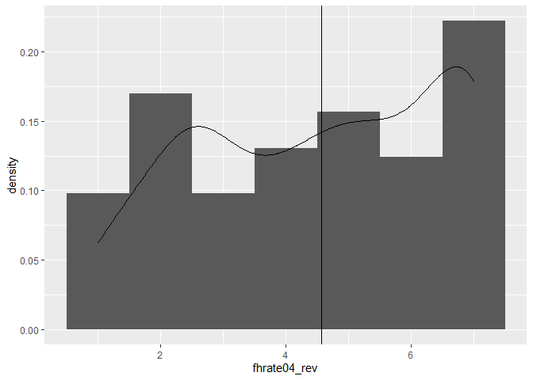
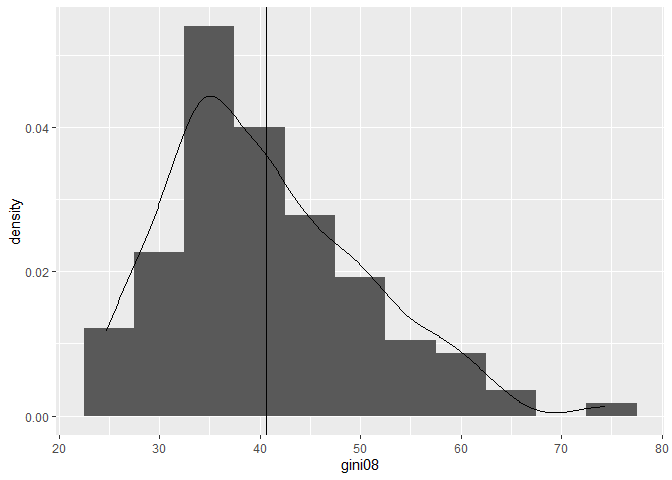
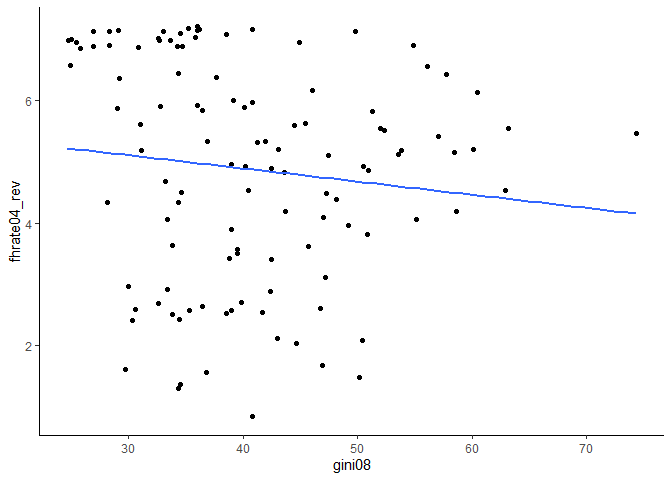
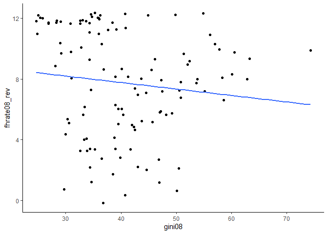
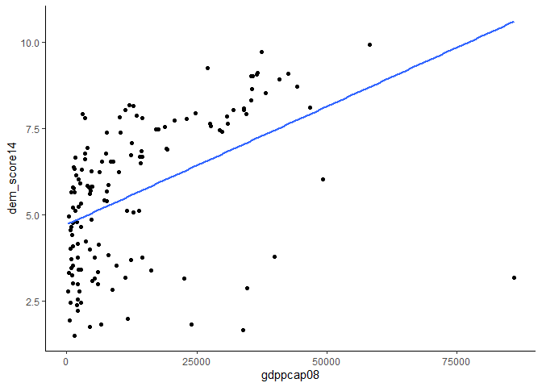

Exercicio 5
================
Pedro Buril

# Exercício 5

## Markdown

### Carregue o banco de dados `world` que está no pacote `poliscidata`.

``` r
library(poliscidata)
library(tidyverse)
```

    ## -- Attaching packages --------------------------------------------------------------------------------- tidyverse 1.3.0 --

    ## v ggplot2 3.3.2     v purrr   0.3.4
    ## v tibble  3.0.1     v dplyr   1.0.0
    ## v tidyr   1.1.0     v stringr 1.4.0
    ## v readr   1.3.1     v forcats 0.5.0

    ## -- Conflicts ------------------------------------------------------------------------------------ tidyverse_conflicts() --
    ## x dplyr::filter() masks stats::filter()
    ## x dplyr::lag()    masks stats::lag()

``` r
banco <- world
```

### Existem diversas medidas de democracia para os países: `dem_score14`, `democ11`, `fhrate04_rev`, `fhrate08_rev`, `polity`. Descreva-as graficamente e diga quais são as diferenças entre tais medidas.

``` r
  banco_selecionado <- banco %>%
  transmute(dem_score14, democ11, fhrate04_rev, fhrate08_rev, polity) 
 
 glimpse(banco_selecionado)
```

    ## Rows: 167
    ## Columns: 5
    ## $ dem_score14  <dbl> 2.77, 5.67, 3.83, 3.35, 6.84, 4.13, 9.01, 8.54, 2.83, ...
    ## $ democ11      <dbl> NA, 9, 3, 2, 8, 5, 10, 10, 0, 0, 6, 0, 8, 7, 3, 7, NA,...
    ## $ fhrate04_rev <dbl> 2.5, 5.0, 2.5, 2.5, 6.0, 3.5, 7.0, 7.0, 2.5, 3.0, 4.0,...
    ## $ fhrate08_rev <dbl> 3, 8, 3, 3, 10, 4, 12, 12, 3, 4, 6, 1, 12, 10, 5, 8, 7...
    ## $ polity       <dbl> NA, 9, 2, -2, 8, 5, 10, 10, -7, -8, 5, -7, 8, 7, 3, 7,...

``` r
 ggplot(banco_selecionado, aes(dem_score14)) +
geom_histogram(aes(y=..density..),
               binwidth=1) + 
   geom_density() + 
   geom_vline(aes(xintercept = mean(dem_score14, na.rm = T)))
```

<!-- -->

``` r
ggplot(banco, aes(democ11)) +
  geom_bar(na.rm = T) 
```

<!-- -->

``` r
ggplot(banco, aes(fhrate04_rev)) +
  geom_histogram(aes(y=..density..),
                 binwidth=1) +
  geom_density() + 
  geom_vline(aes(xintercept = mean(fhrate04_rev, na.rm = T)))
```

    ## Warning: Removed 14 rows containing non-finite values (stat_bin).

    ## Warning: Removed 14 rows containing non-finite values (stat_density).

<!-- -->

``` r
ggplot(banco, aes(x = "", y = fhrate08_rev)) +
  geom_violin(draw_quantiles = c(0.25, 0.5, 0.75))
```

    ## Warning: Removed 15 rows containing non-finite values (stat_ydensity).

<!-- -->

``` r
ggplot(banco, aes(polity)) +
  geom_histogram(binwidth = 1)
```

    ## Warning: Removed 23 rows containing non-finite values (stat_bin).

<!-- -->

``` r
## Todas essas variáveis medem os diferentes graus de democracia. Dentre essas variáveis, os valores podem assumir valores negativos (polity, por exemplo), positivos ou decimais (dem_score14, fhrate04_rev). Há variáveis que são discretas e contínuas. Na prática, isso representaria um país mais ou menos democrático. Para as variáveis que assumem valores negativos (polity), um valor negativo seria um país não-democrático. 
## Uma coisa que me chamou a atenção é a semelhança em como os dados estão distribuídos nessas variáveis. Percebemos que muitos casos dessas variáveis se concentram no extremo positivo para a democracia (democ11, fhrate04_rev, fhrate08_rev, polity, por exemplo) 
```

### Avalie a relação entre todas as medidas de democracia e desigualdade, utilizando a variável `gini08`. Descreva graficamente esta variável, a relação entre as duas variáveis, meça a correlação entre elas e faça regressões lineares (interpretando em profundidade os resultados dos coeficientes e medidas de desempenho dos modelos). Enfatize as semelhanças e diferenças entre os resultados. Quais são suas conclusões?

    ## Rows: 167
    ## Columns: 103
    ## $ country             <fct> Afghanistan, Albania, Algeria, Angola, Argentin...
    ## $ gini10              <dbl> 29.4, 33.0, 35.3, 58.6, 48.8, 30.2, 35.2, 29.1,...
    ## $ dem_level4          <fct> Authoritarian, Hybrid, Authoritarian, Authorita...
    ## $ dem_rank14          <dbl> 151, 88, 117, 133, 52, 113, 9, 14, 148, 147, 85...
    ## $ dem_score14         <dbl> 2.77, 5.67, 3.83, 3.35, 6.84, 4.13, 9.01, 8.54,...
    ## $ lifeex_f            <dbl> 45.25, 80.30, 76.31, 39.83, 80.36, 77.31, 84.35...
    ## $ lifeex_m            <dbl> 44.79, 74.82, 72.78, 37.74, 73.71, 69.59, 79.40...
    ## $ literacy            <dbl> 28.1, NA, 69.9, 67.4, 97.2, 99.4, 99.0, 98.0, 9...
    ## $ oil                 <dbl> 0, 5400, 2125000, 1948000, 796300, 0, 589200, 2...
    ## $ pop_0_14            <dbl> 42.3, 21.4, 24.2, 43.2, 25.4, 17.6, 18.3, 14.0,...
    ## $ pop_15_64           <dbl> 55.3, 68.1, 70.6, 54.1, 63.6, 72.4, 67.7, 67.7,...
    ## $ pop_65_older        <dbl> 2.4, 10.5, 5.2, 2.7, 11.0, 10.1, 14.0, 18.2, 6....
    ## $ fertility           <dbl> 5.39, 1.48, 1.75, 5.97, 2.31, 1.37, 1.78, 1.40,...
    ## $ govregrel           <dbl> 10.000, 0.000, 8.611, 0.556, 0.000, 6.944, 0.00...
    ## $ regionun            <fct> Asia, Europe, Africa, Africa, Latin America/Car...
    ## $ religoin            <fct> Muslim, Muslim, Muslim, Catholic, Catholic, Ort...
    ## $ spendeduc           <dbl> NA, 2.9, 4.3, 2.6, 4.9, 3.0, 4.7, 5.4, 1.9, 2.9...
    ## $ spendhealth         <dbl> 1.8, 2.9, 3.6, 2.0, 5.1, 2.1, 6.0, 7.7, 1.0, 2....
    ## $ spendmil            <dbl> 1.9, 2.0, 3.0, 3.0, 0.8, 3.3, 1.8, 0.9, 3.8, 3....
    ## $ hdi                 <dbl> 0.349, 0.719, 0.677, 0.403, 0.775, 0.695, 0.937...
    ## $ pop_age             <dbl> 16.9, 30.0, 26.2, 17.4, 30.4, 32.0, 37.8, 41.8,...
    ## $ sexratio            <dbl> 106.0, 107.0, 104.6, 99.9, 103.6, 116.5, 105.3,...
    ## $ pop_total           <dbl> 29.1, 3.2, 35.4, 19.0, 40.7, 3.1, 21.5, 8.4, 8....
    ## $ pop_urban           <dbl> 22.6, 51.9, 66.5, 58.5, 92.4, 64.2, 89.1, 67.6,...
    ## $ gender_unequal      <dbl> 0.797, 0.545, 0.594, NA, 0.534, 0.570, 0.296, 0...
    ## $ gender_unequal_rank <dbl> 134, 61, 70, NA, 60, 66, 18, 19, 62, 55, 116, N...
    ## $ arda                <dbl> 1, 3, 4, 7, 11, 12, 14, 15, 16, 18, 19, 21, 22,...
    ## $ lifeex_total        <dbl> 45.02, 77.41, 74.50, 38.76, 76.95, 73.23, 81.81...
    ## $ debt                <dbl> NA, 59.3, 25.7, 20.3, 50.3, NA, 22.4, 70.4, 4.6...
    ## $ colony              <fct> UK, Soviet Union, France, Portugal, Spain, Sovi...
    ## $ confidence          <dbl> NA, 49.335926, 52.055735, NA, 7.299325, 27.1327...
    ## $ decent08            <fct> No local elections, Legislature and executive a...
    ## $ dem_other           <dbl> 10.5, 63.0, 40.8, 40.8, 87.5, 63.0, 58.3, 100.0...
    ## $ dem_other5          <fct> 10%, Approx 60%, Approx 40%, Approx 40%, Approx...
    ## $ democ               <fct> No, Yes, No, No, Yes, Yes, Yes, Yes, No, No, No...
    ## $ democ11             <dbl> NA, 9, 3, 2, 8, 5, 10, 10, 0, 0, 6, 0, 8, 7, 3,...
    ## $ democ_regime        <fct> No, Yes, No, No, Yes, Yes, Yes, Yes, No, No, Ye...
    ## $ democ_regime08      <fct> No, Yes, No, No, Yes, Yes, Yes, Yes, No, No, No...
    ## $ district_size3      <fct> single member, NA, 6 or more members, NA, 6 or ...
    ## $ durable             <dbl> 4, 3, 5, 3, 17, 2, 99, 54, 5, 25, 9, 4, 55, 9, ...
    ## $ effectiveness       <dbl> 13.71158, 35.46099, 32.62411, 19.14894, 34.9881...
    ## $ enpp3_democ         <fct> NA, 1-3 parties, NA, NA, 1-3 parties, 6-11 part...
    ## $ enpp3_democ08       <fct> NA, 1-3 parties, NA, NA, 1-3 parties, 6-11 part...
    ## $ dnpp_3              <dbl> NA, 1, 3, 1, 1, 3, 1, 2, 1, NA, 1, NA, 3, 3, NA...
    ## $ eu                  <fct> Not member, Not member, Not member, Not member,...
    ## $ fhrate04_rev        <dbl> 2.5, 5.0, 2.5, 2.5, 6.0, 3.5, 7.0, 7.0, 2.5, 3....
    ## $ fhrate08_rev        <dbl> 3, 8, 3, 3, 10, 4, 12, 12, 3, 4, 6, 1, 12, 10, ...
    ## $ frac_eth            <dbl> 0.7693, 0.2204, 0.3394, 0.7867, 0.2550, 0.1272,...
    ## $ frac_eth2           <fct> High, Low, Low, High, Low, Low, Low, Low, Low, ...
    ## $ frac_eth3           <fct> High, Low, Medium, High, Low, Low, Low, Low, Lo...
    ## $ free_business       <dbl> NA, 68.0, 71.2, 43.4, 62.1, 83.4, 90.3, 73.6, 7...
    ## $ free_corrupt        <dbl> NA, 34, 32, 19, 29, 29, 87, 81, 19, 54, 21, 20,...
    ## $ free_finance        <dbl> NA, 70, 30, 40, 30, 70, 90, 70, 40, 80, 20, 10,...
    ## $ free_fiscal         <dbl> NA, 92.6, 83.5, 85.1, 69.5, 89.3, 61.4, 51.2, 7...
    ## $ free_govspend       <dbl> NA, 74.2, 73.4, 62.8, 75.6, 90.9, 64.9, 28.8, 7...
    ## $ free_invest         <dbl> NA, 70, 45, 35, 45, 75, 80, 75, 55, 65, 45, 20,...
    ## $ free_labor          <dbl> NA, 52.1, 56.4, 45.2, 50.1, 70.6, 94.9, 79.1, 8...
    ## $ free_monetary       <dbl> NA, 78.7, 77.2, 62.6, 61.2, 72.9, 82.7, 79.3, 6...
    ## $ free_property       <dbl> NA, 35, 30, 20, 20, 30, 90, 90, 20, 60, 20, 20,...
    ## $ free_trade          <dbl> NA, 85.8, 70.7, 70.4, 69.5, 80.5, 85.1, 87.5, 7...
    ## $ free_overall        <dbl> NA, 66.0, 56.9, 48.4, 51.2, 69.2, 82.6, 71.6, 5...
    ## $ free_overall_4      <fct> NA, MidHi, MidLow, Low, Low, High, High, High, ...
    ## $ gdp08               <dbl> 30.6, 24.3, 276.0, 106.3, 571.5, 18.7, 762.6, 3...
    ## $ gdp_10_thou         <dbl> NA, 0.1535, 0.1785, 0.0857, 0.2797, 0.0771, 2.0...
    ## $ gdp_cap2            <fct> NA, Low, Low, Low, High, Low, High, High, Low, ...
    ## $ gdp_cap3            <fct> NA, Middle, Middle, Middle, Middle, Low, High, ...
    ## $ gdpcap2_08          <fct> Low, Low, High, High, High, Low, High, High, Hi...
    ## $ gdpcap3_08          <fct> Low, Mid, Mid, Mid, High, Mid, High, High, Mid,...
    ## $ gdpcap08_2          <fct> Low, Low, High, High, High, Low, High, High, Hi...
    ## $ gdppcap08           <dbl> NA, 7715, 8033, 5899, 14333, 6070, 35677, 38152...
    ## $ gdppcap08_3         <dbl> NA, 2, 2, 2, 3, 2, 3, 3, 2, 3, 1, 2, 3, 1, 2, 2...
    ## $ gender_equal3       <fct> NA, NA, NA, NA, High, NA, High, High, NA, Low, ...
    ## $ gini04              <dbl> NA, 28.2, 35.3, NA, 52.2, 37.9, 35.2, 30.0, 36....
    ## $ gini08              <dbl> NA, 31.1, 35.3, NA, 51.3, 33.8, 35.2, 29.1, 36....
    ## $ hi_gdp              <fct> NA, Low GDP, Low GDP, Low GDP, High GDP, Low GD...
    ## $ indy                <dbl> 1919, 1991, 1962, 1975, 1816, 1991, 1901, 1156,...
    ## $ muslim              <fct> Yes, Yes, Yes, No, No, No, No, No, Yes, Yes, Ye...
    ## $ natcode             <fct> afghanistan, albania, algeria, angola, argentin...
    ## $ oecd                <fct> Not member, Not member, Not member, Not member,...
    ## $ pmat12_3            <fct> NA, Low post-mat, NA, NA, High post-mat, Low po...
    ## $ polity              <dbl> NA, 9, 2, -2, 8, 5, 10, 10, -7, -8, 5, -7, 8, 7...
    ## $ pr_sys              <fct> No, No, Yes, Yes, Yes, No, No, Yes, No, No, No,...
    ## $ protact3            <fct> NA, Moderate, NA, NA, Moderate, High, High, Mod...
    ## $ regime_type3        <fct> Dictatorship, Parliamentary democ, Dictatorship...
    ## $ rich_democ          <dbl> NA, 0, 0, 0, 1, 0, 1, 1, 0, 0, 0, 0, 1, 0, 0, 0...
    ## $ unions              <dbl> NA, NA, NA, NA, 25.4, NA, 28.6, 36.6, 75.4, NA,...
    ## $ unnetgro            <dbl> NA, 21329, 2633, 3567, 331, 378, 66, 120, 20206...
    ## $ unnetuse            <dbl> 1.7, 23.9, 11.9, 3.1, 28.1, 6.2, 70.8, 71.2, 28...
    ## $ unpovnpl            <dbl> 42.0, 18.5, NA, NA, NA, 50.9, NA, NA, 49.6, NA,...
    ## $ unremitp            <dbl> NA, 476, 64, 5, 17, 345, 220, 389, 179, NA, 56,...
    ## $ unremitt            <dbl> NA, 12.2, 1.3, 0.1, 0.2, 8.9, 0.5, 0.8, 3.4, NA...
    ## $ vi_rel3             <fct> NA, 20-50%, >50%, NA, 20-50%, 20-50%, 20-50%, 2...
    ## $ votevap00s          <dbl> NA, 59.56, NA, NA, 70.88, NA, 82.74, 75.61, NA,...
    ## $ votevap90s          <dbl> NA, 85.25755, 71.43356, 88.28227, 79.68567, 53....
    ## $ women05             <dbl> NA, 6.4, NA, NA, 33.7, 5.3, 24.7, 33.9, NA, NA,...
    ## $ women09             <dbl> NA, 16.4, NA, NA, 41.6, 8.4, 26.7, 27.9, NA, NA...
    ## $ women13             <dbl> NA, 15.7, NA, NA, 37.4, 10.7, 24.7, 27.9, NA, N...
    ## $ ipu_wom13_all       <dbl> 27.7, 15.7, 31.6, 34.1, 37.4, 10.7, 24.7, 27.9,...
    ## $ womyear             <dbl> NA, 1920, 1962, 1975, 1947, 1921, 1902, 1918, 1...
    ## $ womyear2            <fct> NA, 1944 or before, After 1944, After 1944, Aft...
    ## $ dem_economist       <dbl> 0, 0, 0, 0, 1, 0, 1, 1, 0, 0, 0, 0, 1, 0, 0, 0,...
    ## $ democ.yes           <dbl> 0, 100, 0, 0, 100, 100, 100, 100, 0, 0, 100, 0,...
    ## $ country1            <fct> Afghanistan, Albania, Algeria, Angola, Argentin...

<!-- -->

    ## 
    ##  Pearson's product-moment correlation
    ## 
    ## data:  banco2$gini08 and banco2$dem_score14
    ## t = -1.7824, df = 113, p-value = 0.07737
    ## alternative hypothesis: true correlation is not equal to 0
    ## 95 percent confidence interval:
    ##  -0.3382358  0.0182973
    ## sample estimates:
    ##        cor 
    ## -0.1653672

    ## (Intercept) dem_score14 
    ##  45.4113195  -0.8048973

    ## 
    ## Call:
    ## lm(formula = gini08 ~ dem_score14, data = banco2)
    ## 
    ## Residuals:
    ##     Min      1Q  Median      3Q     Max 
    ## -14.008  -7.204  -1.856   5.643  33.911 
    ## 
    ## Coefficients:
    ##             Estimate Std. Error t value Pr(>|t|)    
    ## (Intercept)  45.4113     2.8379  16.002   <2e-16 ***
    ## dem_score14  -0.8049     0.4516  -1.782   0.0774 .  
    ## ---
    ## Signif. codes:  0 '***' 0.001 '**' 0.01 '*' 0.05 '.' 0.1 ' ' 1
    ## 
    ## Residual standard error: 9.725 on 113 degrees of freedom
    ## Multiple R-squared:  0.02735,    Adjusted R-squared:  0.01874 
    ## F-statistic: 3.177 on 1 and 113 DF,  p-value: 0.07737

    ## 
    ##  Pearson's product-moment correlation
    ## 
    ## data:  banco2$gini08 and banco2$democ11
    ## t = -0.90439, df = 113, p-value = 0.3677
    ## alternative hypothesis: true correlation is not equal to 0
    ## 95 percent confidence interval:
    ##  -0.26378781  0.09988899
    ## sample estimates:
    ##         cor 
    ## -0.08477203

    ## (Intercept)     democ11 
    ##  42.1711059  -0.2400231

    ## 
    ## Call:
    ## lm(formula = gini08 ~ democ11, data = banco2)
    ## 
    ## Residuals:
    ##     Min      1Q  Median      3Q     Max 
    ## -15.071  -7.211  -1.731   6.059  33.569 
    ## 
    ## Coefficients:
    ##             Estimate Std. Error t value Pr(>|t|)    
    ## (Intercept)  42.1711     1.9462  21.669   <2e-16 ***
    ## democ11      -0.2400     0.2654  -0.904    0.368    
    ## ---
    ## Signif. codes:  0 '***' 0.001 '**' 0.01 '*' 0.05 '.' 0.1 ' ' 1
    ## 
    ## Residual standard error: 9.826 on 113 degrees of freedom
    ## Multiple R-squared:  0.007186,   Adjusted R-squared:  -0.0016 
    ## F-statistic: 0.8179 on 1 and 113 DF,  p-value: 0.3677

    ## 
    ##  Pearson's product-moment correlation
    ## 
    ## data:  banco2$gini08 and banco2$fhrate04_rev
    ## t = -1.2625, df = 113, p-value = 0.2094
    ## alternative hypothesis: true correlation is not equal to 0
    ## 95 percent confidence interval:
    ##  -0.29468718  0.06660813
    ## sample estimates:
    ##        cor 
    ## -0.1179408

    ##  (Intercept) fhrate04_rev 
    ##   43.7790769   -0.6485171

    ## 
    ## Call:
    ## lm(formula = gini08 ~ fhrate04_rev, data = banco2)
    ## 
    ## Residuals:
    ##     Min      1Q  Median      3Q     Max 
    ## -14.664  -7.374  -2.009   5.738  34.088 
    ## 
    ## Coefficients:
    ##              Estimate Std. Error t value Pr(>|t|)    
    ## (Intercept)   43.7791     2.6649  16.428   <2e-16 ***
    ## fhrate04_rev  -0.6485     0.5137  -1.263    0.209    
    ## ---
    ## Signif. codes:  0 '***' 0.001 '**' 0.01 '*' 0.05 '.' 0.1 ' ' 1
    ## 
    ## Residual standard error: 9.792 on 113 degrees of freedom
    ## Multiple R-squared:  0.01391,    Adjusted R-squared:  0.005184 
    ## F-statistic: 1.594 on 1 and 113 DF,  p-value: 0.2094

    ## 
    ##  Pearson's product-moment correlation
    ## 
    ## data:  banco2$gini08 and banco2$fhrate08_rev
    ## t = -1.2591, df = 113, p-value = 0.2106
    ## alternative hypothesis: true correlation is not equal to 0
    ## 95 percent confidence interval:
    ##  -0.29439757  0.06692384
    ## sample estimates:
    ##        cor 
    ## -0.1176281

    ##  (Intercept) fhrate08_rev 
    ##   43.1241158   -0.3237903

    ## 
    ## Call:
    ## lm(formula = gini08 ~ fhrate08_rev, data = banco2)
    ## 
    ## Residuals:
    ##     Min      1Q  Median      3Q     Max 
    ## -14.662  -7.419  -2.005   5.854  34.414 
    ## 
    ## Coefficients:
    ##              Estimate Std. Error t value Pr(>|t|)    
    ## (Intercept)   43.1241     2.1896  19.695   <2e-16 ***
    ## fhrate08_rev  -0.3238     0.2572  -1.259    0.211    
    ## ---
    ## Signif. codes:  0 '***' 0.001 '**' 0.01 '*' 0.05 '.' 0.1 ' ' 1
    ## 
    ## Residual standard error: 9.793 on 113 degrees of freedom
    ## Multiple R-squared:  0.01384,    Adjusted R-squared:  0.005109 
    ## F-statistic: 1.585 on 1 and 113 DF,  p-value: 0.2106

    ## 
    ##  Pearson's product-moment correlation
    ## 
    ## data:  banco2$gini08 and banco2$polity
    ## t = -0.43417, df = 113, p-value = 0.665
    ## alternative hypothesis: true correlation is not equal to 0
    ## 95 percent confidence interval:
    ##  -0.2222590  0.1433725
    ## sample estimates:
    ##         cor 
    ## -0.04080936

    ## (Intercept)      polity 
    ## 41.00233771 -0.07264611

    ## 
    ## Call:
    ## lm(formula = gini08 ~ polity, data = banco2)
    ## 
    ## Residuals:
    ##     Min      1Q  Median      3Q     Max 
    ## -15.576  -7.166  -1.566   6.056  33.734 
    ## 
    ## Coefficients:
    ##             Estimate Std. Error t value Pr(>|t|)    
    ## (Intercept) 41.00234    1.27543  32.148   <2e-16 ***
    ## polity      -0.07265    0.16732  -0.434    0.665    
    ## ---
    ## Signif. codes:  0 '***' 0.001 '**' 0.01 '*' 0.05 '.' 0.1 ' ' 1
    ## 
    ## Residual standard error: 9.853 on 113 degrees of freedom
    ## Multiple R-squared:  0.001665,   Adjusted R-squared:  -0.007169 
    ## F-statistic: 0.1885 on 1 and 113 DF,  p-value: 0.665

    ## `geom_smooth()` using formula 'y ~ x'

<!-- -->

    ## `geom_smooth()` using formula 'y ~ x'

<!-- -->

    ## `geom_smooth()` using formula 'y ~ x'

<!-- -->

    ## `geom_smooth()` using formula 'y ~ x'

<!-- -->

    ## `geom_smooth()` using formula 'y ~ x'

<!-- -->

### Avalie a relação entre todas as medidas de democracia e crescimento econômico, utilizando a variável `gdppcap08`. Descreva graficamente esta variável, a relação entre as duas variáveis, meça a correlação entre elas e faça regressões lineares (interpretando em profundidade os resultados dos coeficientes e medidas de desempenho dos modelos). Enfatize as semelhanças e diferenças entre os resultados. Quais são suas conclusões?

<!-- -->

    ## 
    ##  Pearson's product-moment correlation
    ## 
    ## data:  banco3$gdppcap08 and banco3$dem_score14
    ## t = 6.4009, df = 140, p-value = 2.172e-09
    ## alternative hypothesis: true correlation is not equal to 0
    ## 95 percent confidence interval:
    ##  0.3375433 0.5939851
    ## sample estimates:
    ##       cor 
    ## 0.4758141

    ## (Intercept) dem_score14 
    ##   -5416.071    3304.467

    ## 
    ## Call:
    ## lm(formula = gdppcap08 ~ dem_score14, data = banco3)
    ## 
    ## Residuals:
    ##    Min     1Q Median     3Q    Max 
    ## -17783  -8880  -2960   5320  80776 
    ## 
    ## Coefficients:
    ##             Estimate Std. Error t value Pr(>|t|)    
    ## (Intercept)  -5416.1     3101.3  -1.746   0.0829 .  
    ## dem_score14   3304.5      516.2   6.401 2.17e-09 ***
    ## ---
    ## Signif. codes:  0 '***' 0.001 '**' 0.01 '*' 0.05 '.' 0.1 ' ' 1
    ## 
    ## Residual standard error: 13000 on 140 degrees of freedom
    ## Multiple R-squared:  0.2264, Adjusted R-squared:  0.2209 
    ## F-statistic: 40.97 on 1 and 140 DF,  p-value: 2.172e-09

    ## 
    ##  Pearson's product-moment correlation
    ## 
    ## data:  banco3$gdppcap08 and banco3$democ11
    ## t = 3.6037, df = 140, p-value = 0.000435
    ## alternative hypothesis: true correlation is not equal to 0
    ## 95 percent confidence interval:
    ##  0.1330147 0.4351981
    ## sample estimates:
    ##      cor 
    ## 0.291358

    ## (Intercept)     democ11 
    ##    6351.638    1153.556

    ## 
    ## Call:
    ## lm(formula = gdppcap08 ~ democ11, data = banco3)
    ## 
    ## Residuals:
    ##    Min     1Q Median     3Q    Max 
    ## -15565  -9026  -4320   5131  79516 
    ## 
    ## Coefficients:
    ##             Estimate Std. Error t value Pr(>|t|)    
    ## (Intercept)   6351.6     2232.5   2.845 0.005106 ** 
    ## democ11       1153.6      320.1   3.604 0.000435 ***
    ## ---
    ## Signif. codes:  0 '***' 0.001 '**' 0.01 '*' 0.05 '.' 0.1 ' ' 1
    ## 
    ## Residual standard error: 14130 on 140 degrees of freedom
    ## Multiple R-squared:  0.08489,    Adjusted R-squared:  0.07835 
    ## F-statistic: 12.99 on 1 and 140 DF,  p-value: 0.000435

    ## 
    ##  Pearson's product-moment correlation
    ## 
    ## data:  banco3$gdppcap08 and banco3$fhrate04_rev
    ## t = 5.4808, df = 140, p-value = 1.913e-07
    ## alternative hypothesis: true correlation is not equal to 0
    ## 95 percent confidence interval:
    ##  0.2745960 0.5471552
    ## sample estimates:
    ##       cor 
    ## 0.4203112

    ##  (Intercept) fhrate04_rev 
    ##    -1681.141     3233.877

    ## 
    ## Call:
    ## lm(formula = gdppcap08 ~ fhrate04_rev, data = banco3)
    ## 
    ## Residuals:
    ##    Min     1Q Median     3Q    Max 
    ## -17452  -8891  -3663   5147  79464 
    ## 
    ## Coefficients:
    ##              Estimate Std. Error t value Pr(>|t|)    
    ## (Intercept)     -1681       2934  -0.573    0.568    
    ## fhrate04_rev     3234        590   5.481 1.91e-07 ***
    ## ---
    ## Signif. codes:  0 '***' 0.001 '**' 0.01 '*' 0.05 '.' 0.1 ' ' 1
    ## 
    ## Residual standard error: 13410 on 140 degrees of freedom
    ## Multiple R-squared:  0.1767, Adjusted R-squared:  0.1708 
    ## F-statistic: 30.04 on 1 and 140 DF,  p-value: 1.913e-07

    ## 
    ##  Pearson's product-moment correlation
    ## 
    ## data:  banco3$gdppcap08 and banco3$fhrate08_rev
    ## t = 5.5833, df = 140, p-value = 1.184e-07
    ## alternative hypothesis: true correlation is not equal to 0
    ## 95 percent confidence interval:
    ##  0.2818377 0.5526310
    ## sample estimates:
    ##       cor 
    ## 0.4267524

    ##  (Intercept) fhrate08_rev 
    ##     1195.721     1665.008

    ## 
    ## Call:
    ## lm(formula = gdppcap08 ~ fhrate08_rev, data = banco3)
    ## 
    ## Residuals:
    ##    Min     1Q Median     3Q    Max 
    ## -18059  -8801  -3493   5751  79677 
    ## 
    ## Coefficients:
    ##              Estimate Std. Error t value Pr(>|t|)    
    ## (Intercept)    1195.7     2419.7   0.494    0.622    
    ## fhrate08_rev   1665.0      298.2   5.583 1.18e-07 ***
    ## ---
    ## Signif. codes:  0 '***' 0.001 '**' 0.01 '*' 0.05 '.' 0.1 ' ' 1
    ## 
    ## Residual standard error: 13360 on 140 degrees of freedom
    ## Multiple R-squared:  0.1821, Adjusted R-squared:  0.1763 
    ## F-statistic: 31.17 on 1 and 140 DF,  p-value: 1.184e-07

    ## 
    ##  Pearson's product-moment correlation
    ## 
    ## data:  banco3$gdppcap08 and banco3$polity
    ## t = 2.0332, df = 140, p-value = 0.04392
    ## alternative hypothesis: true correlation is not equal to 0
    ## 95 percent confidence interval:
    ##  0.004758504 0.325013386
    ## sample estimates:
    ##      cor 
    ## 0.169353

    ## (Intercept)      polity 
    ##  11416.1304    406.9975

    ## 
    ## Call:
    ## lm(formula = gdppcap08 ~ polity, data = banco3)
    ## 
    ## Residuals:
    ##    Min     1Q Median     3Q    Max 
    ## -13910 -10214  -5142   3806  78522 
    ## 
    ## Coefficients:
    ##             Estimate Std. Error t value Pr(>|t|)    
    ## (Intercept)  11416.1     1495.1   7.636 3.18e-12 ***
    ## polity         407.0      200.2   2.033   0.0439 *  
    ## ---
    ## Signif. codes:  0 '***' 0.001 '**' 0.01 '*' 0.05 '.' 0.1 ' ' 1
    ## 
    ## Residual standard error: 14560 on 140 degrees of freedom
    ## Multiple R-squared:  0.02868,    Adjusted R-squared:  0.02174 
    ## F-statistic: 4.134 on 1 and 140 DF,  p-value: 0.04392

    ## `geom_smooth()` using formula 'y ~ x'

<!-- -->

    ## `geom_smooth()` using formula 'y ~ x'

<!-- -->

    ## `geom_smooth()` using formula 'y ~ x'

<!-- -->

    ## `geom_smooth()` using formula 'y ~ x'

<!-- -->

    ## `geom_smooth()` using formula 'y ~ x'

<!-- -->

### Avalie a relação entre todas as medidas de democracia e produção de petróleo, utilizando a variável `oil`. Descreva graficamente esta variável, a relação entre as duas variáveis, meça a correlação entre elas e faça regressões lineares (interpretando em profundidade os resultados dos coeficientes e medidas de desempenho dos modelos). Enfatize as semelhanças e diferenças entre os resultados. Quais são suas conclusões?

<!-- -->

    ## 
    ##  Pearson's product-moment correlation
    ## 
    ## data:  banco4$oil and banco4$dem_score14
    ## t = -1.5514, df = 140, p-value = 0.1231
    ## alternative hypothesis: true correlation is not equal to 0
    ## 95 percent confidence interval:
    ##  -0.28855575  0.03547893
    ## sample estimates:
    ##        cor 
    ## -0.1300082

    ## (Intercept) dem_score14 
    ##  1098348.84   -96029.79

    ## 
    ## Call:
    ## lm(formula = oil ~ dem_score14, data = banco4)
    ## 
    ## Residuals:
    ##     Min      1Q  Median      3Q     Max 
    ## -913011 -596348 -452749 -191800 9347192 
    ## 
    ## Coefficients:
    ##             Estimate Std. Error t value Pr(>|t|)   
    ## (Intercept)  1098349     371841   2.954  0.00368 **
    ## dem_score14   -96030      61897  -1.551  0.12305   
    ## ---
    ## Signif. codes:  0 '***' 0.001 '**' 0.01 '*' 0.05 '.' 0.1 ' ' 1
    ## 
    ## Residual standard error: 1558000 on 140 degrees of freedom
    ## Multiple R-squared:  0.0169, Adjusted R-squared:  0.00988 
    ## F-statistic: 2.407 on 1 and 140 DF,  p-value: 0.1231

    ## 
    ##  Pearson's product-moment correlation
    ## 
    ## data:  banco4$oil and banco4$democ11
    ## t = -1.6657, df = 140, p-value = 0.09801
    ## alternative hypothesis: true correlation is not equal to 0
    ## 95 percent confidence interval:
    ##  -0.29730363  0.02591896
    ## sample estimates:
    ##        cor 
    ## -0.1394035

    ## (Intercept)     democ11 
    ##   905143.92   -58702.51

    ## 
    ## Call:
    ## lm(formula = oil ~ democ11, data = banco4)
    ## 
    ## Residuals:
    ##     Min      1Q  Median      3Q     Max 
    ## -905144 -552929 -376821 -232725 9508369 
    ## 
    ## Coefficients:
    ##             Estimate Std. Error t value Pr(>|t|)    
    ## (Intercept)   905144     245787   3.683 0.000329 ***
    ## democ11       -58703      35242  -1.666 0.098007 .  
    ## ---
    ## Signif. codes:  0 '***' 0.001 '**' 0.01 '*' 0.05 '.' 0.1 ' ' 1
    ## 
    ## Residual standard error: 1556000 on 140 degrees of freedom
    ## Multiple R-squared:  0.01943,    Adjusted R-squared:  0.01243 
    ## F-statistic: 2.775 on 1 and 140 DF,  p-value: 0.09801

    ## 
    ##  Pearson's product-moment correlation
    ## 
    ## data:  banco4$oil and banco4$fhrate04_rev
    ## t = -1.8372, df = 140, p-value = 0.0683
    ## alternative hypothesis: true correlation is not equal to 0
    ## 95 percent confidence interval:
    ##  -0.31031541  0.01158904
    ## sample estimates:
    ##        cor 
    ## -0.1534311

    ##  (Intercept) fhrate04_rev 
    ##      1134800      -125556

    ## 
    ## Call:
    ## lm(formula = oil ~ fhrate04_rev, data = banco4)
    ## 
    ## Residuals:
    ##     Min      1Q  Median      3Q     Max 
    ## -960904 -632536 -381464 -188179 9299090 
    ## 
    ## Coefficients:
    ##              Estimate Std. Error t value Pr(>|t|)   
    ## (Intercept)   1134800     339779   3.340  0.00107 **
    ## fhrate04_rev  -125556      68342  -1.837  0.06830 . 
    ## ---
    ## Signif. codes:  0 '***' 0.001 '**' 0.01 '*' 0.05 '.' 0.1 ' ' 1
    ## 
    ## Residual standard error: 1553000 on 140 degrees of freedom
    ## Multiple R-squared:  0.02354,    Adjusted R-squared:  0.01657 
    ## F-statistic: 3.375 on 1 and 140 DF,  p-value: 0.0683

    ## 
    ##  Pearson's product-moment correlation
    ## 
    ## data:  banco4$oil and banco4$fhrate08_rev
    ## t = -1.7489, df = 140, p-value = 0.0825
    ## alternative hypothesis: true correlation is not equal to 0
    ## 95 percent confidence interval:
    ##  -0.30363298  0.01896498
    ## sample estimates:
    ##        cor 
    ## -0.1462191

    ##  (Intercept) fhrate08_rev 
    ##     1195.721     1665.008

    ## 
    ## Call:
    ## lm(formula = gdppcap08 ~ fhrate08_rev, data = banco3)
    ## 
    ## Residuals:
    ##    Min     1Q Median     3Q    Max 
    ## -18059  -8801  -3493   5751  79677 
    ## 
    ## Coefficients:
    ##              Estimate Std. Error t value Pr(>|t|)    
    ## (Intercept)    1195.7     2419.7   0.494    0.622    
    ## fhrate08_rev   1665.0      298.2   5.583 1.18e-07 ***
    ## ---
    ## Signif. codes:  0 '***' 0.001 '**' 0.01 '*' 0.05 '.' 0.1 ' ' 1
    ## 
    ## Residual standard error: 13360 on 140 degrees of freedom
    ## Multiple R-squared:  0.1821, Adjusted R-squared:  0.1763 
    ## F-statistic: 31.17 on 1 and 140 DF,  p-value: 1.184e-07

    ## 
    ##  Pearson's product-moment correlation
    ## 
    ## data:  banco4$oil and banco4$polity
    ## t = -2.1468, df = 140, p-value = 0.03353
    ## alternative hypothesis: true correlation is not equal to 0
    ## 95 percent confidence interval:
    ##  -0.33344683 -0.01421637
    ## sample estimates:
    ##        cor 
    ## -0.1785256

    ## (Intercept)      polity 
    ##  11416.1304    406.9975

    ## 
    ## Call:
    ## lm(formula = gdppcap08 ~ polity, data = banco4)
    ## 
    ## Residuals:
    ##    Min     1Q Median     3Q    Max 
    ## -13910 -10214  -5142   3806  78522 
    ## 
    ## Coefficients:
    ##             Estimate Std. Error t value Pr(>|t|)    
    ## (Intercept)  11416.1     1495.1   7.636 3.18e-12 ***
    ## polity         407.0      200.2   2.033   0.0439 *  
    ## ---
    ## Signif. codes:  0 '***' 0.001 '**' 0.01 '*' 0.05 '.' 0.1 ' ' 1
    ## 
    ## Residual standard error: 14560 on 140 degrees of freedom
    ## Multiple R-squared:  0.02868,    Adjusted R-squared:  0.02174 
    ## F-statistic: 4.134 on 1 and 140 DF,  p-value: 0.04392

    ## `geom_smooth()` using formula 'y ~ x'

<!-- -->

    ## `geom_smooth()` using formula 'y ~ x'

<!-- -->

    ## `geom_smooth()` using formula 'y ~ x'

<!-- -->

    ## `geom_smooth()` using formula 'y ~ x'

<!-- -->

    ## `geom_smooth()` using formula 'y ~ x'

<!-- -->

### Avalie a relação entre crescimento econômico e produção de petróleo. Descreva a relação entre as duas variáveis, meça a correlação entre elas e faça regressões lineares (interpretando em profundidade os resultados dos coeficientes e medidas de desempenho dos modelos). Enfatize as semelhanças e diferenças entre os resultados. Quais são suas conclusões?

    ## 
    ##  Pearson's product-moment correlation
    ## 
    ## data:  banco4$gdppcap08 and banco4$oil
    ## t = 2.5819, df = 140, p-value = 0.01085
    ## alternative hypothesis: true correlation is not equal to 0
    ## 95 percent confidence interval:
    ##  0.05023204 0.36510050
    ## sample estimates:
    ##       cor 
    ## 0.2131952

    ##  (Intercept)          oil 
    ## 1.261545e+04 1.883818e-03

    ## 
    ## Call:
    ## lm(formula = gdppcap08 ~ oil, data = banco5)
    ## 
    ## Residuals:
    ##    Min     1Q Median     3Q    Max 
    ## -15541 -10735  -6347   6549  70967 
    ## 
    ## Coefficients:
    ##              Estimate Std. Error t value Pr(>|t|)    
    ## (Intercept) 1.262e+04  1.319e+03   9.566   <2e-16 ***
    ## oil         1.884e-03  8.173e-04   2.305   0.0225 *  
    ## ---
    ## Signif. codes:  0 '***' 0.001 '**' 0.01 '*' 0.05 '.' 0.1 ' ' 1
    ## 
    ## Residual standard error: 15280 on 149 degrees of freedom
    ## Multiple R-squared:  0.03443,    Adjusted R-squared:  0.02795 
    ## F-statistic: 5.313 on 1 and 149 DF,  p-value: 0.02254

    ## `geom_smooth()` using formula 'y ~ x'

<!-- -->

### A partir das suas conclusões sobre a relação entre democracia, economia e produção de petróleo, quais considerações são possíveis fazer sobre a relação CAUSAL entre estas variáveis? Lembre dos 4 “hurdles” do livro *Fundamentals of Political Science Research*

  - Is there a credible causal mechanism that connects X to Y?

  - Can we rule out the possibility that Y could cause X?

  - Is there covariation between X and Y?

  - Have we controlled for all confounding variables Z that might make
    the association between X and Y spurious?

  - É plausível que variáveis econômicas expliquem desempenho
    democrático. Entretanto, não me parece crível que a \* \* \*
    variável produção de óleo consiga explicar desempenho democrático.
    Apesar de em nossos modelos só inserirmos uma variável independente
    e isso por si só já afetar bastante a capacidade explicativa do
    mesmo, não temos nenhum modelo que mostre resultados amplamente
    confiáveis ou robustos. Há um amplo arcabouço teórico que fornece um
    amplo mecanismo causal de que desempenho econômico afeta a saúde das
    instituições democráticas, entretanto, como nosso modelo pretende
    explicar fenômenos sociais complexos, é necessário modelos mais
    completos. Entrentanto, no caso do modelo que utiliza as variáveis
    “oil” and “gdppcap08”, ele nos fornece resultados relativamente
    aceitáveis. O que pode nos sugerir que há uma relação entre produção
    de petróleo e desempenho econômico, mas não que há uma significância
    estatística entre “oil” e desempenho democrático (talvez seja o caso
    de analisar a geopolítica dos países que são grandes produtores de
    petróleo e que podem não estar sendo analisados corretamente em
    nosso modelo). Não parece plausível que podemos afirmar que Y não
    causa X. É necessário analisar a literatura e resultados de modelos
    mais robustos para afirmarmos que economia causa democracia e não o
    contrário. Sendo assim, pode haver convariação entre X e Y. Por fim,
    não controlamos todas as variáveis que podem estar associadas com X
    e Y. Esse é um modelo teste que ainda carece de mais variáveis
    explicativas.
