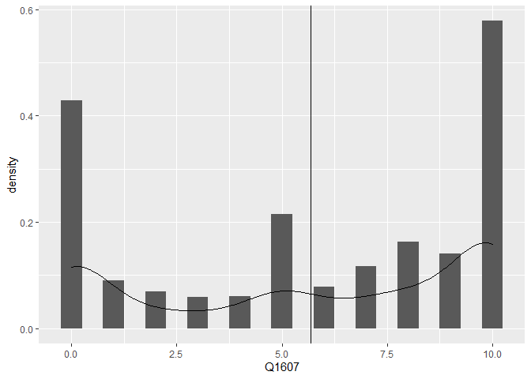
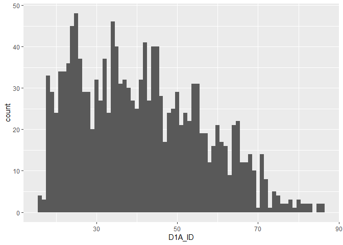
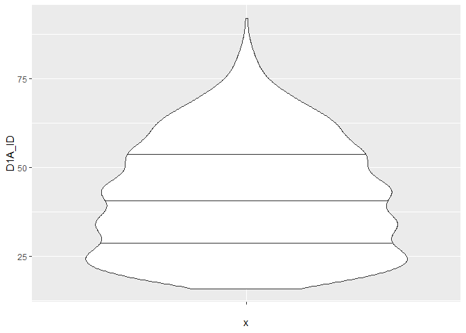
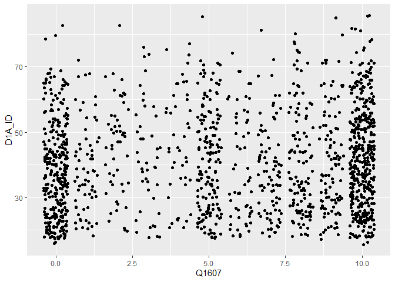
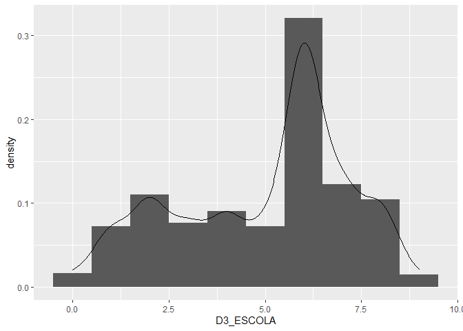
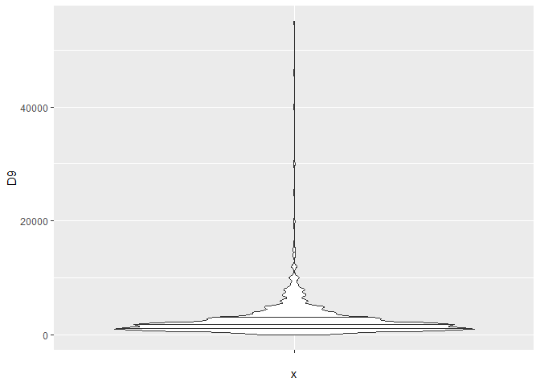
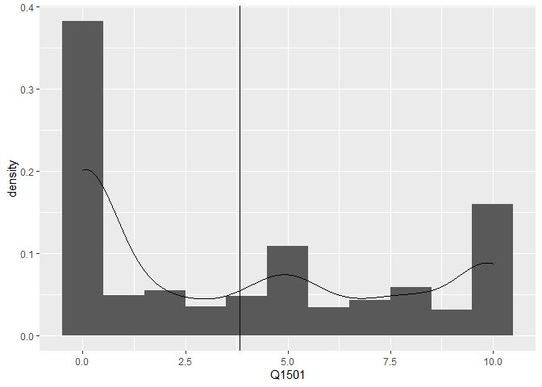
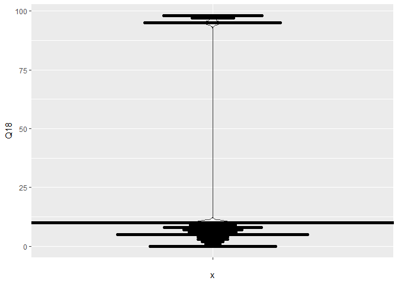
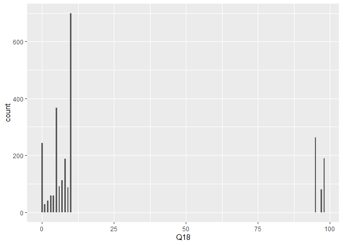

Exercicio 6
================
Rodrigo Martins

### Neste exercício usaremos o banco de dados do ESEB 2018. Para maiores detalhes sobre o survey, ver neste [link](https://www.cesop.unicamp.br/por/eseb). O questionário da pesquisa de 2018 está [aqui](https://www.cesop.unicamp.br/vw/1IMr0S64wNQ_MDA_91ea3_/quest_04622.pdf) e pode ser consultado para ter maiores detalhes sobre as variáveis.

### O banco de dados está disponível no site do CESOP para usuários cadastrados. Para facilitar o acesso, deixei o banco de dados dispónivel no seguinte endereço: <https://github.com/MartinsRodrigo/Analise-de-dados/raw/master/04622.sav>

### Baixe o banco de dados pelo R

### O banco foi feito em SPSS e está em formato SAV. Carregue-o

### Utilize as funções para observar o banco de dados

``` r
url <- "https://github.com/MartinsRodrigo/Analise-de-dados/raw/master/04622.sav"

download.file(url, "04622.sav", mode = "wb")

banco <- read_sav("04622.sav")
head(banco)
```

    ## # A tibble: 6 x 286
    ##   A1_Nquest DIAENTR  MESENTR ANOENTR D1A_ID D1A_FAIXAID D2_SEXO D3_ESCOLA
    ##       <dbl>   <dbl> <dbl+lb>   <dbl>  <dbl>   <dbl+lbl> <dbl+l> <dbl+lbl>
    ## 1         1      15 11 [Nov~    2018     41 4 [35 A 44] 2 [Fem~ 5 [Coleg~
    ## 2         2      15 11 [Nov~    2018     23 2 [18 A 24] 1 [Mas~ 5 [Coleg~
    ## 3         3      15 11 [Nov~    2018     21 2 [18 A 24] 2 [Fem~ 6 [Coleg~
    ## 4         4      16 11 [Nov~    2018     39 4 [35 A 44] 1 [Mas~ 3 [Ginás~
    ## 5         5      16 11 [Nov~    2018     64 6 [55 A 64] 1 [Mas~ 0 [Analf~
    ## 6         6      16 11 [Nov~    2018     45 5 [45 A 54] 2 [Fem~ 0 [Analf~
    ## # ... with 278 more variables: RAMOATIV <dbl+lbl>, RAMOCHEFEF <dbl+lbl>,
    ## #   OCUPA <dbl+lbl>, UF <dbl+lbl>, CID <dbl+lbl>, REG <dbl+lbl>, Q1 <dbl+lbl>,
    ## #   Q2 <dbl+lbl>, Q3 <dbl+lbl>, Q401 <dbl+lbl>, Q402 <dbl+lbl>, Q403 <dbl+lbl>,
    ## #   Q404 <dbl+lbl>, Q405 <dbl+lbl>, Q406 <dbl+lbl>, Q407 <dbl+lbl>,
    ## #   Q501 <dbl+lbl>, Q502 <dbl+lbl>, Q503 <dbl+lbl>, Q504 <dbl+lbl>,
    ## #   Q505 <dbl+lbl>, Q601 <dbl+lbl>, Q602 <dbl+lbl>, Q603 <dbl+lbl>,
    ## #   Q604 <dbl+lbl>, Q7 <dbl+lbl>, Q8 <dbl+lbl>, Q9 <dbl+lbl>, Q10A <dbl+lbl>,
    ## #   Q10B <dbl+lbl>, Q11 <dbl+lbl>, Q12P1_A <dbl+lbl>, Q12P1_B <dbl+lbl>,
    ## #   Q12P2_A <dbl+lbl>, Q12P2_B <dbl+lbl>, Q12G_1A <dbl+lbl>, Q12G_2 <dbl+lbl>,
    ## #   Q12S1 <dbl+lbl>, Q12S2 <dbl+lbl>, Q12CD <dbl+lbl>, Q12CD_recode <dbl+lbl>,
    ## #   Q12AL <dbl+lbl>, Q12AL_recode <dbl+lbl>, Q13A <dbl+lbl>, Q13B <dbl+lbl>,
    ## #   Q13B_2 <dbl+lbl>, Q13B2A <dbl+lbl>, Q13G1 <dbl+lbl>, Q13G2 <dbl+lbl>,
    ## #   Q13S <dbl+lbl>, Q13CD <dbl+lbl>, Q13CD_recode <dbl+lbl>, Q13AL <dbl+lbl>,
    ## #   Q13AL_recode <dbl+lbl>, Q14A <dbl+lbl>, Q14B <dbl+lbl>, Q1501 <dbl+lbl>,
    ## #   Q1502 <dbl+lbl>, Q1503 <dbl+lbl>, Q1504 <dbl+lbl>, Q1505 <dbl+lbl>,
    ## #   Q1506 <dbl+lbl>, Q1507 <dbl+lbl>, Q1508 <dbl+lbl>, Q1509 <dbl+lbl>,
    ## #   Q1510 <dbl+lbl>, Q1511 <dbl+lbl>, Q1512 <dbl+lbl>, Q1513 <dbl+lbl>,
    ## #   Q1514 <dbl+lbl>, Q1515 <dbl+lbl>, Q1516 <dbl+lbl>, Q1517 <dbl+lbl>,
    ## #   Q1518 <dbl+lbl>, Q1519 <dbl+lbl>, Q1520 <dbl+lbl>, Q1521 <dbl+lbl>,
    ## #   Q1522 <dbl+lbl>, Q1523 <dbl+lbl>, Q1524 <dbl+lbl>, Q1525 <dbl+lbl>,
    ## #   Q1526 <dbl+lbl>, Q1601 <dbl+lbl>, Q1602 <dbl+lbl>, Q1603 <dbl+lbl>,
    ## #   Q1604 <dbl+lbl>, Q1605 <dbl+lbl>, Q1606 <dbl+lbl>, Q1607 <dbl+lbl>,
    ## #   Q1608 <dbl+lbl>, Q1609 <dbl+lbl>, Q1610 <dbl+lbl>, Q1611 <dbl+lbl>,
    ## #   Q1612 <dbl+lbl>, Q1613 <dbl+lbl>, Q1614 <dbl+lbl>, Q1615 <dbl+lbl>,
    ## #   Q1616 <dbl+lbl>, Q1617 <dbl+lbl>, Q1618 <dbl+lbl>, ...

``` r
glimpse(banco)
```

    ## Rows: 2,506
    ## Columns: 286
    ## $ A1_Nquest           <dbl> 1, 2, 3, 4, 5, 6, 7, 8, 9, 10, 11, 12, 13, 14, ...
    ## $ DIAENTR             <dbl> 15, 15, 15, 16, 16, 16, 16, 17, 17, 17, 17, 17,...
    ## $ MESENTR             <dbl+lbl> 11, 11, 11, 11, 11, 11, 11, 11, 11, 11, 11,...
    ## $ ANOENTR             <dbl> 2018, 2018, 2018, 2018, 2018, 2018, 2018, 2018,...
    ## $ D1A_ID              <dbl> 41, 23, 21, 39, 64, 45, 18, 29, 25, 31, 23, 45,...
    ## $ D1A_FAIXAID         <dbl+lbl> 4, 2, 2, 4, 6, 5, 2, 3, 3, 3, 2, 5, 6, 3, 6...
    ## $ D2_SEXO             <dbl+lbl> 2, 1, 2, 1, 1, 2, 2, 1, 2, 1, 1, 1, 2, 2, 1...
    ## $ D3_ESCOLA           <dbl+lbl> 5, 5, 6, 3, 0, 0, 4, 8, 8, 6, 2, 2, 1, 2, 6...
    ## $ RAMOATIV            <dbl+lbl>  6,  4, 10,  3,  1,  7, 10,  5,  4,  7, 10,...
    ## $ RAMOCHEFEF          <dbl+lbl> 99, 99, 99, 99, 99, 99, 99, 99, 99, 99, 99,...
    ## $ OCUPA               <dbl+lbl> 2, 1, 4, 3, 3, 1, 4, 2, 1, 1, 4, 4, 4, 4, 3...
    ## $ UF                  <dbl+lbl> 12, 12, 12, 12, 12, 12, 12, 12, 12, 12, 12,...
    ## $ CID                 <dbl+lbl> 1, 1, 1, 1, 1, 1, 1, 1, 1, 1, 1, 1, 1, 1, 2...
    ## $ REG                 <dbl+lbl> 1, 1, 1, 1, 1, 1, 1, 1, 1, 1, 1, 1, 1, 1, 1...
    ## $ Q1                  <dbl+lbl> 4, 4, 4, 4, 1, 4, 4, 3, 4, 2, 3, 3, 3, 4, 3...
    ## $ Q2                  <dbl+lbl> 3, 3, 4, 3, 4, 3, 4, 3, 4, 2, 3, 3, 4, 4, 3...
    ## $ Q3                  <dbl+lbl> 2, 3, 3, 2, 1, 2, 4, 2, 4, 1, 5, 2, 3, 5, 1...
    ## $ Q401                <dbl+lbl> 3, 2, 5, 1, 4, 2, 2, 1, 2, 3, 4, 1, 2, 1, 1...
    ## $ Q402                <dbl+lbl> 1, 1, 3, 1, 1, 1, 1, 1, 1, 1, 1, 1, 1, 2, 1...
    ## $ Q403                <dbl+lbl> 5, 1, 5, 3, 5, 3, 5, 5, 1, 5, 4, 5, 2, 5, 5...
    ## $ Q404                <dbl+lbl> 1, 1, 1, 1, 1, 1, 2, 1, 1, 1, 4, 1, 3, 1, 1...
    ## $ Q405                <dbl+lbl> 3, 3, 3, 1, 1, 3, 4, 5, 1, 5, 2, 2, 5, 5, 1...
    ## $ Q406                <dbl+lbl> 1, 1, 3, 1, 4, 1, 2, 1, 2, 1, 1, 1, 2, 1, 4...
    ## $ Q407                <dbl+lbl> 1, 1, 1, 1, 1, 1, 1, 1, 1, 1, 1, 1, 1, 1, 1...
    ## $ Q501                <dbl+lbl> 3, 3, 3, 3, 4, 2, 4, 1, 2, 2, 2, 5, 3, 1, 1...
    ## $ Q502                <dbl+lbl> 1, 4, 2, 2, 2, 4, 3, 1, 1, 1, 5, 5, 2, 3, 5...
    ## $ Q503                <dbl+lbl> 2, 2, 1, 3, 1, 8, 3, 5, 2, 2, 2, 5, 3, 2, 5...
    ## $ Q504                <dbl+lbl> 3, 5, 1, 3, 3, 2, 5, 1, 4, 4, 4, 1, 3, 1, 1...
    ## $ Q505                <dbl+lbl> 3, 3, 3, 3, 4, 5, 4, 1, 5, 4, 5, 4, 3, 1, 1...
    ## $ Q601                <dbl+lbl> 1, 1, 1, 1, 1, 1, 4, 4, 2, 1, 3, 1, 2, 4, 1...
    ## $ Q602                <dbl+lbl> 1, 3, 1, 3, 3, 1, 2, 1, 1, 3, 1, 2, 4, 3, 1...
    ## $ Q603                <dbl+lbl> 1, 3, 1, 1, 1, 1, 3, 1, 1, 2, 2, 3, 3, 4, 1...
    ## $ Q604                <dbl+lbl> 1, 2, 2, 1, 1, 1, 1, 1, 2, 1, 1, 1, 4, 2, 1...
    ## $ Q7                  <dbl+lbl> 1, 1, 1, 1, 1, 1, 1, 1, 1, 1, 1, 1, 2, 3, 4...
    ## $ Q8                  <dbl+lbl> 1, 2, 3, 2, 1, 1, 3, 1, 1, 1, 1, 1, 3, 1, 1...
    ## $ Q9                  <dbl+lbl> 5, 5, 5, 5, 5, 5, 5, 5, 4, 5, 4, 5, 4, 5, 5...
    ## $ Q10A                <dbl+lbl> 5, 5, 5, 1, 1, 5, 5, 1, 5, 5, 5, 5, 5, 5, 5...
    ## $ Q10B                <dbl+lbl> 99, 99, 99, 17, 13, 99, 99, 17, 99, 99, 99,...
    ## $ Q11                 <dbl+lbl> 5, 3, 5, 5, 5, 5, 5, 5, 5, 4, 4, 4, 3, 5, 5...
    ## $ Q12P1_A             <dbl+lbl> 1, 1, 1, 1, 1, 1, 1, 1, 1, 7, 6, 1, 1, 1, 1...
    ## $ Q12P1_B             <dbl+lbl>  9,  9,  9,  9,  9,  9,  9,  9,  9, 99, 99,...
    ## $ Q12P2_A             <dbl+lbl> 1, 1, 1, 1, 1, 1, 1, 1, 1, 4, 6, 1, 1, 1, 1...
    ## $ Q12P2_B             <dbl+lbl>  2,  2,  2,  2,  2,  2,  2,  2,  2, 99, 99,...
    ## $ Q12G_1A             <dbl+lbl> 9950, 1203, 9998, 1203, 1203, 1203, 1203, 1...
    ## $ Q12G_2              <dbl+lbl> 9999, 9999, 9999, 9999, 9999, 9999, 9999, 9...
    ## $ Q12S1               <dbl+lbl> 1206, 1203, 9998, 1206, 1206, 1201, 1204, 1...
    ## $ Q12S2               <dbl+lbl> 9998, 1202, 9998, 1202, 1202, 1206, 1201, 1...
    ## $ Q12CD               <dbl+lbl> 2037, 9950, 9998, 9998, 9998, 2038, 9960,  ...
    ## $ Q12CD_recode        <dbl+lbl>   1,   4,   3,   3,   3,   1,   4,   1,   1...
    ## $ Q12AL               <dbl+lbl> 9998, 2084, 9998, 1174, 9998, 1092, 9960,  ...
    ## $ Q12AL_recode        <dbl+lbl>   3,   1,   3,   1,   3,   1,   4,   1,   1...
    ## $ Q13A                <dbl+lbl>  1,  5,  1,  1,  1,  1,  3,  1,  1,  1,  1,...
    ## $ Q13B                <dbl+lbl>  2, 99,  2,  2,  7, 98, 99,  2, 98,  1,  2,...
    ## $ Q13B_2              <dbl+lbl>  4,  5,  1,  1,  1,  1,  3,  1,  1,  1,  1,...
    ## $ Q13B2A              <dbl+lbl> 99, 99,  2,  2,  1,  2, 99,  2, 60,  1,  2,...
    ## $ Q13G1               <dbl+lbl> 9950, 9999, 1204, 1204, 1203, 1204, 9999, 1...
    ## $ Q13G2               <dbl+lbl> 9999, 9999, 1204, 1204, 1203, 1204, 9999, 1...
    ## $ Q13S                <dbl+lbl> 9950, 9999, 1203, 1201, 1203, 1202, 9999, 1...
    ## $ Q13CD               <dbl+lbl> 9950, 9999, 9998, 1175, 9998, 9998, 9999, 9...
    ## $ Q13CD_recode        <dbl+lbl>   4, 999,   3,   2,   3,   3, 999,   3,   1...
    ## $ Q13AL               <dbl+lbl> 9950, 9999, 9998, 9998,  770, 9998, 9999,  ...
    ## $ Q13AL_recode        <dbl+lbl>   4, 999,   3,   3,   3,   3, 999,   3,   3...
    ## $ Q14A                <dbl+lbl> 5, 5, 4, 5, 5, 5, 5, 5, 3, 5, 5, 2, 3, 5, 3...
    ## $ Q14B                <dbl+lbl> 5, 5, 5, 5, 5, 5, 4, 5, 4, 5, 5, 5, 1, 5, 5...
    ## $ Q1501               <dbl+lbl>  1,  0,  0,  0,  0, 10,  0, 96,  2,  0,  0,...
    ## $ Q1502               <dbl+lbl> 96,  5, 96,  0,  5,  5, 96, 96, 96,  4,  0,...
    ## $ Q1503               <dbl+lbl> 96, 96,  2, 96,  8, 96, 98, 96,  5,  2,  0,...
    ## $ Q1504               <dbl+lbl> 96, 96, 96,  0, 96, 96, 96, 96, 96,  2,  0,...
    ## $ Q1505               <dbl+lbl>  1,  0,  3,  0, 10, 10,  0, 96,  8,  5,  6,...
    ## $ Q1506               <dbl+lbl> 98, 96, 96,  0, 96,  5,  0, 96,  5,  8,  0,...
    ## $ Q1507               <dbl+lbl> 96, 96, 96,  0, 96, 96,  0, 96, 96,  6,  0,...
    ## $ Q1508               <dbl+lbl>  1,  0, 96,  0,  7, 96,  0, 96,  8,  8,  4,...
    ## $ Q1509               <dbl+lbl> 96,  0, 96,  0, 96, 96, 96, 96, 96, 96,  0,...
    ## $ Q1510               <dbl+lbl> 96, 96, 96, 96, 96, 96, 96, 96, 96, 96,  0,...
    ## $ Q1511               <dbl+lbl>  1, 96, 96,  0, 10, 96,  0, 96,  3, 96,  5,...
    ## $ Q1512               <dbl+lbl> 96,  9,  2, 10, 96,  5, 96, 10,  7,  8,  5,...
    ## $ Q1513               <dbl+lbl>  1, 96, 96,  0, 96, 96,  0, 96, 96,  1,  0,...
    ## $ Q1514               <dbl+lbl> 96, 96,  3,  0,  8, 96, 10, 96,  4,  0,  0,...
    ## $ Q1515               <dbl+lbl> 96, 96, 96,  0, 96, 96, 96, 96, 96,  0,  0,...
    ## $ Q1516               <dbl+lbl> 96, 96, 96, 96, 96, 96, 96, 96, 96,  8,  0,...
    ## $ Q1517               <dbl+lbl> 96, 96,  2,  0, 96, 96,  7, 96,  5, 96,  6,...
    ## $ Q1518               <dbl+lbl>  1, 96, 96,  0, 96,  5, 96, 96,  5,  5,  0,...
    ## $ Q1519               <dbl+lbl> 96, 96, 96, 96, 96, 96,  0, 96,  5,  2,  0,...
    ## $ Q1520               <dbl+lbl> 96, 96, 96, 96,  5,  5,  0, 96,  7,  5,  4,...
    ## $ Q1521               <dbl+lbl> 96, 96, 96,  0,  8, 96,  4, 96,  4,  8,  0,...
    ## $ Q1522               <dbl+lbl> 96, 96, 96,  0, 96, 96,  1, 96,  6,  5,  0,...
    ## $ Q1523               <dbl+lbl> 96, 96, 96, 96,  4, 96, 98, 96,  4,  2,  0,...
    ## $ Q1524               <dbl+lbl> 96, 96, 96,  0, 96, 96,  0, 96, 96,  1,  0,...
    ## $ Q1525               <dbl+lbl> 96, 96, 96,  0, 10, 96, 96, 96, 96, 96,  0,...
    ## $ Q1526               <dbl+lbl> 96, 96, 96, 96, 96, 96, 96, 96, 96,  2,  5,...
    ## $ Q1601               <dbl+lbl>  1,  0,  0,  0, 96,  5,  8,  0,  1,  8,  0,...
    ## $ Q1602               <dbl+lbl>  0,  0, 96, 96, 96, 96, 96,  0, 96,  0,  0,...
    ## $ Q1603               <dbl+lbl>  1,  0, 96,  0, 96, 96,  0,  0, 96,  0,  0,...
    ## $ Q1604               <dbl+lbl>  0,  3,  3,  0, 10,  5,  0,  5,  5,  8,  0,...
    ## $ Q1605               <dbl+lbl> 0, 0, 2, 0, 8, 5, 0, 0, 5, 0, 0, 0, 0, 0, 5...
    ## $ Q1606               <dbl+lbl>  1,  0,  0,  0, 96, 96, 98,  6,  7,  0,  7,...
    ## $ Q1607               <dbl+lbl> 10, 10,  3, 10, 10, 10, 10, 10,  8, 10, 10,...
    ## $ Q1608               <dbl+lbl>  1,  0,  0,  0, 10, 96,  6,  0,  2,  5,  8,...
    ## $ Q1609               <dbl+lbl>  1,  0, 96, 96, 96, 96, 96,  0, 96,  0,  7,...
    ## $ Q1610               <dbl+lbl>  1,  0,  1,  0, 10,  5,  0,  0,  0,  0,  0,...
    ## $ Q1611               <dbl+lbl>  1,  0, 96,  0, 96, 96,  7,  0,  3,  0,  6,...
    ## $ Q1612               <dbl+lbl>  1,  0, 96,  0, 96, 96, 96,  0, 96,  2, 96,...
    ## $ Q1613               <dbl+lbl>  1,  3, 96,  6, 96, 96,  9, 10, 96,  0,  0,...
    ## $ Q1614               <dbl+lbl>  1,  0, 96,  0, 96, 96, 96,  0, 96, 96,  0,...
    ## $ Q1615               <dbl+lbl>  1, 96, 96, 96, 96, 96, 96,  3, 96, 96, 96,...
    ## $ Q1616               <dbl+lbl>  1,  0,  1,  0, 96, 96, 96,  0, 96, 96, 96,...
    ## $ Q1617               <dbl+lbl>  1,  0,  1,  0,  8, 96, 98,  0,  3,  8,  0,...
    ## $ Q1618               <dbl+lbl>  0,  0,  0,  0,  0,  5,  0,  0,  0,  0,  0,...
    ## $ Q1619               <dbl+lbl>  1,  0, 96,  0, 96, 96, 96,  0, 96, 96, 96,...
    ## $ Q1620               <dbl+lbl>  1,  0, 96,  0, 96, 96, 96,  0,  3,  0,  0,...
    ## $ Q1621               <dbl+lbl> 1, 0, 0, 0, 8, 0, 0, 0, 1, 0, 0, 0, 0, 0, 0...
    ## $ Q1701               <dbl+lbl>  0,  0,  0,  0,  0,  5,  0,  0,  2, 10,  1,...
    ## $ Q1702               <dbl+lbl>  0,  0, 96, 96,  5,  0, 96, 96,  8,  8, 96,...
    ## $ Q1703               <dbl+lbl>  1,  0,  0,  0,  5,  0,  4, 96, 10,  7,  3,...
    ## $ Q1704               <dbl+lbl>  0, 96, 96,  0, 96,  0, 96, 96,  5, 96,  6,...
    ## $ Q1705               <dbl+lbl>  0,  0, 10,  4,  5,  5,  2, 96,  8,  7,  7,...
    ## $ Q1706               <dbl+lbl>  2, 96, 96,  0, 96,  0, 96,  2,  4,  5,  6,...
    ## $ Q1707               <dbl+lbl>  2,  0, 96, 96, 96,  0, 96, 96,  3,  5, 96,...
    ## $ Q1708               <dbl+lbl>  2,  0, 96,  0,  4,  0,  3,  5,  1,  1,  5,...
    ## $ Q1709               <dbl+lbl>  3,  0, 96, 96, 96,  0, 96,  5,  2, 96,  6,...
    ## $ Q1710               <dbl+lbl>  0, 96, 96,  0,  5,  0, 96, 96,  6, 96, 96,...
    ## $ Q1711               <dbl+lbl>  2,  0, 96,  0, 10,  0, 96, 96,  6,  6,  7,...
    ## $ Q1712               <dbl+lbl>  4,  8,  0, 10,  5,  5, 96, 10,  3,  3,  5,...
    ## $ Q1713               <dbl+lbl>  2,  0, 96,  1, 96,  0, 96,  2,  5, 96, 96,...
    ## $ Q1714               <dbl+lbl>  2,  0,  0,  1,  5,  5,  8,  0, 10, 10,  3,...
    ## $ Q1715               <dbl+lbl> 96, 96, 96, 96, 96,  0, 96, 96,  3, 96, 96,...
    ## $ Q1716               <dbl+lbl>  2,  0, 96,  0,  4,  0, 96, 96,  4,  8, 96,...
    ## $ Q1717               <dbl+lbl>  2,  0,  0,  3,  4,  5,  4, 96,  6,  6,  6,...
    ## $ Q1718               <dbl+lbl>  2,  0, 96,  0,  4,  0, 96, 96,  3,  5, 96,...
    ## $ Q1719               <dbl+lbl>  2,  0, 96,  0, 96,  0, 96, 96,  7,  7, 96,...
    ## $ Q1720               <dbl+lbl>  2,  0, 10,  0,  5,  0,  9, 96,  8,  8,  4,...
    ## $ Q1721               <dbl+lbl>  2,  0, 96,  0,  0,  0,  5, 96,  2, 96,  4,...
    ## $ Q1722               <dbl+lbl>  2,  0, 96, 96,  0,  0, 96, 96,  1,  3, 96,...
    ## $ Q1723               <dbl+lbl>  2,  0, 96,  6,  8,  0,  7,  2,  7,  3, 96,...
    ## $ Q1724               <dbl+lbl>  0,  0,  0, 96, 96,  0, 96,  0,  5, 96, 96,...
    ## $ Q1725               <dbl+lbl>  2, 96, 96, 96, 96,  0, 96, 96,  7, 96, 96,...
    ## $ Q1726               <dbl+lbl>  1,  0, 96,  0, 96,  0, 96,  2,  4, 96,  4,...
    ## $ Q18                 <dbl+lbl> 10, 10, 10, 10, 10, 10,  7,  0, 10, 10, 10,...
    ## $ Q21                 <dbl+lbl> 5, 4, 5, 4, 5, 5, 5, 5, 4, 5, 2, 4, 4, 4, 5...
    ## $ Q22A                <dbl+lbl> 2, 2, 2, 2, 1, 2, 2, 2, 2, 2, 2, 2, 2, 2, 2...
    ## $ Q22B                <dbl+lbl>  2,  1,  2,  1, 99,  1,  2,  2,  2,  1,  2,...
    ## $ Q22C                <dbl+lbl> 99, 17, 99, 17, 17, 98, 99, 99, 99, 50, 99,...
    ## $ Q22D                <dbl+lbl> 99,  2, 99,  2,  2, 99, 99, 99, 99,  2, 99,...
    ## $ P1                  <dbl+lbl> 1, 1, 1, 1, 1, 2, 1, 1, 1, 1, 1, 1, 1, 1, 2...
    ## $ P1A                 <dbl+lbl>  13,  13,  13,  13,  13, 999,  13,  13,  13...
    ## $ D5_1                <dbl+lbl> 2, 2, 2, 2, 2, 2, 2, 1, 2, 1, 2, 2, 2, 2, 2...
    ## $ D5_2                <dbl+lbl> 2, 2, 2, 2, 2, 2, 2, 2, 2, 1, 2, 2, 2, 2, 2...
    ## $ P201                <dbl+lbl> 2, 2, 2, 2, 1, 2, 2, 2, 2, 2, 2, 2, 2, 2, 2...
    ## $ P202                <dbl+lbl> 2, 2, 2, 2, 1, 2, 2, 2, 2, 2, 2, 2, 2, 2, 2...
    ## $ P203                <dbl+lbl> 2, 2, 2, 2, 1, 2, 2, 2, 2, 2, 2, 2, 2, 2, 2...
    ## $ P204                <dbl+lbl> 2, 2, 2, 2, 2, 2, 2, 2, 2, 1, 2, 2, 2, 2, 2...
    ## $ P205                <dbl+lbl> 2, 2, 1, 2, 2, 2, 2, 2, 2, 2, 2, 2, 2, 2, 2...
    ## $ P206                <dbl+lbl> 1, 2, 1, 2, 1, 1, 1, 2, 2, 1, 1, 2, 2, 2, 2...
    ## $ P207                <dbl+lbl> 2, 2, 2, 2, 1, 2, 2, 2, 2, 2, 2, 1, 2, 2, 1...
    ## $ P208                <dbl+lbl> 2, 2, 2, 2, 2, 2, 2, 2, 2, 1, 2, 2, 2, 2, 2...
    ## $ P209                <dbl+lbl> 2, 2, 2, 2, 2, 2, 1, 2, 2, 2, 2, 2, 2, 2, 1...
    ## $ P210                <dbl+lbl> 2, 2, 2, 2, 2, 2, 2, 2, 2, 2, 2, 2, 2, 2, 2...
    ## $ P211                <dbl+lbl> 2, 2, 2, 2, 2, 2, 2, 2, 2, 2, 2, 2, 2, 2, 2...
    ## $ P212                <dbl+lbl> 2, 2, 2, 2, 2, 2, 2, 2, 2, 1, 2, 2, 2, 2, 2...
    ## $ P213                <dbl+lbl> 2, 2, 2, 2, 2, 2, 2, 2, 2, 2, 2, 2, 2, 2, 2...
    ## $ P214                <dbl+lbl> 2, 2, 2, 2, 1, 2, 2, 2, 2, 2, 2, 1, 2, 2, 2...
    ## $ P215                <dbl+lbl> 2, 2, 2, 2, 2, 2, 2, 2, 2, 2, 2, 2, 2, 2, 2...
    ## $ P216                <dbl+lbl> 2, 2, 2, 2, 2, 2, 2, 2, 2, 2, 2, 2, 2, 2, 2...
    ## $ P217                <dbl+lbl> 2, 2, 1, 2, 1, 2, 2, 2, 2, 2, 2, 1, 2, 2, 2...
    ## $ P301                <dbl+lbl> 5, 2, 1, 2, 2, 1, 3, 6, 2, 2, 2, 5, 2, 2, 6...
    ## $ P302                <dbl+lbl> 1, 2, 1, 2, 2, 2, 1, 1, 2, 2, 2, 4, 2, 1, 1...
    ## $ P303                <dbl+lbl> 1, 2, 2, 2, 2, 1, 1, 2, 1, 2, 1, 2, 2, 2, 6...
    ## $ P304                <dbl+lbl> 6, 2, 6, 6, 6, 6, 6, 6, 2, 6, 2, 5, 3, 6, 6...
    ## $ P305                <dbl+lbl> 6, 1, 6, 6, 2, 6, 6, 6, 1, 6, 2, 4, 2, 6, 6...
    ## $ P306                <dbl+lbl> 5, 2, 2, 6, 2, 2, 3, 6, 5, 2, 1, 4, 2, 5, 2...
    ## $ P307                <dbl+lbl> 5, 6, 2, 6, 5, 6, 2, 6, 6, 5, 5, 6, 5, 6, 6...
    ## $ P308                <dbl+lbl> 6, 5, 5, 6, 6, 6, 2, 6, 6, 6, 5, 6, 5, 6, 6...
    ## $ P309                <dbl+lbl> 1, 2, 2, 2, 2, 1, 1, 1, 2, 6, 2, 3, 2, 2, 6...
    ## $ P310                <dbl+lbl> 6, 2, 6, 6, 2, 6, 4, 6, 5, 6, 5, 2, 3, 2, 6...
    ## $ P311                <dbl+lbl> 5, 6, 6, 6, 2, 1, 2, 6, 6, 6, 6, 6, 3, 6, 6...
    ## $ P312                <dbl+lbl> 1, 2, 2, 6, 2, 1, 1, 1, 5, 2, 2, 2, 2, 1, 6...
    ## $ P401                <dbl+lbl> 3, 1, 1, 4, 1, 1, 3, 4, 3, 3, 2, 4, 3, 3, 3...
    ## $ P402                <dbl+lbl> 1, 3, 1, 4, 1, 3, 1, 1, 3, 3, 2, 3, 2, 1, 3...
    ## $ P403                <dbl+lbl> 1, 1, 4, 1, 1, 1, 3, 1, 2, 4, 1, 2, 2, 1, 3...
    ## $ P404                <dbl+lbl> 3, 1, 3, 4, 3, 4, 4, 4, 3, 4, 2, 4, 4, 3, 3...
    ## $ P405                <dbl+lbl> 4, 3, 3, 4, 1, 4, 2, 3, 3, 4, 2, 3, 2, 3, 3...
    ## $ P406                <dbl+lbl> 3, 3, 3, 4, 1, 1, 4, 4, 3, 4, 2, 3, 2, 3, 3...
    ## $ P407                <dbl+lbl> 4, 3, 4, 4, 3, 4, 4, 4, 4, 4, 3, 4, 4, 3, 3...
    ## $ P408                <dbl+lbl> 4, 3, 4, 4, 3, 4, 4, 4, 4, 4, 2, 4, 4, 3, 3...
    ## $ P409                <dbl+lbl> 1, 1, 3, 1, 1, 1, 1, 1, 2, 4, 2, 2, 3, 1, 3...
    ## $ P410                <dbl+lbl> 3, 3, 3, 4, 1, 4, 2, 4, 3, 4, 2, 2, 3, 3, 3...
    ## $ P411                <dbl+lbl> 3, 4, 4, 4, 1, 4, 3, 4, 4, 4, 4, 4, 3, 3, 3...
    ## $ P412                <dbl+lbl> 1, 3, 3, 4, 1, 4, 2, 1, 4, 3, 2, 3, 2, 3, 3...
    ## $ P5                  <dbl+lbl> 2, 2, 2, 2, 1, 1, 2, 2, 2, 2, 1, 2, 2, 2, 2...
    ## $ P601                <dbl+lbl> 0, 0, 0, 0, 0, 0, 9, 0, 1, 0, 4, 0, 0, 5, 0...
    ## $ P602                <dbl+lbl> 3, 0, 0, 0, 0, 0, 5, 0, 0, 0, 3, 4, 0, 5, 0...
    ## $ P603                <dbl+lbl> 0, 0, 0, 0, 0, 5, 1, 0, 4, 0, 4, 1, 0, 5, 0...
    ## $ P604                <dbl+lbl>  0,  0,  0,  0,  0, 10,  7,  0,  5,  0,  3,...
    ## $ P605                <dbl+lbl>  2,  0,  0,  0,  0, 10,  2,  0,  2,  0,  5,...
    ## $ P606                <dbl+lbl>  0,  0,  0,  0, 10,  0,  1,  0,  2,  0,  2,...
    ## $ P607                <dbl+lbl>  1,  3,  2,  0, 10, 10,  5,  0,  3,  8,  5,...
    ## $ P608                <dbl+lbl>  1,  3,  1,  0, 10, 10,  2,  0,  3,  8,  5,...
    ## $ P609                <dbl+lbl>  1,  5,  5,  0,  0,  5,  0,  0,  0,  5,  8,...
    ## $ P610                <dbl+lbl>  0, 10,  0,  0,  0,  0,  0,  0,  4,  0,  3,...
    ## $ P611                <dbl+lbl>  0,  0,  0,  0, 98,  0,  4,  0,  5,  0,  6,...
    ## $ P612                <dbl+lbl>  3,  0,  0,  0, 99,  0,  9,  0,  2,  5,  5,...
    ## $ P613                <dbl+lbl>  2,  0,  0,  0, 10, 10,  9,  0,  0,  0,  8,...
    ## $ P614                <dbl+lbl> 2, 0, 0, 0, 0, 5, 6, 0, 0, 0, 6, 2, 0, 5, 0...
    ## $ P615                <dbl+lbl>  0,  0,  0,  0,  0, 10,  2,  0,  0,  0,  5,...
    ## $ P616                <dbl+lbl> 3, 0, 5, 0, 0, 0, 3, 0, 2, 0, 8, 0, 0, 5, 0...
    ## $ P7_aberta_agregada  <dbl+lbl>  70, 998,  50,  72, 998, 998, 998,  72, 998...
    ## $ P8                  <dbl+lbl> 8, 2, 2, 1, 2, 1, 8, 1, 3, 1, 1, 2, 8, 8, 8...
    ## $ P9                  <dbl+lbl> 2, 1, 2, 1, 8, 2, 8, 2, 1, 1, 1, 2, 8, 8, 8...
    ## $ P1001               <dbl+lbl> 1, 1, 2, 1, 5, 1, 2, 1, 1, 1, 5, 1, 2, 1, 1...
    ## $ P1002               <dbl+lbl> 1, 2, 4, 1, 1, 1, 1, 1, 1, 2, 5, 1, 2, 1, 1...
    ## $ P1003               <dbl+lbl> 1, 4, 1, 2, 3, 1, 3, 1, 2, 2, 1, 4, 4, 2, 2...
    ## $ P1004               <dbl+lbl> 1, 1, 4, 5, 1, 1, 3, 1, 1, 1, 1, 1, 5, 2, 1...
    ## $ P1101               <dbl+lbl> 1, 1, 2, 1, 1, 1, 2, 1, 2, 4, 1, 1, 2, 5, 1...
    ## $ P1102               <dbl+lbl> 1, 1, 1, 1, 1, 1, 1, 1, 2, 1, 5, 1, 2, 1, 1...
    ## $ P1103               <dbl+lbl> 1, 1, 4, 1, 5, 1, 3, 1, 4, 2, 4, 1, 3, 8, 1...
    ## $ P1104               <dbl+lbl> 1, 1, 5, 1, 1, 1, 4, 5, 1, 1, 2, 1, 2, 5, 1...
    ## $ P1105               <dbl+lbl> 1, 1, 5, 1, 5, 1, 4, 5, 1, 1, 5, 1, 4, 5, 5...
    ## $ P12                 <dbl+lbl> 1, 1, 1, 1, 1, 1, 1, 1, 1, 1, 1, 1, 1, 1, 1...
    ## $ P13_aberta_agregada <dbl+lbl>  20,  11,  10,  10,  10,  10,  25,  20, 998...
    ## $ P14A                <dbl+lbl>  2, 99,  1, 99,  3, 99,  2, 99,  2, 99,  2,...
    ## $ P14B                <dbl+lbl> 99,  2, 99,  1, 99,  2, 99,  4, 99,  2, 99,...
    ## $ P15                 <dbl+lbl> 2, 1, 1, 2, 8, 2, 8, 2, 2, 2, 1, 2, 8, 1, 2...
    ## $ P1601               <dbl+lbl> 10, 10,  7,  9, 10, 10,  5,  7,  5,  5, 10,...
    ## $ P1602               <dbl+lbl>  2,  1,  3,  1, 10,  5,  2,  1,  2,  2,  8,...
    ## $ P1603               <dbl+lbl> 10,  1,  4,  1, 10,  5,  3,  1,  2,  6,  9,...
    ## $ P1604               <dbl+lbl> 10,  1,  2,  1, 10, 10,  3,  1,  5,  3,  8,...
    ## $ P1605               <dbl+lbl>  2, 10,  3,  1, 10,  5,  1,  1,  3,  3, 10,...
    ## $ P1606               <dbl+lbl>  2, 10,  5,  1, 10,  5,  3,  1,  5,  4,  9,...
    ## $ P1607               <dbl+lbl>  2, 10,  6,  1, 10, 10,  2,  1,  2,  4,  9,...
    ## $ P1608               <dbl+lbl>  2,  1,  2,  1, 10, 10,  1,  1,  1,  6,  7,...
    ## $ P1609               <dbl+lbl> 10, 10,  4,  1, 10,  5,  8,  1,  2,  6,  8,...
    ## $ P1610               <dbl+lbl> 10, 10,  5,  1, 10, 10,  1,  1,  3,  5,  9,...
    ## $ P1611               <dbl+lbl> 10,  1,  6,  1, 10,  5,  5,  1,  6,  6,  5,...
    ## $ P1701               <dbl+lbl> 5, 5, 5, 5, 3, 4, 3, 5, 5, 1, 1, 5, 5, 5, 5...
    ## $ P1702               <dbl+lbl> 1, 1, 1, 1, 3, 3, 1, 1, 1, 1, 1, 1, 1, 5, 1...
    ## $ P1703               <dbl+lbl> 1, 5, 1, 5, 3, 4, 5, 5, 5, 5, 2, 5, 5, 5, 4...
    ## $ P1704               <dbl+lbl> 5, 1, 5, 1, 3, 1, 5, 5, 1, 1, 4, 1, 2, 2, 1...
    ## $ P1705               <dbl+lbl> 1, 2, 1, 1, 3, 1, 8, 5, 2, 3, 2, 5, 4, 5, 5...
    ## $ P1706               <dbl+lbl> 1, 1, 2, 1, 1, 1, 8, 1, 1, 1, 1, 1, 1, 1, 5...
    ## $ P1707               <dbl+lbl> 5, 2, 4, 5, 3, 2, 8, 2, 2, 4, 4, 5, 4, 1, 1...
    ## $ P1708               <dbl+lbl> 1, 4, 1, 1, 3, 2, 8, 1, 2, 4, 4, 3, 2, 5, 5...
    ## $ P1709               <dbl+lbl> 5, 5, 4, 5, 3, 2, 5, 5, 4, 4, 5, 4, 3, 5, 5...
    ## $ P1710               <dbl+lbl> 5, 2, 4, 5, 1, 4, 8, 5, 2, 5, 2, 1, 5, 1, 5...
    ## $ P1711               <dbl+lbl> 1, 1, 1, 1, 3, 4, 5, 5, 1, 1, 2, 1, 2, 1, 5...
    ## $ P1712               <dbl+lbl> 1, 4, 1, 1, 3, 2, 8, 1, 2, 1, 2, 1, 2, 2, 5...
    ## $ P1713               <dbl+lbl> 5, 2, 2, 5, 3, 2, 3, 1, 1, 1, 5, 1, 5, 2, 1...
    ## $ P18                 <dbl+lbl> 5, 2, 2, 5, 8, 4, 1, 5, 2, 5, 1, 5, 8, 1, 5...
    ## $ P19                 <dbl+lbl> 1, 1, 1, 1, 1, 1, 1, 1, 1, 3, 1, 1, 5, 5, 3...
    ## $ P20                 <dbl+lbl> 1, 1, 1, 1, 1, 1, 1, 1, 2, 1, 1, 1, 2, 1, 1...
    ## $ P2101               <dbl+lbl> 5, 1, 5, 5, 1, 2, 5, 5, 4, 5, 5, 5, 2, 5, 5...
    ## $ P2102               <dbl+lbl> 5, 4, 5, 5, 3, 5, 5, 5, 5, 5, 5, 5, 1, 5, 1...
    ## $ P2103               <dbl+lbl> 5, 5, 5, 5, 3, 2, 1, 5, 5, 5, 5, 5, 4, 5, 5...
    ## $ P2104               <dbl+lbl> 5, 2, 5, 5, 1, 2, 5, 5, 5, 5, 5, 5, 5, 5, 5...
    ## $ P2105               <dbl+lbl> 5, 5, 5, 5, 1, 2, 1, 5, 1, 5, 5, 5, 4, 5, 5...
    ## $ P2106               <dbl+lbl> 1, 1, 2, 1, 5, 2, 8, 1, 2, 1, 4, 1, 2, 1, 1...
    ## $ P22                 <dbl+lbl> 4, 4, 4, 4, 1, 4, 4, 4, 4, 4, 4, 4, 4, 4, 3...
    ## $ P24                 <dbl+lbl> 1, 2, 2, 1, 1, 2, 2, 2, 2, 2, 1, 2, 2, 2, 2...
    ## $ P25                 <dbl+lbl> 10,  1,  4,  1,  5,  2,  5,  8,  2,  1,  2,...
    ## $ P26                 <dbl+lbl> 999,   1,   1,   3,   3,   7,   4,   3,   1...
    ## $ P27                 <dbl+lbl>  2, 12,  2,  2,  2,  4, 98,  8,  4,  7,  1,...
    ## $ P28                 <dbl+lbl> 2, 2, 1, 2, 1, 2, 8, 2, 2, 2, 2, 1, 2, 1, 2...
    ## $ P28A                <dbl+lbl> 3, 2, 4, 4, 2, 4, 3, 4, 4, 4, 4, 5, 4, 4, 3...
    ## $ P28B                <dbl+lbl> 999, 999,   2, 999,   4, 999, 999, 999, 999...
    ## $ P29                 <dbl+lbl> 2, 2, 1, 1, 2, 2, 2, 2, 1, 2, 1, 2, 2, 2, 2...
    ## $ P30                 <dbl+lbl> 2, 1, 1, 2, 1, 1, 2, 2, 2, 1, 1, 1, 1, 2, 2...
    ## $ D4                  <dbl+lbl> 1, 2, 3, 2, 3, 2, 3, 2, 2, 3, 3, 3, 3, 2, 3...
    ## $ D7                  <dbl+lbl>  3, 10, 11,  3, 16,  1, 98,  3,  3,  1, 16,...
    ## $ D8                  <dbl+lbl>    5, 9999, 9999,    5, 9999,    2, 9999,  ...
    ## $ D8A                 <dbl+lbl>   3, 999, 999,   3, 999,   3, 999,   3,   3...
    ## $ D6                  <dbl+lbl>   1, 999, 999,   1, 999,   2, 999,   1,   1...
    ## $ D9                  <dbl+lbl>    5000,   12000,   40000,    1500,     954...
    ## $ D9A                 <dbl+lbl> 999, 999, 999, 999, 999, 999,  98, 999, 999...
    ## $ D9B_FAIXA_RENDAF    <dbl+lbl>  4,  5,  7,  2,  1,  1, 98,  3,  3,  3,  2,...
    ## $ D11                 <dbl+lbl> 3, 4, 2, 4, 3, 3, 2, 5, 5, 2, 2, 6, 4, 2, 5...
    ## $ D10                 <dbl+lbl>  5,  3,  3,  3,  5,  3,  5,  5,  5,  5,  5,...
    ## $ D10A                <dbl+lbl>  100, 9999, 9999, 9999,    1, 9999,    8,  ...
    ## $ D12                 <dbl+lbl> 1, 2, 8, 5, 5, 9, 8, 7, 8, 8, 8, 7, 8, 8, 8...
    ## $ D12A                <dbl+lbl> 2, 2, 2, 2, 8, 1, 2, 5, 2, 2, 2, 1, 2, 2, 2...
    ## $ D14                 <dbl+lbl> 1, 1, 1, 1, 1, 1, 1, 1, 1, 1, 1, 1, 1, 1, 1...
    ## $ D15                 <dbl+lbl> 2, 2, 2, 2, 2, 2, 1, 2, 2, 2, 2, 2, 2, 2, 2...
    ## $ D16                 <dbl+lbl> 7, 1, 8, 1, 1, 3, 1, 1, 1, 3, 1, 1, 7, 1, 1...
    ## $ D20                 <dbl+lbl> 3, 3, 2, 5, 3, 3, 2, 4, 4, 3, 8, 1, 4, 2, 4...
    ## $ DIAANIVER           <dbl> 5, 3, 11, 3, 17, 5, 4, 18, 25, 3, 15, 24, 7, 14...
    ## $ MESANIVER           <dbl+lbl> 12,  3, 12, 11,  3,  2, 11,  4, 10, 12,  2,...
    ## $ ANOANIVER           <dbl> 1977, 1995, 1997, 1979, 1954, 1973, 2000, 1989,...
    ## $ A3                  <dbl+lbl> 1, 1, 1, 1, 1, 1, 1, 1, 1, 1, 1, 1, 1, 1, 1...


### A variável Q1607 indica uma nota de 0 a 10 ao candidato Jair Bolsonaro. Valores acima de 10 representam respostas não uteis para nossa pesquisa. Represente graficamente esta variável apenas com os valores válidos e descreva o resultado.\*OBS: transforme esta variável para númerica com a função `as.numeric()`.

``` r
banco_selecionado <- banco %>% 
  select(Q1607, D1A_ID, D3_ESCOLA, D9, Q1501, Q18) %>%
  filter(Q1607 < 11) %>%
  filter(D9 < 9999998) %>%
  filter(Q1501 <= 10) %>%
  filter(Q18 <= 10)

  banco_selecionado$Q1607 <- as.numeric(banco_selecionado$Q1607)

glimpse(banco_selecionado)
```

    ## Rows: 1,462
    ## Columns: 6
    ## $ Q1607     <dbl> 10, 10, 3, 10, 10, 10, 8, 10, 10, 10, 10, 10, 5, 10, 10, ...
    ## $ D1A_ID    <dbl> 41, 23, 21, 39, 64, 45, 25, 31, 23, 45, 55, 25, 56, 18, 2...
    ## $ D3_ESCOLA <dbl+lbl> 5, 5, 6, 3, 0, 0, 8, 6, 2, 2, 1, 2, 6, 2, 4, 8, 8, 6,...
    ## $ D9        <dbl+lbl>  5000, 12000, 40000,  1500,   954,   954,  2862,  250...
    ## $ Q1501     <dbl+lbl>  1,  0,  0,  0,  0, 10,  2,  0,  0,  0,  0,  0,  5,  ...
    ## $ Q18       <dbl+lbl> 10, 10, 10, 10, 10, 10, 10, 10, 10, 10,  7,  0,  5,  ...

``` r
ggplot(banco_selecionado, aes(Q1607)) +
  geom_histogram(aes(y=..density..),
                 binwidth=0.5) +
  geom_density() +
  geom_vline(aes(xintercept = mean(Q1607, na.rm = T)))
```

<!-- -->

Por incrível que pareça há bastante gente que atribui uma nota 10 para o
governo do presidente Bolsonaro. Mas também há uma número expressivo de
pessoas que atribui nota 0 (0.2) ou nota 5 (0.1) para o governo. A média
do governo é de 5.8.

### Vamos procurar entender o que está associado à aprovação deste candidato. Primeiro, vamos observar a idade dos respondentes com a variável D1A\_ID. Represente esta variável graficamente.

``` r
ggplot(banco_selecionado, aes(D1A_ID)) +
  geom_histogram(binwidth = 1)
```

<!-- -->

``` r
ggplot(banco, aes(x = "", y = D1A_ID)) +
  geom_violin(draw_quantiles = c(0.25, 0.5, 0.75))
```

<!-- -->

### Teste a associação entre a nota dada a Jair Bolsonaro e idade do respondente, explicando o resultado.

``` r
cor.test(banco_selecionado$Q1607, banco_selecionado$D1A_ID)
```

    ## 
    ##  Pearson's product-moment correlation
    ## 
    ## data:  banco_selecionado$Q1607 and banco_selecionado$D1A_ID
    ## t = 3.0571, df = 1460, p-value = 0.002276
    ## alternative hypothesis: true correlation is not equal to 0
    ## 95 percent confidence interval:
    ##  0.02860265 0.13048656
    ## sample estimates:
    ##        cor 
    ## 0.07975289

``` r
ggplot(banco_selecionado, aes(Q1607, D1A_ID)) +
geom_jitter()
```

<!-- -->

O valor 0 não está presente no intervalo de confiança, logo o resultado
pode ter algum tipo de significância estátistica. O p-valor também
contribui para a ideia de que há algum tipo de correlação estatística
entre essas duas variáveis. O valor da correlação está bem baixo
(positiva 0,1), sugerindo que a magnitude da correlação das variáveis é
fraca. Também vemos que há alguns casos que poderíamos considerá-los de
certa forma outliers (80 anos +). Deveríamos testar o resultado do
modelo sem os outliers.

### Faça uma regressao linear mostrando em que medida a idade do respondente explica a avaliação do candidato Jair Bolsonaro. Interprete o resultado.

``` r
regressao <- lm(Q1607 ~ D1A_ID, data = banco_selecionado)

summary(regressao)
```

    ## 
    ## Call:
    ## lm(formula = Q1607 ~ D1A_ID, data = banco_selecionado)
    ## 
    ## Residuals:
    ##     Min      1Q  Median      3Q     Max 
    ## -6.5423 -4.3924  0.7616  3.8889  4.8334 
    ## 
    ## Coefficients:
    ##             Estimate Std. Error t value Pr(>|t|)    
    ## (Intercept) 4.838056   0.293850  16.464  < 2e-16 ***
    ## D1A_ID      0.020533   0.006716   3.057  0.00228 ** 
    ## ---
    ## Signif. codes:  0 '***' 0.001 '**' 0.01 '*' 0.05 '.' 0.1 ' ' 1
    ## 
    ## Residual standard error: 3.922 on 1460 degrees of freedom
    ## Multiple R-squared:  0.006361,   Adjusted R-squared:  0.00568 
    ## F-statistic: 9.346 on 1 and 1460 DF,  p-value: 0.002276

Aqui encontramos um p-valor bastante baixo e com os astericos (\*\*\*)
em torno do intercepto e da variável independente. Entretanto,
encontramos um R² e um R² ajustado bem baixo, sugerindo que tem mais
variáveis relevantes que devem ser inseridas no modelo. O erro padrão é
de 0.23, sugerindo que há uma dispersão de 0.23 da amostra em torno da
média populacional (um valor baixo, pode ter sido causado pela
influência do tamanho da amostra no erro padrão).

### Observe a variável D3\_ESCOLA dos respondentes relativa a educação. Represente esta variável graficamente. \#OBS: observe que esta variável está como numérica, apesar de ser categórica ordinal. No entanto, trate-a como numérica, indicando que quanto maior o valor, maior o nível educacional do respondente

``` r
ggplot(banco_selecionado, aes(D3_ESCOLA)) +
  geom_histogram(aes(y=..density..),
                 binwidth=1) +
  geom_density()
```

    ## Don't know how to automatically pick scale for object of type haven_labelled/vctrs_vctr/double. Defaulting to continuous.

<!-- -->

### Teste a associação entre a nota dada a Jair Bolsonaro e educação do respondente, explicando o resultado.

``` r
cor.test(banco_selecionado$Q1607, banco_selecionado$D3_ESCOLA)
```

    ## 
    ##  Pearson's product-moment correlation
    ## 
    ## data:  banco_selecionado$Q1607 and banco_selecionado$D3_ESCOLA
    ## t = -2.4569, df = 1460, p-value = 0.01413
    ## alternative hypothesis: true correlation is not equal to 0
    ## 95 percent confidence interval:
    ##  -0.11505494 -0.01294162
    ## sample estimates:
    ##         cor 
    ## -0.06416624

O intervalo de confiança não contém o valor 0, sugerindo que pode haver
algum tipo de significância estatística. O p-valor está baixo (\<0.05),
mas a correlação das variáveis está bem ruim, negativo 0.06.

### Faça uma regressao linear mostrando em que medida a educação do respondente explica a avaliação do candidato Jair Bolsonaro. Interprete o resultado.

``` r
regressao1 <- lm(Q1607 ~ D3_ESCOLA, data = banco_selecionado)

summary(regressao1)
```

    ## 
    ## Call:
    ## lm(formula = Q1607 ~ D3_ESCOLA, data = banco_selecionado)
    ## 
    ## Residuals:
    ##     Min      1Q  Median      3Q     Max 
    ## -6.2467 -4.4520  0.7183  3.9804  4.7751 
    ## 
    ## Coefficients:
    ##             Estimate Std. Error t value Pr(>|t|)    
    ## (Intercept)  6.24666    0.25251  24.739   <2e-16 ***
    ## D3_ESCOLA   -0.11352    0.04621  -2.457   0.0141 *  
    ## ---
    ## Signif. codes:  0 '***' 0.001 '**' 0.01 '*' 0.05 '.' 0.1 ' ' 1
    ## 
    ## Residual standard error: 3.926 on 1460 degrees of freedom
    ## Multiple R-squared:  0.004117,   Adjusted R-squared:  0.003435 
    ## F-statistic: 6.036 on 1 and 1460 DF,  p-value: 0.01413

Esse modelo tem um p-valor pequeno, alguns asteriscos em torno do
intercepto (\*\*\*) e da variável D3\_ESCOLA. Tem um erro padrão de 0,25
(maior do que o modelo passado). Temos um R² e R² ajustado pequeno (e
menor do que o modelo passado), sugerindo uma menor explicação do
modelo. O erro residual padronizado de 3.926 (O melhor modelo é aquele
que tem o menor erro padronizado e maior R²). O RSE influencia na
comparabilidade dos resultados.

### Observe a variável D9 sobre renda dos respondentes. Represente esta variável graficamente. \#OBS: note que os valores 9999998 e 9999999 devem ser descartados.

``` r
glimpse(banco_selecionado)
```

    ## Rows: 1,462
    ## Columns: 6
    ## $ Q1607     <dbl> 10, 10, 3, 10, 10, 10, 8, 10, 10, 10, 10, 10, 5, 10, 10, ...
    ## $ D1A_ID    <dbl> 41, 23, 21, 39, 64, 45, 25, 31, 23, 45, 55, 25, 56, 18, 2...
    ## $ D3_ESCOLA <dbl+lbl> 5, 5, 6, 3, 0, 0, 8, 6, 2, 2, 1, 2, 6, 2, 4, 8, 8, 6,...
    ## $ D9        <dbl+lbl>  5000, 12000, 40000,  1500,   954,   954,  2862,  250...
    ## $ Q1501     <dbl+lbl>  1,  0,  0,  0,  0, 10,  2,  0,  0,  0,  0,  0,  5,  ...
    ## $ Q18       <dbl+lbl> 10, 10, 10, 10, 10, 10, 10, 10, 10, 10,  7,  0,  5,  ...

``` r
ggplot(banco_selecionado, aes(x = "", y = D9)) +
  geom_violin(draw_quantiles = c(0.25, 0.50, 0.75))
```

    ## Don't know how to automatically pick scale for object of type haven_labelled/vctrs_vctr/double. Defaulting to continuous.

<!-- -->

### Teste a associação entre a nota dada a Jair Bolsonaro e renda do respondente, explicando o resultado.

``` r
glimpse(banco_selecionado)
```

    ## Rows: 1,462
    ## Columns: 6
    ## $ Q1607     <dbl> 10, 10, 3, 10, 10, 10, 8, 10, 10, 10, 10, 10, 5, 10, 10, ...
    ## $ D1A_ID    <dbl> 41, 23, 21, 39, 64, 45, 25, 31, 23, 45, 55, 25, 56, 18, 2...
    ## $ D3_ESCOLA <dbl+lbl> 5, 5, 6, 3, 0, 0, 8, 6, 2, 2, 1, 2, 6, 2, 4, 8, 8, 6,...
    ## $ D9        <dbl+lbl>  5000, 12000, 40000,  1500,   954,   954,  2862,  250...
    ## $ Q1501     <dbl+lbl>  1,  0,  0,  0,  0, 10,  2,  0,  0,  0,  0,  0,  5,  ...
    ## $ Q18       <dbl+lbl> 10, 10, 10, 10, 10, 10, 10, 10, 10, 10,  7,  0,  5,  ...

``` r
cor.test(banco_selecionado$Q1607, banco_selecionado$D9)
```

    ## 
    ##  Pearson's product-moment correlation
    ## 
    ## data:  banco_selecionado$Q1607 and banco_selecionado$D9
    ## t = 0.33594, df = 1460, p-value = 0.737
    ## alternative hypothesis: true correlation is not equal to 0
    ## 95 percent confidence interval:
    ##  -0.04249462  0.06003185
    ## sample estimates:
    ##        cor 
    ## 0.00879172

O 0 pertence ao intervalo de confiança, mostrando que não há
significância estátística na associação das variáveis. O p-valor
reforça essa ideia. O valor da correlação está positivo (0.008), porém
muito baixo. Até agora foi a pior associação de variáveis

### Faça uma regressao linear mostrando em que medida a renda do respondente explica a avaliação do candidato Jair Bolsonaro. Interprete o resultado.

``` r
glimpse(banco_selecionado)
```

    ## Rows: 1,462
    ## Columns: 6
    ## $ Q1607     <dbl> 10, 10, 3, 10, 10, 10, 8, 10, 10, 10, 10, 10, 5, 10, 10, ...
    ## $ D1A_ID    <dbl> 41, 23, 21, 39, 64, 45, 25, 31, 23, 45, 55, 25, 56, 18, 2...
    ## $ D3_ESCOLA <dbl+lbl> 5, 5, 6, 3, 0, 0, 8, 6, 2, 2, 1, 2, 6, 2, 4, 8, 8, 6,...
    ## $ D9        <dbl+lbl>  5000, 12000, 40000,  1500,   954,   954,  2862,  250...
    ## $ Q1501     <dbl+lbl>  1,  0,  0,  0,  0, 10,  2,  0,  0,  0,  0,  0,  5,  ...
    ## $ Q18       <dbl+lbl> 10, 10, 10, 10, 10, 10, 10, 10, 10, 10,  7,  0,  5,  ...

``` r
regressao2 <- lm(Q1607 ~ D9, data = banco_selecionado)
summary(regressao2)
```

    ## 
    ## Call:
    ## lm(formula = Q1607 ~ D9, data = banco_selecionado)
    ## 
    ## Residuals:
    ##     Min      1Q  Median      3Q     Max 
    ## -6.1384 -4.6616  0.3444  4.3065  4.3479 
    ## 
    ## Coefficients:
    ##              Estimate Std. Error t value Pr(>|t|)    
    ## (Intercept) 5.651e+00  1.338e-01  42.227   <2e-16 ***
    ## D9          1.059e-05  3.153e-05   0.336    0.737    
    ## ---
    ## Signif. codes:  0 '***' 0.001 '**' 0.01 '*' 0.05 '.' 0.1 ' ' 1
    ## 
    ## Residual standard error: 3.934 on 1460 degrees of freedom
    ## Multiple R-squared:  7.729e-05,  Adjusted R-squared:  -0.0006076 
    ## F-statistic: 0.1129 on 1 and 1460 DF,  p-value: 0.737

O p-valor não foi estatisticamente significante. O R² ajustado é
negativo, mostrando que essa variável explica negativamente o modelo.
Tem poucos astericos para a variável independente. O erro padrão é alto,
sugerindo que há uma grande chance da média da amostra ser ruim
comparado com a população. O modelo que tiver menor RSE, tem menor erro.
Se os graus de liberdade variarem entre os modelos, é muito difícil de
compara-los entre si.

### Deixando as variáveis socio-economicas de lado, vamos analisar agora variáveis relativas a preferências políticas.

### A variável Q1501 indica uma nota de 0 a 10 ao PT. Valores acima de 10 representam respostas não uteis para nossa pesquisa. Represente graficamente esta variável apenas com os valores válidos e descreva o resultado.

``` r
glimpse(banco_selecionado)
```

    ## Rows: 1,462
    ## Columns: 6
    ## $ Q1607     <dbl> 10, 10, 3, 10, 10, 10, 8, 10, 10, 10, 10, 10, 5, 10, 10, ...
    ## $ D1A_ID    <dbl> 41, 23, 21, 39, 64, 45, 25, 31, 23, 45, 55, 25, 56, 18, 2...
    ## $ D3_ESCOLA <dbl+lbl> 5, 5, 6, 3, 0, 0, 8, 6, 2, 2, 1, 2, 6, 2, 4, 8, 8, 6,...
    ## $ D9        <dbl+lbl>  5000, 12000, 40000,  1500,   954,   954,  2862,  250...
    ## $ Q1501     <dbl+lbl>  1,  0,  0,  0,  0, 10,  2,  0,  0,  0,  0,  0,  5,  ...
    ## $ Q18       <dbl+lbl> 10, 10, 10, 10, 10, 10, 10, 10, 10, 10,  7,  0,  5,  ...

``` r
ggplot(banco_selecionado, aes(Q1501)) +
  geom_histogram(aes(y=..density..),
                 binwidth=1) +
  geom_density() +
  geom_vline(aes(xintercept = mean(Q1501, na.rm = T)))
```

    ## Don't know how to automatically pick scale for object of type haven_labelled/vctrs_vctr/double. Defaulting to continuous.

<!-- -->

Aqui vemos que o governo do PT é mal avaliado. A maioria dos casos
avaliam o PT com nota 0. O segundo ponto mais frequente do histograma
sãoo aqueles que avaliama o PT como nota 10 (provavelmente essa nota
foi dada por petistas). Poderíamos analisar qual a causa principal que
os entrevistados atribuem para a nota 0 do PT (corrupção, má gestão,
etc)

### Teste a associação entre a nota dada a Jair Bolsonaro e a nota dada ao PT, explicando o resultado.

``` r
cor.test(banco_selecionado$Q1607, banco_selecionado$Q1501)
```

    ## 
    ##  Pearson's product-moment correlation
    ## 
    ## data:  banco_selecionado$Q1607 and banco_selecionado$Q1501
    ## t = -18.403, df = 1460, p-value < 2.2e-16
    ## alternative hypothesis: true correlation is not equal to 0
    ## 95 percent confidence interval:
    ##  -0.4746404 -0.3913717
    ## sample estimates:
    ##        cor 
    ## -0.4339322

O 0 não pertence ao intervalo de confiança, o p-valor é relevante
estatisticamente. Há uma correlação negativa de 0.43 entre a nota
atribuida ao governo Bolsonaro e a nota dada ao PT (uma correlação não
tão alta).

### Faça uma regressao linear mostrando em que medida a nota dada ao PT pelo respondente explica a avaliação do candidato Jair Bolsonaro. Interprete o resultado.

``` r
regressao3 <- lm(Q1607 ~ Q1501, data = banco_selecionado)

summary(regressao3)
```

    ## 
    ## Call:
    ## lm(formula = Q1607 ~ Q1501, data = banco_selecionado)
    ## 
    ## Residuals:
    ##     Min      1Q  Median      3Q     Max 
    ## -7.3753 -2.9482  0.6247  2.6247  7.0518 
    ## 
    ## Coefficients:
    ##             Estimate Std. Error t value Pr(>|t|)    
    ## (Intercept)  7.37535    0.13069   56.43   <2e-16 ***
    ## Q1501       -0.44271    0.02406  -18.40   <2e-16 ***
    ## ---
    ## Signif. codes:  0 '***' 0.001 '**' 0.01 '*' 0.05 '.' 0.1 ' ' 1
    ## 
    ## Residual standard error: 3.544 on 1460 degrees of freedom
    ## Multiple R-squared:  0.1883, Adjusted R-squared:  0.1877 
    ## F-statistic: 338.7 on 1 and 1460 DF,  p-value: < 2.2e-16

O p-valor é relevante estatisticamente. O R² e o R² ajustado são
relativamente bons comparados com os que já apareceram no exercício. Há
muitos astericos, tanto no intercepto, quanto na variável que queremos
correlacionar. Os valores dos erros não são discrepantes comparados com
os exercícios passados.

### A variável Q18 indica uma auto-atribuição em uma escala ideologica de 0 a 10, da esquerda para a direita. Valores acima de 10 representam respostas não uteis para nossa pesquisa. Represente graficamente esta variável apenas com os valores válidos e descreva o resultado.

``` r
glimpse(banco_selecionado)
```

    ## Rows: 1,462
    ## Columns: 6
    ## $ Q1607     <dbl> 10, 10, 3, 10, 10, 10, 8, 10, 10, 10, 10, 10, 5, 10, 10, ...
    ## $ D1A_ID    <dbl> 41, 23, 21, 39, 64, 45, 25, 31, 23, 45, 55, 25, 56, 18, 2...
    ## $ D3_ESCOLA <dbl+lbl> 5, 5, 6, 3, 0, 0, 8, 6, 2, 2, 1, 2, 6, 2, 4, 8, 8, 6,...
    ## $ D9        <dbl+lbl>  5000, 12000, 40000,  1500,   954,   954,  2862,  250...
    ## $ Q1501     <dbl+lbl>  1,  0,  0,  0,  0, 10,  2,  0,  0,  0,  0,  0,  5,  ...
    ## $ Q18       <dbl+lbl> 10, 10, 10, 10, 10, 10, 10, 10, 10, 10,  7,  0,  5,  ...

``` r
library(ggbeeswarm)

ggplot(banco, aes("", Q18)) +
  geom_violin(draw_quantiles = c(0.25, 0.5, 0.75)) +
  geom_beeswarm()
```

    ## Don't know how to automatically pick scale for object of type haven_labelled/vctrs_vctr/double. Defaulting to continuous.

<!-- -->

``` r
ggplot(banco, aes(Q18)) +
  geom_histogram(binwidth = 0.5)
```

    ## Don't know how to automatically pick scale for object of type haven_labelled/vctrs_vctr/double. Defaulting to continuous.

<!-- --> Esse é
gráfico é interessante. Vemos que as pessoas se auto-denominam com
frequência nos extremos dos eixos ideológicos muito mais do que no
centro. Também vemos que há mais casos que se denominam de esquerda do
que de direita.

### Teste a associação entre a nota dada a Jair Bolsonaro e a auto-atribuição ideológica, explicando o resultado.

``` r
glimpse(banco_selecionado)
```

    ## Rows: 1,462
    ## Columns: 6
    ## $ Q1607     <dbl> 10, 10, 3, 10, 10, 10, 8, 10, 10, 10, 10, 10, 5, 10, 10, ...
    ## $ D1A_ID    <dbl> 41, 23, 21, 39, 64, 45, 25, 31, 23, 45, 55, 25, 56, 18, 2...
    ## $ D3_ESCOLA <dbl+lbl> 5, 5, 6, 3, 0, 0, 8, 6, 2, 2, 1, 2, 6, 2, 4, 8, 8, 6,...
    ## $ D9        <dbl+lbl>  5000, 12000, 40000,  1500,   954,   954,  2862,  250...
    ## $ Q1501     <dbl+lbl>  1,  0,  0,  0,  0, 10,  2,  0,  0,  0,  0,  0,  5,  ...
    ## $ Q18       <dbl+lbl> 10, 10, 10, 10, 10, 10, 10, 10, 10, 10,  7,  0,  5,  ...

``` r
cor.test(banco_selecionado$Q1607, banco_selecionado$Q18)
```

    ## 
    ##  Pearson's product-moment correlation
    ## 
    ## data:  banco_selecionado$Q1607 and banco_selecionado$Q18
    ## t = 14.491, df = 1460, p-value < 2.2e-16
    ## alternative hypothesis: true correlation is not equal to 0
    ## 95 percent confidence interval:
    ##  0.3089536 0.3986246
    ## sample estimates:
    ##       cor 
    ## 0.3546042

Temos uma correlação positiva de 0.35 (não é tão alta, tendo em vista
que correlação varia de -1 para 1). O p-valor estatisticamente
significante e o 0 não está presente no intervalo de confiança (vale
destacar que esse intervalo de confiança é relativamente pequeno, talvez
haja muito erro envolvido nesse modelo)

### Faça uma regressao linear mostrando em que medida a auto-atribuição ideológica do repondente explica a avaliação do candidato Jair Bolsonaro. Interprete o resultado.

``` r
glimpse(banco_selecionado)
```

    ## Rows: 1,462
    ## Columns: 6
    ## $ Q1607     <dbl> 10, 10, 3, 10, 10, 10, 8, 10, 10, 10, 10, 10, 5, 10, 10, ...
    ## $ D1A_ID    <dbl> 41, 23, 21, 39, 64, 45, 25, 31, 23, 45, 55, 25, 56, 18, 2...
    ## $ D3_ESCOLA <dbl+lbl> 5, 5, 6, 3, 0, 0, 8, 6, 2, 2, 1, 2, 6, 2, 4, 8, 8, 6,...
    ## $ D9        <dbl+lbl>  5000, 12000, 40000,  1500,   954,   954,  2862,  250...
    ## $ Q1501     <dbl+lbl>  1,  0,  0,  0,  0, 10,  2,  0,  0,  0,  0,  0,  5,  ...
    ## $ Q18       <dbl+lbl> 10, 10, 10, 10, 10, 10, 10, 10, 10, 10,  7,  0,  5,  ...

``` r
regressao4 <- lm(Q1607 ~ Q18, data = banco_selecionado)

summary(regressao4)
```

    ## 
    ## Call:
    ## lm(formula = Q1607 ~ Q18, data = banco_selecionado)
    ## 
    ## Residuals:
    ##     Min      1Q  Median      3Q     Max 
    ## -7.0742 -2.9643  0.9258  2.9258  7.0357 
    ## 
    ## Coefficients:
    ##             Estimate Std. Error t value Pr(>|t|)    
    ## (Intercept)  2.96426    0.21065   14.07   <2e-16 ***
    ## Q18          0.41100    0.02836   14.49   <2e-16 ***
    ## ---
    ## Signif. codes:  0 '***' 0.001 '**' 0.01 '*' 0.05 '.' 0.1 ' ' 1
    ## 
    ## Residual standard error: 3.678 on 1460 degrees of freedom
    ## Multiple R-squared:  0.1257, Adjusted R-squared:  0.1251 
    ## F-statistic:   210 on 1 and 1460 DF,  p-value: < 2.2e-16

O p-valor também foi estatisticamente relevante. O modelo tem muitos
astericos, tanto no intercepto, quanto na variável (\*\*\*). O erro
residual foi de 3678 (quanto menor o RSE, melhor o modelo). O R² e o R²
ajustado foi alto (comparado com as questões até aqui) - quanto maior os
R², melhor.

### Observando o resultado das regressões, você diria que qual tipo de variável explica mais a variação das notas atribuidas a Jair Bolsonaro, as socio-economicas ou políticas?

Pela magnitude das correlações, eu diria que as variáveis políticas
foram mais determinantes nas notas atribuidas do que as variáveis
socio-econômicas. A variável renda foi a pior a que mostrou ter menor
significância estatística no momento de avaliar o governo bolsonaro. Ao
meu ver, modelos mais complexos (com mais variáveis explicativas)
poderiam melhorar o nosso poder inferencial.

### Observando o resultado das regressões, você diria que algum modelo errou menos comparado aos outros na nota prevista atribuída a Jair Bolsonaro?

O modelo com maior erro foi o com a variável Educação. Entretanto é
difícil fazer uma comparação assim, tendo em vista que há diferença
entre os graus de liberdade entre eles, dimuíndo nosso poder comparativo
entre os modelos. Quanto menor os erros, melhor o modelo.

### Observando o resultado das regressões, você diria que qual(quais) variáveis possui(em) maior efeito no nota atribuída a Jair Bolsonaro?

As variáveis políticas foram a que tem maior efeito na nota atribuída ao
governo Bolsonaro. A de auto-atribuição ideologica, a da nota dada ao
PT, foram as que mais influenciaram a nota atribuída ao governo.
