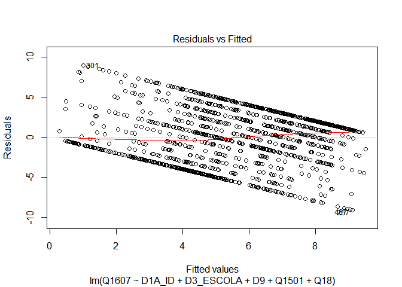
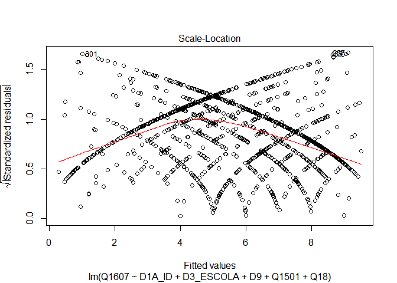
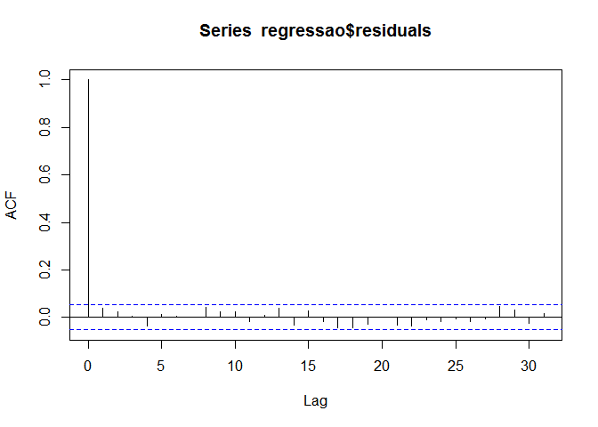
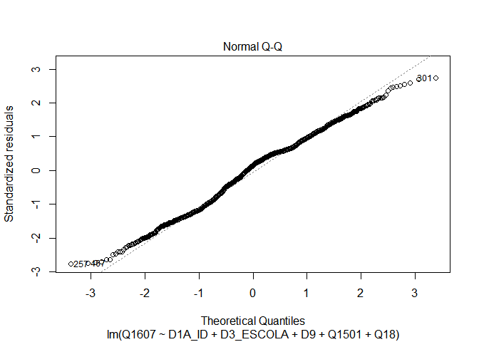

Exercicio 7
================
Pedro Buril

### No exercício anterior foram feitos alguns modelos bivariados. Agora faça uma regressão multivariada mostrando como a nota atribuída a Jair Bolsonaro (variável Q1607) pode ser explicada pelas variáveis idade (D1A\_ID), educação (D3\_ESCOLA), renda (D9), nota atribuída ao PT (Q1501) e auto-atribuição ideológica (Q18) dos respondentes. Interprete o resultado a partir das informações dadas pelo sumário da regressão.

``` r
knitr::opts_chunk$set(echo = TRUE, message = F, warning = F)

library(tidyverse)
library(poliscidata)
library(haven)

banco <- read_sav("04622.sav")
head(banco)
```

    ## # A tibble: 6 x 286
    ##   A1_Nquest DIAENTR  MESENTR ANOENTR D1A_ID D1A_FAIXAID D2_SEXO D3_ESCOLA
    ##       <dbl>   <dbl> <dbl+lb>   <dbl>  <dbl>   <dbl+lbl> <dbl+l> <dbl+lbl>
    ## 1         1      15 11 [Nov~    2018     41 4 [35 A 44] 2 [Fem~ 5 [Coleg~
    ## 2         2      15 11 [Nov~    2018     23 2 [18 A 24] 1 [Mas~ 5 [Coleg~
    ## 3         3      15 11 [Nov~    2018     21 2 [18 A 24] 2 [Fem~ 6 [Coleg~
    ## 4         4      16 11 [Nov~    2018     39 4 [35 A 44] 1 [Mas~ 3 [Ginás~
    ## 5         5      16 11 [Nov~    2018     64 6 [55 A 64] 1 [Mas~ 0 [Analf~
    ## 6         6      16 11 [Nov~    2018     45 5 [45 A 54] 2 [Fem~ 0 [Analf~
    ## # ... with 278 more variables: RAMOATIV <dbl+lbl>, RAMOCHEFEF <dbl+lbl>,
    ## #   OCUPA <dbl+lbl>, UF <dbl+lbl>, CID <dbl+lbl>, REG <dbl+lbl>, Q1 <dbl+lbl>,
    ## #   Q2 <dbl+lbl>, Q3 <dbl+lbl>, Q401 <dbl+lbl>, Q402 <dbl+lbl>, Q403 <dbl+lbl>,
    ## #   Q404 <dbl+lbl>, Q405 <dbl+lbl>, Q406 <dbl+lbl>, Q407 <dbl+lbl>,
    ## #   Q501 <dbl+lbl>, Q502 <dbl+lbl>, Q503 <dbl+lbl>, Q504 <dbl+lbl>,
    ## #   Q505 <dbl+lbl>, Q601 <dbl+lbl>, Q602 <dbl+lbl>, Q603 <dbl+lbl>,
    ## #   Q604 <dbl+lbl>, Q7 <dbl+lbl>, Q8 <dbl+lbl>, Q9 <dbl+lbl>, Q10A <dbl+lbl>,
    ## #   Q10B <dbl+lbl>, Q11 <dbl+lbl>, Q12P1_A <dbl+lbl>, Q12P1_B <dbl+lbl>,
    ## #   Q12P2_A <dbl+lbl>, Q12P2_B <dbl+lbl>, Q12G_1A <dbl+lbl>, Q12G_2 <dbl+lbl>,
    ## #   Q12S1 <dbl+lbl>, Q12S2 <dbl+lbl>, Q12CD <dbl+lbl>, Q12CD_recode <dbl+lbl>,
    ## #   Q12AL <dbl+lbl>, Q12AL_recode <dbl+lbl>, Q13A <dbl+lbl>, Q13B <dbl+lbl>,
    ## #   Q13B_2 <dbl+lbl>, Q13B2A <dbl+lbl>, Q13G1 <dbl+lbl>, Q13G2 <dbl+lbl>,
    ## #   Q13S <dbl+lbl>, Q13CD <dbl+lbl>, Q13CD_recode <dbl+lbl>, Q13AL <dbl+lbl>,
    ## #   Q13AL_recode <dbl+lbl>, Q14A <dbl+lbl>, Q14B <dbl+lbl>, Q1501 <dbl+lbl>,
    ## #   Q1502 <dbl+lbl>, Q1503 <dbl+lbl>, Q1504 <dbl+lbl>, Q1505 <dbl+lbl>,
    ## #   Q1506 <dbl+lbl>, Q1507 <dbl+lbl>, Q1508 <dbl+lbl>, Q1509 <dbl+lbl>,
    ## #   Q1510 <dbl+lbl>, Q1511 <dbl+lbl>, Q1512 <dbl+lbl>, Q1513 <dbl+lbl>,
    ## #   Q1514 <dbl+lbl>, Q1515 <dbl+lbl>, Q1516 <dbl+lbl>, Q1517 <dbl+lbl>,
    ## #   Q1518 <dbl+lbl>, Q1519 <dbl+lbl>, Q1520 <dbl+lbl>, Q1521 <dbl+lbl>,
    ## #   Q1522 <dbl+lbl>, Q1523 <dbl+lbl>, Q1524 <dbl+lbl>, Q1525 <dbl+lbl>,
    ## #   Q1526 <dbl+lbl>, Q1601 <dbl+lbl>, Q1602 <dbl+lbl>, Q1603 <dbl+lbl>,
    ## #   Q1604 <dbl+lbl>, Q1605 <dbl+lbl>, Q1606 <dbl+lbl>, Q1607 <dbl+lbl>,
    ## #   Q1608 <dbl+lbl>, Q1609 <dbl+lbl>, Q1610 <dbl+lbl>, Q1611 <dbl+lbl>,
    ## #   Q1612 <dbl+lbl>, Q1613 <dbl+lbl>, Q1614 <dbl+lbl>, Q1615 <dbl+lbl>,
    ## #   Q1616 <dbl+lbl>, Q1617 <dbl+lbl>, Q1618 <dbl+lbl>, ...

``` r
glimpse(banco)
```

    ## Rows: 2,506
    ## Columns: 286
    ## $ A1_Nquest           <dbl> 1, 2, 3, 4, 5, 6, 7, 8, 9, 10, 11, 12, 13, 14, ...
    ## $ DIAENTR             <dbl> 15, 15, 15, 16, 16, 16, 16, 17, 17, 17, 17, 17,...
    ## $ MESENTR             <dbl+lbl> 11, 11, 11, 11, 11, 11, 11, 11, 11, 11, 11,...
    ## $ ANOENTR             <dbl> 2018, 2018, 2018, 2018, 2018, 2018, 2018, 2018,...
    ## $ D1A_ID              <dbl> 41, 23, 21, 39, 64, 45, 18, 29, 25, 31, 23, 45,...
    ## $ D1A_FAIXAID         <dbl+lbl> 4, 2, 2, 4, 6, 5, 2, 3, 3, 3, 2, 5, 6, 3, 6...
    ## $ D2_SEXO             <dbl+lbl> 2, 1, 2, 1, 1, 2, 2, 1, 2, 1, 1, 1, 2, 2, 1...
    ## $ D3_ESCOLA           <dbl+lbl> 5, 5, 6, 3, 0, 0, 4, 8, 8, 6, 2, 2, 1, 2, 6...
    ## $ RAMOATIV            <dbl+lbl>  6,  4, 10,  3,  1,  7, 10,  5,  4,  7, 10,...
    ## $ RAMOCHEFEF          <dbl+lbl> 99, 99, 99, 99, 99, 99, 99, 99, 99, 99, 99,...
    ## $ OCUPA               <dbl+lbl> 2, 1, 4, 3, 3, 1, 4, 2, 1, 1, 4, 4, 4, 4, 3...
    ## $ UF                  <dbl+lbl> 12, 12, 12, 12, 12, 12, 12, 12, 12, 12, 12,...
    ## $ CID                 <dbl+lbl> 1, 1, 1, 1, 1, 1, 1, 1, 1, 1, 1, 1, 1, 1, 2...
    ## $ REG                 <dbl+lbl> 1, 1, 1, 1, 1, 1, 1, 1, 1, 1, 1, 1, 1, 1, 1...
    ## $ Q1                  <dbl+lbl> 4, 4, 4, 4, 1, 4, 4, 3, 4, 2, 3, 3, 3, 4, 3...
    ## $ Q2                  <dbl+lbl> 3, 3, 4, 3, 4, 3, 4, 3, 4, 2, 3, 3, 4, 4, 3...
    ## $ Q3                  <dbl+lbl> 2, 3, 3, 2, 1, 2, 4, 2, 4, 1, 5, 2, 3, 5, 1...
    ## $ Q401                <dbl+lbl> 3, 2, 5, 1, 4, 2, 2, 1, 2, 3, 4, 1, 2, 1, 1...
    ## $ Q402                <dbl+lbl> 1, 1, 3, 1, 1, 1, 1, 1, 1, 1, 1, 1, 1, 2, 1...
    ## $ Q403                <dbl+lbl> 5, 1, 5, 3, 5, 3, 5, 5, 1, 5, 4, 5, 2, 5, 5...
    ## $ Q404                <dbl+lbl> 1, 1, 1, 1, 1, 1, 2, 1, 1, 1, 4, 1, 3, 1, 1...
    ## $ Q405                <dbl+lbl> 3, 3, 3, 1, 1, 3, 4, 5, 1, 5, 2, 2, 5, 5, 1...
    ## $ Q406                <dbl+lbl> 1, 1, 3, 1, 4, 1, 2, 1, 2, 1, 1, 1, 2, 1, 4...
    ## $ Q407                <dbl+lbl> 1, 1, 1, 1, 1, 1, 1, 1, 1, 1, 1, 1, 1, 1, 1...
    ## $ Q501                <dbl+lbl> 3, 3, 3, 3, 4, 2, 4, 1, 2, 2, 2, 5, 3, 1, 1...
    ## $ Q502                <dbl+lbl> 1, 4, 2, 2, 2, 4, 3, 1, 1, 1, 5, 5, 2, 3, 5...
    ## $ Q503                <dbl+lbl> 2, 2, 1, 3, 1, 8, 3, 5, 2, 2, 2, 5, 3, 2, 5...
    ## $ Q504                <dbl+lbl> 3, 5, 1, 3, 3, 2, 5, 1, 4, 4, 4, 1, 3, 1, 1...
    ## $ Q505                <dbl+lbl> 3, 3, 3, 3, 4, 5, 4, 1, 5, 4, 5, 4, 3, 1, 1...
    ## $ Q601                <dbl+lbl> 1, 1, 1, 1, 1, 1, 4, 4, 2, 1, 3, 1, 2, 4, 1...
    ## $ Q602                <dbl+lbl> 1, 3, 1, 3, 3, 1, 2, 1, 1, 3, 1, 2, 4, 3, 1...
    ## $ Q603                <dbl+lbl> 1, 3, 1, 1, 1, 1, 3, 1, 1, 2, 2, 3, 3, 4, 1...
    ## $ Q604                <dbl+lbl> 1, 2, 2, 1, 1, 1, 1, 1, 2, 1, 1, 1, 4, 2, 1...
    ## $ Q7                  <dbl+lbl> 1, 1, 1, 1, 1, 1, 1, 1, 1, 1, 1, 1, 2, 3, 4...
    ## $ Q8                  <dbl+lbl> 1, 2, 3, 2, 1, 1, 3, 1, 1, 1, 1, 1, 3, 1, 1...
    ## $ Q9                  <dbl+lbl> 5, 5, 5, 5, 5, 5, 5, 5, 4, 5, 4, 5, 4, 5, 5...
    ## $ Q10A                <dbl+lbl> 5, 5, 5, 1, 1, 5, 5, 1, 5, 5, 5, 5, 5, 5, 5...
    ## $ Q10B                <dbl+lbl> 99, 99, 99, 17, 13, 99, 99, 17, 99, 99, 99,...
    ## $ Q11                 <dbl+lbl> 5, 3, 5, 5, 5, 5, 5, 5, 5, 4, 4, 4, 3, 5, 5...
    ## $ Q12P1_A             <dbl+lbl> 1, 1, 1, 1, 1, 1, 1, 1, 1, 7, 6, 1, 1, 1, 1...
    ## $ Q12P1_B             <dbl+lbl>  9,  9,  9,  9,  9,  9,  9,  9,  9, 99, 99,...
    ## $ Q12P2_A             <dbl+lbl> 1, 1, 1, 1, 1, 1, 1, 1, 1, 4, 6, 1, 1, 1, 1...
    ## $ Q12P2_B             <dbl+lbl>  2,  2,  2,  2,  2,  2,  2,  2,  2, 99, 99,...
    ## $ Q12G_1A             <dbl+lbl> 9950, 1203, 9998, 1203, 1203, 1203, 1203, 1...
    ## $ Q12G_2              <dbl+lbl> 9999, 9999, 9999, 9999, 9999, 9999, 9999, 9...
    ## $ Q12S1               <dbl+lbl> 1206, 1203, 9998, 1206, 1206, 1201, 1204, 1...
    ## $ Q12S2               <dbl+lbl> 9998, 1202, 9998, 1202, 1202, 1206, 1201, 1...
    ## $ Q12CD               <dbl+lbl> 2037, 9950, 9998, 9998, 9998, 2038, 9960,  ...
    ## $ Q12CD_recode        <dbl+lbl>   1,   4,   3,   3,   3,   1,   4,   1,   1...
    ## $ Q12AL               <dbl+lbl> 9998, 2084, 9998, 1174, 9998, 1092, 9960,  ...
    ## $ Q12AL_recode        <dbl+lbl>   3,   1,   3,   1,   3,   1,   4,   1,   1...
    ## $ Q13A                <dbl+lbl>  1,  5,  1,  1,  1,  1,  3,  1,  1,  1,  1,...
    ## $ Q13B                <dbl+lbl>  2, 99,  2,  2,  7, 98, 99,  2, 98,  1,  2,...
    ## $ Q13B_2              <dbl+lbl>  4,  5,  1,  1,  1,  1,  3,  1,  1,  1,  1,...
    ## $ Q13B2A              <dbl+lbl> 99, 99,  2,  2,  1,  2, 99,  2, 60,  1,  2,...
    ## $ Q13G1               <dbl+lbl> 9950, 9999, 1204, 1204, 1203, 1204, 9999, 1...
    ## $ Q13G2               <dbl+lbl> 9999, 9999, 1204, 1204, 1203, 1204, 9999, 1...
    ## $ Q13S                <dbl+lbl> 9950, 9999, 1203, 1201, 1203, 1202, 9999, 1...
    ## $ Q13CD               <dbl+lbl> 9950, 9999, 9998, 1175, 9998, 9998, 9999, 9...
    ## $ Q13CD_recode        <dbl+lbl>   4, 999,   3,   2,   3,   3, 999,   3,   1...
    ## $ Q13AL               <dbl+lbl> 9950, 9999, 9998, 9998,  770, 9998, 9999,  ...
    ## $ Q13AL_recode        <dbl+lbl>   4, 999,   3,   3,   3,   3, 999,   3,   3...
    ## $ Q14A                <dbl+lbl> 5, 5, 4, 5, 5, 5, 5, 5, 3, 5, 5, 2, 3, 5, 3...
    ## $ Q14B                <dbl+lbl> 5, 5, 5, 5, 5, 5, 4, 5, 4, 5, 5, 5, 1, 5, 5...
    ## $ Q1501               <dbl+lbl>  1,  0,  0,  0,  0, 10,  0, 96,  2,  0,  0,...
    ## $ Q1502               <dbl+lbl> 96,  5, 96,  0,  5,  5, 96, 96, 96,  4,  0,...
    ## $ Q1503               <dbl+lbl> 96, 96,  2, 96,  8, 96, 98, 96,  5,  2,  0,...
    ## $ Q1504               <dbl+lbl> 96, 96, 96,  0, 96, 96, 96, 96, 96,  2,  0,...
    ## $ Q1505               <dbl+lbl>  1,  0,  3,  0, 10, 10,  0, 96,  8,  5,  6,...
    ## $ Q1506               <dbl+lbl> 98, 96, 96,  0, 96,  5,  0, 96,  5,  8,  0,...
    ## $ Q1507               <dbl+lbl> 96, 96, 96,  0, 96, 96,  0, 96, 96,  6,  0,...
    ## $ Q1508               <dbl+lbl>  1,  0, 96,  0,  7, 96,  0, 96,  8,  8,  4,...
    ## $ Q1509               <dbl+lbl> 96,  0, 96,  0, 96, 96, 96, 96, 96, 96,  0,...
    ## $ Q1510               <dbl+lbl> 96, 96, 96, 96, 96, 96, 96, 96, 96, 96,  0,...
    ## $ Q1511               <dbl+lbl>  1, 96, 96,  0, 10, 96,  0, 96,  3, 96,  5,...
    ## $ Q1512               <dbl+lbl> 96,  9,  2, 10, 96,  5, 96, 10,  7,  8,  5,...
    ## $ Q1513               <dbl+lbl>  1, 96, 96,  0, 96, 96,  0, 96, 96,  1,  0,...
    ## $ Q1514               <dbl+lbl> 96, 96,  3,  0,  8, 96, 10, 96,  4,  0,  0,...
    ## $ Q1515               <dbl+lbl> 96, 96, 96,  0, 96, 96, 96, 96, 96,  0,  0,...
    ## $ Q1516               <dbl+lbl> 96, 96, 96, 96, 96, 96, 96, 96, 96,  8,  0,...
    ## $ Q1517               <dbl+lbl> 96, 96,  2,  0, 96, 96,  7, 96,  5, 96,  6,...
    ## $ Q1518               <dbl+lbl>  1, 96, 96,  0, 96,  5, 96, 96,  5,  5,  0,...
    ## $ Q1519               <dbl+lbl> 96, 96, 96, 96, 96, 96,  0, 96,  5,  2,  0,...
    ## $ Q1520               <dbl+lbl> 96, 96, 96, 96,  5,  5,  0, 96,  7,  5,  4,...
    ## $ Q1521               <dbl+lbl> 96, 96, 96,  0,  8, 96,  4, 96,  4,  8,  0,...
    ## $ Q1522               <dbl+lbl> 96, 96, 96,  0, 96, 96,  1, 96,  6,  5,  0,...
    ## $ Q1523               <dbl+lbl> 96, 96, 96, 96,  4, 96, 98, 96,  4,  2,  0,...
    ## $ Q1524               <dbl+lbl> 96, 96, 96,  0, 96, 96,  0, 96, 96,  1,  0,...
    ## $ Q1525               <dbl+lbl> 96, 96, 96,  0, 10, 96, 96, 96, 96, 96,  0,...
    ## $ Q1526               <dbl+lbl> 96, 96, 96, 96, 96, 96, 96, 96, 96,  2,  5,...
    ## $ Q1601               <dbl+lbl>  1,  0,  0,  0, 96,  5,  8,  0,  1,  8,  0,...
    ## $ Q1602               <dbl+lbl>  0,  0, 96, 96, 96, 96, 96,  0, 96,  0,  0,...
    ## $ Q1603               <dbl+lbl>  1,  0, 96,  0, 96, 96,  0,  0, 96,  0,  0,...
    ## $ Q1604               <dbl+lbl>  0,  3,  3,  0, 10,  5,  0,  5,  5,  8,  0,...
    ## $ Q1605               <dbl+lbl> 0, 0, 2, 0, 8, 5, 0, 0, 5, 0, 0, 0, 0, 0, 5...
    ## $ Q1606               <dbl+lbl>  1,  0,  0,  0, 96, 96, 98,  6,  7,  0,  7,...
    ## $ Q1607               <dbl+lbl> 10, 10,  3, 10, 10, 10, 10, 10,  8, 10, 10,...
    ## $ Q1608               <dbl+lbl>  1,  0,  0,  0, 10, 96,  6,  0,  2,  5,  8,...
    ## $ Q1609               <dbl+lbl>  1,  0, 96, 96, 96, 96, 96,  0, 96,  0,  7,...
    ## $ Q1610               <dbl+lbl>  1,  0,  1,  0, 10,  5,  0,  0,  0,  0,  0,...
    ## $ Q1611               <dbl+lbl>  1,  0, 96,  0, 96, 96,  7,  0,  3,  0,  6,...
    ## $ Q1612               <dbl+lbl>  1,  0, 96,  0, 96, 96, 96,  0, 96,  2, 96,...
    ## $ Q1613               <dbl+lbl>  1,  3, 96,  6, 96, 96,  9, 10, 96,  0,  0,...
    ## $ Q1614               <dbl+lbl>  1,  0, 96,  0, 96, 96, 96,  0, 96, 96,  0,...
    ## $ Q1615               <dbl+lbl>  1, 96, 96, 96, 96, 96, 96,  3, 96, 96, 96,...
    ## $ Q1616               <dbl+lbl>  1,  0,  1,  0, 96, 96, 96,  0, 96, 96, 96,...
    ## $ Q1617               <dbl+lbl>  1,  0,  1,  0,  8, 96, 98,  0,  3,  8,  0,...
    ## $ Q1618               <dbl+lbl>  0,  0,  0,  0,  0,  5,  0,  0,  0,  0,  0,...
    ## $ Q1619               <dbl+lbl>  1,  0, 96,  0, 96, 96, 96,  0, 96, 96, 96,...
    ## $ Q1620               <dbl+lbl>  1,  0, 96,  0, 96, 96, 96,  0,  3,  0,  0,...
    ## $ Q1621               <dbl+lbl> 1, 0, 0, 0, 8, 0, 0, 0, 1, 0, 0, 0, 0, 0, 0...
    ## $ Q1701               <dbl+lbl>  0,  0,  0,  0,  0,  5,  0,  0,  2, 10,  1,...
    ## $ Q1702               <dbl+lbl>  0,  0, 96, 96,  5,  0, 96, 96,  8,  8, 96,...
    ## $ Q1703               <dbl+lbl>  1,  0,  0,  0,  5,  0,  4, 96, 10,  7,  3,...
    ## $ Q1704               <dbl+lbl>  0, 96, 96,  0, 96,  0, 96, 96,  5, 96,  6,...
    ## $ Q1705               <dbl+lbl>  0,  0, 10,  4,  5,  5,  2, 96,  8,  7,  7,...
    ## $ Q1706               <dbl+lbl>  2, 96, 96,  0, 96,  0, 96,  2,  4,  5,  6,...
    ## $ Q1707               <dbl+lbl>  2,  0, 96, 96, 96,  0, 96, 96,  3,  5, 96,...
    ## $ Q1708               <dbl+lbl>  2,  0, 96,  0,  4,  0,  3,  5,  1,  1,  5,...
    ## $ Q1709               <dbl+lbl>  3,  0, 96, 96, 96,  0, 96,  5,  2, 96,  6,...
    ## $ Q1710               <dbl+lbl>  0, 96, 96,  0,  5,  0, 96, 96,  6, 96, 96,...
    ## $ Q1711               <dbl+lbl>  2,  0, 96,  0, 10,  0, 96, 96,  6,  6,  7,...
    ## $ Q1712               <dbl+lbl>  4,  8,  0, 10,  5,  5, 96, 10,  3,  3,  5,...
    ## $ Q1713               <dbl+lbl>  2,  0, 96,  1, 96,  0, 96,  2,  5, 96, 96,...
    ## $ Q1714               <dbl+lbl>  2,  0,  0,  1,  5,  5,  8,  0, 10, 10,  3,...
    ## $ Q1715               <dbl+lbl> 96, 96, 96, 96, 96,  0, 96, 96,  3, 96, 96,...
    ## $ Q1716               <dbl+lbl>  2,  0, 96,  0,  4,  0, 96, 96,  4,  8, 96,...
    ## $ Q1717               <dbl+lbl>  2,  0,  0,  3,  4,  5,  4, 96,  6,  6,  6,...
    ## $ Q1718               <dbl+lbl>  2,  0, 96,  0,  4,  0, 96, 96,  3,  5, 96,...
    ## $ Q1719               <dbl+lbl>  2,  0, 96,  0, 96,  0, 96, 96,  7,  7, 96,...
    ## $ Q1720               <dbl+lbl>  2,  0, 10,  0,  5,  0,  9, 96,  8,  8,  4,...
    ## $ Q1721               <dbl+lbl>  2,  0, 96,  0,  0,  0,  5, 96,  2, 96,  4,...
    ## $ Q1722               <dbl+lbl>  2,  0, 96, 96,  0,  0, 96, 96,  1,  3, 96,...
    ## $ Q1723               <dbl+lbl>  2,  0, 96,  6,  8,  0,  7,  2,  7,  3, 96,...
    ## $ Q1724               <dbl+lbl>  0,  0,  0, 96, 96,  0, 96,  0,  5, 96, 96,...
    ## $ Q1725               <dbl+lbl>  2, 96, 96, 96, 96,  0, 96, 96,  7, 96, 96,...
    ## $ Q1726               <dbl+lbl>  1,  0, 96,  0, 96,  0, 96,  2,  4, 96,  4,...
    ## $ Q18                 <dbl+lbl> 10, 10, 10, 10, 10, 10,  7,  0, 10, 10, 10,...
    ## $ Q21                 <dbl+lbl> 5, 4, 5, 4, 5, 5, 5, 5, 4, 5, 2, 4, 4, 4, 5...
    ## $ Q22A                <dbl+lbl> 2, 2, 2, 2, 1, 2, 2, 2, 2, 2, 2, 2, 2, 2, 2...
    ## $ Q22B                <dbl+lbl>  2,  1,  2,  1, 99,  1,  2,  2,  2,  1,  2,...
    ## $ Q22C                <dbl+lbl> 99, 17, 99, 17, 17, 98, 99, 99, 99, 50, 99,...
    ## $ Q22D                <dbl+lbl> 99,  2, 99,  2,  2, 99, 99, 99, 99,  2, 99,...
    ## $ P1                  <dbl+lbl> 1, 1, 1, 1, 1, 2, 1, 1, 1, 1, 1, 1, 1, 1, 2...
    ## $ P1A                 <dbl+lbl>  13,  13,  13,  13,  13, 999,  13,  13,  13...
    ## $ D5_1                <dbl+lbl> 2, 2, 2, 2, 2, 2, 2, 1, 2, 1, 2, 2, 2, 2, 2...
    ## $ D5_2                <dbl+lbl> 2, 2, 2, 2, 2, 2, 2, 2, 2, 1, 2, 2, 2, 2, 2...
    ## $ P201                <dbl+lbl> 2, 2, 2, 2, 1, 2, 2, 2, 2, 2, 2, 2, 2, 2, 2...
    ## $ P202                <dbl+lbl> 2, 2, 2, 2, 1, 2, 2, 2, 2, 2, 2, 2, 2, 2, 2...
    ## $ P203                <dbl+lbl> 2, 2, 2, 2, 1, 2, 2, 2, 2, 2, 2, 2, 2, 2, 2...
    ## $ P204                <dbl+lbl> 2, 2, 2, 2, 2, 2, 2, 2, 2, 1, 2, 2, 2, 2, 2...
    ## $ P205                <dbl+lbl> 2, 2, 1, 2, 2, 2, 2, 2, 2, 2, 2, 2, 2, 2, 2...
    ## $ P206                <dbl+lbl> 1, 2, 1, 2, 1, 1, 1, 2, 2, 1, 1, 2, 2, 2, 2...
    ## $ P207                <dbl+lbl> 2, 2, 2, 2, 1, 2, 2, 2, 2, 2, 2, 1, 2, 2, 1...
    ## $ P208                <dbl+lbl> 2, 2, 2, 2, 2, 2, 2, 2, 2, 1, 2, 2, 2, 2, 2...
    ## $ P209                <dbl+lbl> 2, 2, 2, 2, 2, 2, 1, 2, 2, 2, 2, 2, 2, 2, 1...
    ## $ P210                <dbl+lbl> 2, 2, 2, 2, 2, 2, 2, 2, 2, 2, 2, 2, 2, 2, 2...
    ## $ P211                <dbl+lbl> 2, 2, 2, 2, 2, 2, 2, 2, 2, 2, 2, 2, 2, 2, 2...
    ## $ P212                <dbl+lbl> 2, 2, 2, 2, 2, 2, 2, 2, 2, 1, 2, 2, 2, 2, 2...
    ## $ P213                <dbl+lbl> 2, 2, 2, 2, 2, 2, 2, 2, 2, 2, 2, 2, 2, 2, 2...
    ## $ P214                <dbl+lbl> 2, 2, 2, 2, 1, 2, 2, 2, 2, 2, 2, 1, 2, 2, 2...
    ## $ P215                <dbl+lbl> 2, 2, 2, 2, 2, 2, 2, 2, 2, 2, 2, 2, 2, 2, 2...
    ## $ P216                <dbl+lbl> 2, 2, 2, 2, 2, 2, 2, 2, 2, 2, 2, 2, 2, 2, 2...
    ## $ P217                <dbl+lbl> 2, 2, 1, 2, 1, 2, 2, 2, 2, 2, 2, 1, 2, 2, 2...
    ## $ P301                <dbl+lbl> 5, 2, 1, 2, 2, 1, 3, 6, 2, 2, 2, 5, 2, 2, 6...
    ## $ P302                <dbl+lbl> 1, 2, 1, 2, 2, 2, 1, 1, 2, 2, 2, 4, 2, 1, 1...
    ## $ P303                <dbl+lbl> 1, 2, 2, 2, 2, 1, 1, 2, 1, 2, 1, 2, 2, 2, 6...
    ## $ P304                <dbl+lbl> 6, 2, 6, 6, 6, 6, 6, 6, 2, 6, 2, 5, 3, 6, 6...
    ## $ P305                <dbl+lbl> 6, 1, 6, 6, 2, 6, 6, 6, 1, 6, 2, 4, 2, 6, 6...
    ## $ P306                <dbl+lbl> 5, 2, 2, 6, 2, 2, 3, 6, 5, 2, 1, 4, 2, 5, 2...
    ## $ P307                <dbl+lbl> 5, 6, 2, 6, 5, 6, 2, 6, 6, 5, 5, 6, 5, 6, 6...
    ## $ P308                <dbl+lbl> 6, 5, 5, 6, 6, 6, 2, 6, 6, 6, 5, 6, 5, 6, 6...
    ## $ P309                <dbl+lbl> 1, 2, 2, 2, 2, 1, 1, 1, 2, 6, 2, 3, 2, 2, 6...
    ## $ P310                <dbl+lbl> 6, 2, 6, 6, 2, 6, 4, 6, 5, 6, 5, 2, 3, 2, 6...
    ## $ P311                <dbl+lbl> 5, 6, 6, 6, 2, 1, 2, 6, 6, 6, 6, 6, 3, 6, 6...
    ## $ P312                <dbl+lbl> 1, 2, 2, 6, 2, 1, 1, 1, 5, 2, 2, 2, 2, 1, 6...
    ## $ P401                <dbl+lbl> 3, 1, 1, 4, 1, 1, 3, 4, 3, 3, 2, 4, 3, 3, 3...
    ## $ P402                <dbl+lbl> 1, 3, 1, 4, 1, 3, 1, 1, 3, 3, 2, 3, 2, 1, 3...
    ## $ P403                <dbl+lbl> 1, 1, 4, 1, 1, 1, 3, 1, 2, 4, 1, 2, 2, 1, 3...
    ## $ P404                <dbl+lbl> 3, 1, 3, 4, 3, 4, 4, 4, 3, 4, 2, 4, 4, 3, 3...
    ## $ P405                <dbl+lbl> 4, 3, 3, 4, 1, 4, 2, 3, 3, 4, 2, 3, 2, 3, 3...
    ## $ P406                <dbl+lbl> 3, 3, 3, 4, 1, 1, 4, 4, 3, 4, 2, 3, 2, 3, 3...
    ## $ P407                <dbl+lbl> 4, 3, 4, 4, 3, 4, 4, 4, 4, 4, 3, 4, 4, 3, 3...
    ## $ P408                <dbl+lbl> 4, 3, 4, 4, 3, 4, 4, 4, 4, 4, 2, 4, 4, 3, 3...
    ## $ P409                <dbl+lbl> 1, 1, 3, 1, 1, 1, 1, 1, 2, 4, 2, 2, 3, 1, 3...
    ## $ P410                <dbl+lbl> 3, 3, 3, 4, 1, 4, 2, 4, 3, 4, 2, 2, 3, 3, 3...
    ## $ P411                <dbl+lbl> 3, 4, 4, 4, 1, 4, 3, 4, 4, 4, 4, 4, 3, 3, 3...
    ## $ P412                <dbl+lbl> 1, 3, 3, 4, 1, 4, 2, 1, 4, 3, 2, 3, 2, 3, 3...
    ## $ P5                  <dbl+lbl> 2, 2, 2, 2, 1, 1, 2, 2, 2, 2, 1, 2, 2, 2, 2...
    ## $ P601                <dbl+lbl> 0, 0, 0, 0, 0, 0, 9, 0, 1, 0, 4, 0, 0, 5, 0...
    ## $ P602                <dbl+lbl> 3, 0, 0, 0, 0, 0, 5, 0, 0, 0, 3, 4, 0, 5, 0...
    ## $ P603                <dbl+lbl> 0, 0, 0, 0, 0, 5, 1, 0, 4, 0, 4, 1, 0, 5, 0...
    ## $ P604                <dbl+lbl>  0,  0,  0,  0,  0, 10,  7,  0,  5,  0,  3,...
    ## $ P605                <dbl+lbl>  2,  0,  0,  0,  0, 10,  2,  0,  2,  0,  5,...
    ## $ P606                <dbl+lbl>  0,  0,  0,  0, 10,  0,  1,  0,  2,  0,  2,...
    ## $ P607                <dbl+lbl>  1,  3,  2,  0, 10, 10,  5,  0,  3,  8,  5,...
    ## $ P608                <dbl+lbl>  1,  3,  1,  0, 10, 10,  2,  0,  3,  8,  5,...
    ## $ P609                <dbl+lbl>  1,  5,  5,  0,  0,  5,  0,  0,  0,  5,  8,...
    ## $ P610                <dbl+lbl>  0, 10,  0,  0,  0,  0,  0,  0,  4,  0,  3,...
    ## $ P611                <dbl+lbl>  0,  0,  0,  0, 98,  0,  4,  0,  5,  0,  6,...
    ## $ P612                <dbl+lbl>  3,  0,  0,  0, 99,  0,  9,  0,  2,  5,  5,...
    ## $ P613                <dbl+lbl>  2,  0,  0,  0, 10, 10,  9,  0,  0,  0,  8,...
    ## $ P614                <dbl+lbl> 2, 0, 0, 0, 0, 5, 6, 0, 0, 0, 6, 2, 0, 5, 0...
    ## $ P615                <dbl+lbl>  0,  0,  0,  0,  0, 10,  2,  0,  0,  0,  5,...
    ## $ P616                <dbl+lbl> 3, 0, 5, 0, 0, 0, 3, 0, 2, 0, 8, 0, 0, 5, 0...
    ## $ P7_aberta_agregada  <dbl+lbl>  70, 998,  50,  72, 998, 998, 998,  72, 998...
    ## $ P8                  <dbl+lbl> 8, 2, 2, 1, 2, 1, 8, 1, 3, 1, 1, 2, 8, 8, 8...
    ## $ P9                  <dbl+lbl> 2, 1, 2, 1, 8, 2, 8, 2, 1, 1, 1, 2, 8, 8, 8...
    ## $ P1001               <dbl+lbl> 1, 1, 2, 1, 5, 1, 2, 1, 1, 1, 5, 1, 2, 1, 1...
    ## $ P1002               <dbl+lbl> 1, 2, 4, 1, 1, 1, 1, 1, 1, 2, 5, 1, 2, 1, 1...
    ## $ P1003               <dbl+lbl> 1, 4, 1, 2, 3, 1, 3, 1, 2, 2, 1, 4, 4, 2, 2...
    ## $ P1004               <dbl+lbl> 1, 1, 4, 5, 1, 1, 3, 1, 1, 1, 1, 1, 5, 2, 1...
    ## $ P1101               <dbl+lbl> 1, 1, 2, 1, 1, 1, 2, 1, 2, 4, 1, 1, 2, 5, 1...
    ## $ P1102               <dbl+lbl> 1, 1, 1, 1, 1, 1, 1, 1, 2, 1, 5, 1, 2, 1, 1...
    ## $ P1103               <dbl+lbl> 1, 1, 4, 1, 5, 1, 3, 1, 4, 2, 4, 1, 3, 8, 1...
    ## $ P1104               <dbl+lbl> 1, 1, 5, 1, 1, 1, 4, 5, 1, 1, 2, 1, 2, 5, 1...
    ## $ P1105               <dbl+lbl> 1, 1, 5, 1, 5, 1, 4, 5, 1, 1, 5, 1, 4, 5, 5...
    ## $ P12                 <dbl+lbl> 1, 1, 1, 1, 1, 1, 1, 1, 1, 1, 1, 1, 1, 1, 1...
    ## $ P13_aberta_agregada <dbl+lbl>  20,  11,  10,  10,  10,  10,  25,  20, 998...
    ## $ P14A                <dbl+lbl>  2, 99,  1, 99,  3, 99,  2, 99,  2, 99,  2,...
    ## $ P14B                <dbl+lbl> 99,  2, 99,  1, 99,  2, 99,  4, 99,  2, 99,...
    ## $ P15                 <dbl+lbl> 2, 1, 1, 2, 8, 2, 8, 2, 2, 2, 1, 2, 8, 1, 2...
    ## $ P1601               <dbl+lbl> 10, 10,  7,  9, 10, 10,  5,  7,  5,  5, 10,...
    ## $ P1602               <dbl+lbl>  2,  1,  3,  1, 10,  5,  2,  1,  2,  2,  8,...
    ## $ P1603               <dbl+lbl> 10,  1,  4,  1, 10,  5,  3,  1,  2,  6,  9,...
    ## $ P1604               <dbl+lbl> 10,  1,  2,  1, 10, 10,  3,  1,  5,  3,  8,...
    ## $ P1605               <dbl+lbl>  2, 10,  3,  1, 10,  5,  1,  1,  3,  3, 10,...
    ## $ P1606               <dbl+lbl>  2, 10,  5,  1, 10,  5,  3,  1,  5,  4,  9,...
    ## $ P1607               <dbl+lbl>  2, 10,  6,  1, 10, 10,  2,  1,  2,  4,  9,...
    ## $ P1608               <dbl+lbl>  2,  1,  2,  1, 10, 10,  1,  1,  1,  6,  7,...
    ## $ P1609               <dbl+lbl> 10, 10,  4,  1, 10,  5,  8,  1,  2,  6,  8,...
    ## $ P1610               <dbl+lbl> 10, 10,  5,  1, 10, 10,  1,  1,  3,  5,  9,...
    ## $ P1611               <dbl+lbl> 10,  1,  6,  1, 10,  5,  5,  1,  6,  6,  5,...
    ## $ P1701               <dbl+lbl> 5, 5, 5, 5, 3, 4, 3, 5, 5, 1, 1, 5, 5, 5, 5...
    ## $ P1702               <dbl+lbl> 1, 1, 1, 1, 3, 3, 1, 1, 1, 1, 1, 1, 1, 5, 1...
    ## $ P1703               <dbl+lbl> 1, 5, 1, 5, 3, 4, 5, 5, 5, 5, 2, 5, 5, 5, 4...
    ## $ P1704               <dbl+lbl> 5, 1, 5, 1, 3, 1, 5, 5, 1, 1, 4, 1, 2, 2, 1...
    ## $ P1705               <dbl+lbl> 1, 2, 1, 1, 3, 1, 8, 5, 2, 3, 2, 5, 4, 5, 5...
    ## $ P1706               <dbl+lbl> 1, 1, 2, 1, 1, 1, 8, 1, 1, 1, 1, 1, 1, 1, 5...
    ## $ P1707               <dbl+lbl> 5, 2, 4, 5, 3, 2, 8, 2, 2, 4, 4, 5, 4, 1, 1...
    ## $ P1708               <dbl+lbl> 1, 4, 1, 1, 3, 2, 8, 1, 2, 4, 4, 3, 2, 5, 5...
    ## $ P1709               <dbl+lbl> 5, 5, 4, 5, 3, 2, 5, 5, 4, 4, 5, 4, 3, 5, 5...
    ## $ P1710               <dbl+lbl> 5, 2, 4, 5, 1, 4, 8, 5, 2, 5, 2, 1, 5, 1, 5...
    ## $ P1711               <dbl+lbl> 1, 1, 1, 1, 3, 4, 5, 5, 1, 1, 2, 1, 2, 1, 5...
    ## $ P1712               <dbl+lbl> 1, 4, 1, 1, 3, 2, 8, 1, 2, 1, 2, 1, 2, 2, 5...
    ## $ P1713               <dbl+lbl> 5, 2, 2, 5, 3, 2, 3, 1, 1, 1, 5, 1, 5, 2, 1...
    ## $ P18                 <dbl+lbl> 5, 2, 2, 5, 8, 4, 1, 5, 2, 5, 1, 5, 8, 1, 5...
    ## $ P19                 <dbl+lbl> 1, 1, 1, 1, 1, 1, 1, 1, 1, 3, 1, 1, 5, 5, 3...
    ## $ P20                 <dbl+lbl> 1, 1, 1, 1, 1, 1, 1, 1, 2, 1, 1, 1, 2, 1, 1...
    ## $ P2101               <dbl+lbl> 5, 1, 5, 5, 1, 2, 5, 5, 4, 5, 5, 5, 2, 5, 5...
    ## $ P2102               <dbl+lbl> 5, 4, 5, 5, 3, 5, 5, 5, 5, 5, 5, 5, 1, 5, 1...
    ## $ P2103               <dbl+lbl> 5, 5, 5, 5, 3, 2, 1, 5, 5, 5, 5, 5, 4, 5, 5...
    ## $ P2104               <dbl+lbl> 5, 2, 5, 5, 1, 2, 5, 5, 5, 5, 5, 5, 5, 5, 5...
    ## $ P2105               <dbl+lbl> 5, 5, 5, 5, 1, 2, 1, 5, 1, 5, 5, 5, 4, 5, 5...
    ## $ P2106               <dbl+lbl> 1, 1, 2, 1, 5, 2, 8, 1, 2, 1, 4, 1, 2, 1, 1...
    ## $ P22                 <dbl+lbl> 4, 4, 4, 4, 1, 4, 4, 4, 4, 4, 4, 4, 4, 4, 3...
    ## $ P24                 <dbl+lbl> 1, 2, 2, 1, 1, 2, 2, 2, 2, 2, 1, 2, 2, 2, 2...
    ## $ P25                 <dbl+lbl> 10,  1,  4,  1,  5,  2,  5,  8,  2,  1,  2,...
    ## $ P26                 <dbl+lbl> 999,   1,   1,   3,   3,   7,   4,   3,   1...
    ## $ P27                 <dbl+lbl>  2, 12,  2,  2,  2,  4, 98,  8,  4,  7,  1,...
    ## $ P28                 <dbl+lbl> 2, 2, 1, 2, 1, 2, 8, 2, 2, 2, 2, 1, 2, 1, 2...
    ## $ P28A                <dbl+lbl> 3, 2, 4, 4, 2, 4, 3, 4, 4, 4, 4, 5, 4, 4, 3...
    ## $ P28B                <dbl+lbl> 999, 999,   2, 999,   4, 999, 999, 999, 999...
    ## $ P29                 <dbl+lbl> 2, 2, 1, 1, 2, 2, 2, 2, 1, 2, 1, 2, 2, 2, 2...
    ## $ P30                 <dbl+lbl> 2, 1, 1, 2, 1, 1, 2, 2, 2, 1, 1, 1, 1, 2, 2...
    ## $ D4                  <dbl+lbl> 1, 2, 3, 2, 3, 2, 3, 2, 2, 3, 3, 3, 3, 2, 3...
    ## $ D7                  <dbl+lbl>  3, 10, 11,  3, 16,  1, 98,  3,  3,  1, 16,...
    ## $ D8                  <dbl+lbl>    5, 9999, 9999,    5, 9999,    2, 9999,  ...
    ## $ D8A                 <dbl+lbl>   3, 999, 999,   3, 999,   3, 999,   3,   3...
    ## $ D6                  <dbl+lbl>   1, 999, 999,   1, 999,   2, 999,   1,   1...
    ## $ D9                  <dbl+lbl>    5000,   12000,   40000,    1500,     954...
    ## $ D9A                 <dbl+lbl> 999, 999, 999, 999, 999, 999,  98, 999, 999...
    ## $ D9B_FAIXA_RENDAF    <dbl+lbl>  4,  5,  7,  2,  1,  1, 98,  3,  3,  3,  2,...
    ## $ D11                 <dbl+lbl> 3, 4, 2, 4, 3, 3, 2, 5, 5, 2, 2, 6, 4, 2, 5...
    ## $ D10                 <dbl+lbl>  5,  3,  3,  3,  5,  3,  5,  5,  5,  5,  5,...
    ## $ D10A                <dbl+lbl>  100, 9999, 9999, 9999,    1, 9999,    8,  ...
    ## $ D12                 <dbl+lbl> 1, 2, 8, 5, 5, 9, 8, 7, 8, 8, 8, 7, 8, 8, 8...
    ## $ D12A                <dbl+lbl> 2, 2, 2, 2, 8, 1, 2, 5, 2, 2, 2, 1, 2, 2, 2...
    ## $ D14                 <dbl+lbl> 1, 1, 1, 1, 1, 1, 1, 1, 1, 1, 1, 1, 1, 1, 1...
    ## $ D15                 <dbl+lbl> 2, 2, 2, 2, 2, 2, 1, 2, 2, 2, 2, 2, 2, 2, 2...
    ## $ D16                 <dbl+lbl> 7, 1, 8, 1, 1, 3, 1, 1, 1, 3, 1, 1, 7, 1, 1...
    ## $ D20                 <dbl+lbl> 3, 3, 2, 5, 3, 3, 2, 4, 4, 3, 8, 1, 4, 2, 4...
    ## $ DIAANIVER           <dbl> 5, 3, 11, 3, 17, 5, 4, 18, 25, 3, 15, 24, 7, 14...
    ## $ MESANIVER           <dbl+lbl> 12,  3, 12, 11,  3,  2, 11,  4, 10, 12,  2,...
    ## $ ANOANIVER           <dbl> 1977, 1995, 1997, 1979, 1954, 1973, 2000, 1989,...
    ## $ A3                  <dbl+lbl> 1, 1, 1, 1, 1, 1, 1, 1, 1, 1, 1, 1, 1, 1, 1...

``` r
banco_selecionado <- banco %>% 
  select(Q1607, D1A_ID, D3_ESCOLA, D9, Q1501, Q18, P26) %>%
  filter(Q1607 <= 11) %>%
  filter(D9 < 9999998) %>%
  filter(Q1501 <= 10) %>%
  filter(Q18 <= 10) %>%
  filter(P26 < 98) 

banco_selecionado$P26 <- as.numeric(banco_selecionado$P26)

regressao <- lm(Q1607 ~ D1A_ID + D3_ESCOLA + D9 + Q1501 + Q18, data = banco_selecionado)
summary(regressao)
```

    ## 
    ## Call:
    ## lm(formula = Q1607 ~ D1A_ID + D3_ESCOLA + D9 + Q1501 + Q18, data = banco_selecionado)
    ## 
    ## Residuals:
    ##     Min      1Q  Median      3Q     Max 
    ## -9.1189 -2.5351  0.5336  2.1220  8.9946 
    ## 
    ## Coefficients:
    ##               Estimate Std. Error t value Pr(>|t|)    
    ## (Intercept)  5.695e+00  4.891e-01  11.644   <2e-16 ***
    ## D1A_ID       7.970e-03  6.332e-03   1.259   0.2084    
    ## D3_ESCOLA   -1.461e-01  4.593e-02  -3.181   0.0015 ** 
    ## D9          -3.421e-05  2.809e-05  -1.218   0.2235    
    ## Q1501       -4.217e-01  2.411e-02 -17.491   <2e-16 ***
    ## Q18          3.248e-01  2.687e-02  12.086   <2e-16 ***
    ## ---
    ## Signif. codes:  0 '***' 0.001 '**' 0.01 '*' 0.05 '.' 0.1 ' ' 1
    ## 
    ## Residual standard error: 3.296 on 1370 degrees of freedom
    ## Multiple R-squared:  0.2949, Adjusted R-squared:  0.2924 
    ## F-statistic: 114.6 on 5 and 1370 DF,  p-value: < 2.2e-16

Quase todas as variáveis tiveram relevância estatística, com exceção de
D1A\_ID e D9, sugerindo que nem Renda, nem idade são fatores relevantes
para avaliar o governo. O R² e o R² ajustado não foram tão altos assim,
mesmo inserido várias variáveis no modelo. Dessa forma, talvez tenham
algumas variáveis que necessitem ser inseridas no modelo. As variáveis
D9, Q1501, Q18 tem um erro padrão menor, sugerindo que os casos dessas
variáveis estão mais próximas da linha ajustada.

### Em que medida os resultados se mantém ou se alteram quando comparados com os resultados do exercício anterior, quando foram utilizadas apenas regressões bivariadas?

Mudou de diversas formas. Variáveis que eram estatísticamente relevantes
(como D1A\_ID, por exemplo) deixaram de ser e variáveis que não eram
tiveram uma significância maior quando inserido mais variáveis. O valor
do R² e do R² ajustado aumentou bastante, já que antes o valor era
extremamente baixo (0.006\<). O valor dos Estimates e dos Standard Error
também mudaram para todas as variáveis. Acredito que isso tenha ocorrido
por que a reta da regressão tenha “mudado de local” a partir do momento
que se insere mais variáveis. (x = a + yB + zB + jB + e).

### A partir da exposição de gráficos e testes, avalie se o modelo se adequa aos pressupostos que uma regressão linear exige.

``` r
plot(regressao, 1)
```

<!-- -->

``` r
plot(regressao, 3)
```

<!-- -->

``` r
library(lmtest)
bptest(regressao)
```

    ## 
    ##  studentized Breusch-Pagan test
    ## 
    ## data:  regressao
    ## BP = 65.797, df = 5, p-value = 7.659e-13

``` r
library(car)
ncvTest(regressao)
```

    ## Non-constant Variance Score Test 
    ## Variance formula: ~ fitted.values 
    ## Chisquare = 25.69273, Df = 1, p = 4.0033e-07

``` r
acf(regressao$residuals)
```

<!-- -->

``` r
plot(regressao, 2)
```

<!-- -->

``` r
library(MASS)
sresid <- studres(regressao)
shapiro.test(sresid)
```

    ## 
    ##  Shapiro-Wilk normality test
    ## 
    ## data:  sresid
    ## W = 0.98894, p-value = 1.063e-08

O pressuposto da linearidade não é satisfeito neste caso. O p-valor
desse teste foi alto. Dessa forma, o resultado sugere que não podemos
rejeitar a hipótese nula. Logo, o pressuposto da Homocedasticidade está
satisfeito. O teste de autocorrelação entre os casos foi bom. As linhas
verticais ficaram dentro do intervalo delimitado pelas linhas azuis. Os
pontos estão próximos da linha diagonal, sugerindo a normalidade dos
resíduos. P-valor alto. A hipótese nula não pode ser descartada.

### Caso algum pressuposto não seja satisfeito, quais são as consequências específicas para o modelo estimado?

A falta de um desses pressupostos irá afetar sobretudo:

1)  A estimação dos coeficientes do modelo
2)  os testes e os intervalos de confiança
3)  a eficiência da estimativa dos coeficientes
4)  a utilização do modelo para efeitos preditivos por conta da falta de
    eficiência dos estimadores dos coeficientes
5)  as inferências geradas do modelo

### Considerando o 4o hurdle do livro *Fundamentals…*, faça um modelo de regressão extra adicionando uma variável **numérica** que foi omitida do modelo anterior, mas que possa ter relação causal com a variável dependente (e talvez alguma associação com as independentes anteriores). Justifique a variável extra e analise o resultado.

``` r
regressao1 <- lm(Q1607 ~ D1A_ID + D3_ESCOLA + D9 + Q1501 + Q18 + P26, data = banco_selecionado)

summary(regressao1)
```

    ## 
    ## Call:
    ## lm(formula = Q1607 ~ D1A_ID + D3_ESCOLA + D9 + Q1501 + Q18 + 
    ##     P26, data = banco_selecionado)
    ## 
    ## Residuals:
    ##     Min      1Q  Median      3Q     Max 
    ## -9.3278 -2.5004  0.4986  2.1248  8.8545 
    ## 
    ## Coefficients:
    ##               Estimate Std. Error t value Pr(>|t|)    
    ## (Intercept)  5.777e+00  4.874e-01  11.853  < 2e-16 ***
    ## D1A_ID       1.054e-02  6.342e-03   1.662 0.096833 .  
    ## D3_ESCOLA   -1.623e-01  4.593e-02  -3.533 0.000424 ***
    ## D9          -3.130e-05  2.797e-05  -1.119 0.263338    
    ## Q1501       -4.166e-01  2.404e-02 -17.332  < 2e-16 ***
    ## Q18          3.264e-01  2.675e-02  12.201  < 2e-16 ***
    ## P26         -1.203e-02  3.272e-03  -3.678 0.000244 ***
    ## ---
    ## Signif. codes:  0 '***' 0.001 '**' 0.01 '*' 0.05 '.' 0.1 ' ' 1
    ## 
    ## Residual standard error: 3.281 on 1369 degrees of freedom
    ## Multiple R-squared:  0.3018, Adjusted R-squared:  0.2988 
    ## F-statistic: 98.64 on 6 and 1369 DF,  p-value: < 2.2e-16

De acordo com o 4º hurdle do livro, temos que controlar todas as
variáveis confounding que possam ter associação com X e Y. Inseri no
modelo a variável P26, que avalia sobre informação política via redes
sociais. Como o disparo de mensagens era uma prática comum na gestão
Bolsonaro, quis analisar se a informação obtida via rede social
(independente de qual rede social) influenciaria na avaliação do
gorveno. Filtrei os NR e o NS, que corresponderiam aos missing cases. O
modelo sugere que a variável tem relevância estátistica na avaliação do
governo, pois o p-valor é muito baixo e tem bastantes astericos.

### Compare o resultado obtido com o modelo e conclusões anteriores.

O r² e o r² ajustado do meu modelo foram maiores. Isso pode ser causado
por que o novo modelo pode explicar melhor a variável dependente ou
apenas por que eu inseri mais uma variável independente. Acredito que
pelo tamanho do aumento ser muito pequeno, a segunda justificativa
explicaria melhor. O p-valor da variável 26 foi estatísticamente
relevante, sugerindo que se informar via rede social teria um impacto
estátistico negativo na avaliação do governo Bolsonaro, controlando
todas as outras variáveis independete.
