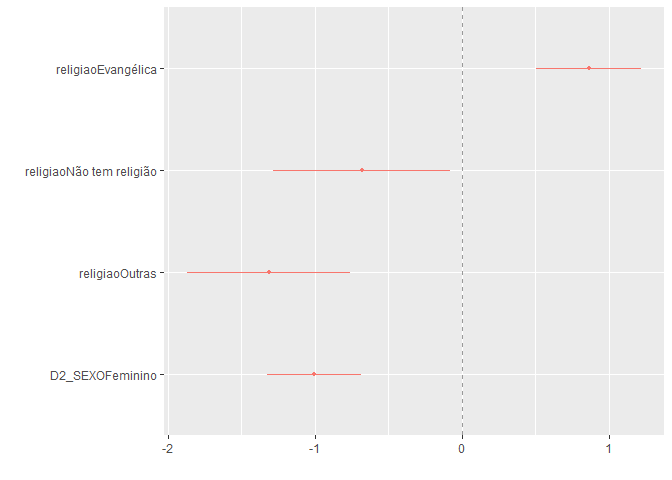

Exercício 8
================
Pedro Buril

### Continuaremos com a utilização dos dados do ESEB2018. Carregue o banco da mesma forma que nos exercicios anteriores

``` r
knitr::opts_chunk$set(echo = TRUE, message = F, warning = F)

library(tidyverse)
library(haven)
library(scales)
library(dotwhisker)
library(broom)
library(dplyr)

link <- "https://github.com/MartinsRodrigo/Analise-de-dados/blob/master/04622.sav?raw=true"

download.file(link, "04622.sav", mode = "wb")

banco <- read_sav("04622.sav") 

banco <- banco %>%
  mutate(D2_SEXO = as_factor(D2_SEXO),
         D10 = as_factor(D10)) %>%
  
  filter(Q1607 < 11)
```

### Começaremos a utilizar no modelo de regressão variáveis qualitativas/categóricas. A primeira delas é sexo (D2\_SEXO). Represente esta variável graficamente.

``` r
ggplot(banco, aes(D2_SEXO)) +
  geom_bar()
```

<!-- -->

### Represente graficamente a associação entre sexo e nota atribuida a Bolsonaro (Q1607)

``` r
ggplot(banco, aes(Q1607, fill = D2_SEXO)) +
  geom_density(alpha = 0.5)
```

<!-- -->

``` r
ggplot(banco, aes(D2_SEXO, Q1607)) +
  geom_boxplot()
```

<!-- -->

### Teste a associação entre sexo e aprovação de Bolsonaro. Qual é sua conclusão?

``` r
banco %>%
  group_by(D2_SEXO) %>%
  summarise(median(Q1607),
            mean(Q1607),
            sd(Q1607),
            n = n())
```

    ## # A tibble: 2 x 5
    ##   D2_SEXO   `median(Q1607)` `mean(Q1607)` `sd(Q1607)`     n
    ##   <fct>               <dbl>         <dbl>       <dbl> <int>
    ## 1 Masculino               7          6.02        3.78  1120
    ## 2 Feminino                5          5.06        4.08  1206

``` r
t.test(Q1607 ~ D2_SEXO, data = banco)
```

    ## 
    ##  Welch Two Sample t-test
    ## 
    ## data:  Q1607 by D2_SEXO
    ## t = 5.88, df = 2324, p-value = 4.693e-09
    ## alternative hypothesis: true difference in means is not equal to 0
    ## 95 percent confidence interval:
    ##  0.6392909 1.2790608
    ## sample estimates:
    ## mean in group Masculino  mean in group Feminino 
    ##                6.020536                5.061360

Os homens avaliam melhor Bolsonaro do que as mulheres. Como o 0 não está
incluso no intervalo de confiança, há significância
estatística. A média do grupo masculino foi de 1 ponto a mais do que a
média do grupo feminino. O número de casos da amostra para categoria
masculino é menor do que para a categoria feminino. O p-valor foi
bastante baixo, com 9 zeros antes do 4.69, sendo um p-valor relevante estatísticamente.

### Faça uma regressão bivariada com estas duas variáveis, verificando em que medida sexo explica a nota atribuida a Bolsonaro. Interprete o resultado da regressão (o \(\beta\), o \(\alpha\), p-valores e medidas de desempenho do modelo)

``` r
modelo <- lm(Q1607 ~ D2_SEXO, data = banco)

summary(modelo)
```

    ## 
    ## Call:
    ## lm(formula = Q1607 ~ D2_SEXO, data = banco)
    ## 
    ## Residuals:
    ##     Min      1Q  Median      3Q     Max 
    ## -6.0205 -4.0614 -0.0205  3.9795  4.9386 
    ## 
    ## Coefficients:
    ##                 Estimate Std. Error t value Pr(>|t|)    
    ## (Intercept)       6.0205     0.1178  51.112  < 2e-16 ***
    ## D2_SEXOFeminino  -0.9592     0.1636  -5.863 5.18e-09 ***
    ## ---
    ## Signif. codes:  0 '***' 0.001 '**' 0.01 '*' 0.05 '.' 0.1 ' ' 1
    ## 
    ## Residual standard error: 3.942 on 2324 degrees of freedom
    ## Multiple R-squared:  0.01458,    Adjusted R-squared:  0.01415 
    ## F-statistic: 34.38 on 1 and 2324 DF,  p-value: 5.178e-09

``` r
modelo$coefficients
```

    ##     (Intercept) D2_SEXOFeminino 
    ##       6.0205357      -0.9591758

A equação da reta ajustada para o gênero feminino foi: E(Y) = 6.02 +
-0.95 \* D2\_SEXO. Ou seja, por ser mulher, você tende a avaliar o
governo Bolsonaro, em média, 0.95 a menos do que se fosse homem. O
efeito da categoria feminino foi negativo para a avaliação do governo
bolsonaro. A variável apresenta (\*\*\*) que seria um bom nível de
confiança com que podemos afirmar que o efeito não é nulo. O R² e o R²
ajustado foi pequeno, isso devido ao modelo ser uma única variável que está
inserida na análise. O p-valor foi bem baixo, sugerindo que há
significância estátistica na regressão. Em outras palavras, a cada unidade em ser feminino, 
a tendência é que o governo Bolsonaro seja avaliado em -0.95

### Outra variável categórica bastante presente no debate sobre voto na última eleição é religião (D10). Represente esta variável graficamente.

``` r
ggplot(banco, aes(x = ..count.., D10)) +
geom_bar()
```

<!-- -->

### Crie no banco de dados uma variável de religião modificada chamada `religiao` com as categorias “Evangélica”, “Católica”, “Não tem religião”, e agregue todas as outras na categoria “Outras”.

``` r
Outras <- levels(banco$D10)[-c(3,5,13)]

banco <- banco %>%
  mutate(religiao = case_when(D10 %in% Outras ~ "Outras",
                              D10 == "Católica" ~ "Católica",
                              D10 == "Evangélica" ~ "Evangélica",
                              D10 == "Não tem religião" ~ "Não tem religião"))


ggplot(banco, aes(religiao, ..count../sum(..count..) )) +
  geom_bar() +
  scale_y_continuous(labels = percent)
```

<!-- -->

### Represente graficamente a associação entre religiao e nota atribuida a Bolsonaro

``` r
banco %>%
  group_by(religiao) %>%
  summarise(median(Q1607),
            mean(Q1607),
            sd(Q1607),
            n = n())
```

    ## # A tibble: 4 x 5
    ##   religiao         `median(Q1607)` `mean(Q1607)` `sd(Q1607)`     n
    ##   <chr>                      <dbl>         <dbl>       <dbl> <int>
    ## 1 Católica                       5          5.44        3.91  1170
    ## 2 Evangélica                     8          6.26        3.88   744
    ## 3 Não tem religião               5          4.81        4.07   188
    ## 4 Outras                         3          4.11        4.00   224

``` r
ggplot(banco, aes(Q1607, fill = religiao)) +
  geom_density(alpha = 0.3)
```

<!-- -->

``` r
ggplot(banco, aes(religiao, Q1607)) +
  geom_boxplot()
```

<!-- -->

``` r
ggplot(banco, aes(religiao, Q1607)) +
  geom_violin(draw_quantiles = c(0.25, 0.5, 0.75))
```

<!-- -->

### Para fazer o teste estatistico da associação entre as variáveis, não podemos usar o teste-t pois neste caso a variável categórica possui diversos níveis. O adequado é utilizar o teste de ANOVA ou o teste de Kruskal. Abaixo ilustramos como fazer esse teste. O Kruskal-test indica se há diferença entre alguma das categorias da variável e a variável contínua, mas não especifica como as diferentes categorias se diferenciam. Isso pode ser obtido com o teste de Wilcox, que compara os agrupamentos par a par. Como você interpreta esse resultado?

``` r
kruskal.test(Q1607 ~ religiao, data = banco)
```

    ## 
    ##  Kruskal-Wallis rank sum test
    ## 
    ## data:  Q1607 by religiao
    ## Kruskal-Wallis chi-squared = 61.013, df = 3, p-value = 3.571e-13

``` r
pairwise.wilcox.test(banco$Q1607, banco$religiao,
                     p.adjust.method = "BH")
```

    ## 
    ##  Pairwise comparisons using Wilcoxon rank sum test 
    ## 
    ## data:  banco$Q1607 and banco$religiao 
    ## 
    ##                  Católica Evangélica Não tem religião
    ## Evangélica       7.4e-06  -          -               
    ## Não tem religião 0.043    8.3e-06    -               
    ## Outras           1.2e-05  4.4e-11    0.126           
    ## 
    ## P value adjustment method: BH

Pelo Kruskal Test vemos que a variável categórica e a variável contínua
tem algum tipo de relação (pelo p-valor bem baixo), mas não sabemos como
as categorias diferem entre si. Quando rodamos o Wilcox Test, vemos como
as categorias da variáveis categóricas se relacionam entre si.
Percebemos que os Católicos diferenciam muito pouco dos Evangélicos, mas
se diferenciam bastante dos ateus e um pouco menos das outras religiões.
Os Evangélicos se diferenciam ainda menos dos que não tem religião e dos
outros (algo difícil de ser explicado) e os que não tem religião é o
grupo que mais se diferencia dos outros em magnitude. (0.126 da religião
outros, 0.043 dos católicos).

### Faça uma regressão linear para verificar em que medida religião explica a avaliação de Bolsonaro. Interprete o resultado da regressão (cada um dos \(\beta\)s, o \(\alpha\), p-valores e medidas de desempenho do modelo)

``` r
modelo1 <- lm(Q1607 ~ religiao, data = banco)

modelo1$coefficients
```

    ##              (Intercept)       religiaoEvangélica religiaoNão tem religião 
    ##                 5.441026                 0.818383                -0.632515 
    ##           religiaoOutras 
    ##                -1.333883

``` r
summary(modelo1)
```

    ## 
    ## Call:
    ## lm(formula = Q1607 ~ religiao, data = banco)
    ## 
    ## Residuals:
    ##    Min     1Q Median     3Q    Max 
    ## -6.259 -4.107  0.559  3.741  5.893 
    ## 
    ## Coefficients:
    ##                          Estimate Std. Error t value Pr(>|t|)    
    ## (Intercept)                5.4410     0.1146  47.470  < 2e-16 ***
    ## religiaoEvangélica         0.8184     0.1838   4.452 8.93e-06 ***
    ## religiaoNão tem religião  -0.6325     0.3081  -2.053   0.0402 *  
    ## religiaoOutras            -1.3339     0.2859  -4.665 3.26e-06 ***
    ## ---
    ## Signif. codes:  0 '***' 0.001 '**' 0.01 '*' 0.05 '.' 0.1 ' ' 1
    ## 
    ## Residual standard error: 3.921 on 2322 degrees of freedom
    ## Multiple R-squared:  0.0261, Adjusted R-squared:  0.02484 
    ## F-statistic: 20.74 on 3 and 2322 DF,  p-value: 2.936e-13

A equação da reta ajustada: E(E) = 5.44 + 0.81*Religião Evangélica Reta
ajustada: E(N) = 5.44 + -0.63*Não tem religião Reta ajustada: E(O) =
5.44 + -1.33\*Outras

O efeito de não ter religião e de ter outras religiões é negativo na
avaliação do governo Bolsonaro. Todas as categorias da variável religião
tiveram algum grau de adequação do modelo. A categoria com menor
adequação foi a de ser Ateu. O R² e o R² ajustado foi bem razoável
mesmo tendo inserido apenas uma única variável no modelo, fora a
variável religião, acredito que a variável Renda, Auto atribuição
ideológica e sexo também tem relevância estátistica. Todos os p-valores
foram bem pequenos, com excessão da categoria Não tem Religião, que
mesmo assim manteve um p-valor aceitável.

### Faça uma regressao linear avaliando ao mesmo tempo em que medida religiao e sexo explicam a avaliacao de Bolsonaro. Interprete o resultado de cada um dos coeficientes a partir da representação gráfica destes.

``` r
modelo2 <- lm(Q1607 ~ religiao + D2_SEXO, data = banco)

summary(modelo2)
```

    ## 
    ## Call:
    ## lm(formula = Q1607 ~ religiao + D2_SEXO, data = banco)
    ## 
    ## Residuals:
    ##     Min      1Q  Median      3Q     Max 
    ## -6.8130 -3.9448  0.1915  3.7365  6.3682 
    ## 
    ## Coefficients:
    ##                          Estimate Std. Error t value Pr(>|t|)    
    ## (Intercept)                5.9493     0.1401  42.477  < 2e-16 ***
    ## religiaoEvangélica         0.8637     0.1825   4.732 2.36e-06 ***
    ## religiaoNão tem religião  -0.6813     0.3057  -2.229   0.0259 *  
    ## religiaoOutras            -1.3130     0.2837  -4.629 3.88e-06 ***
    ## D2_SEXOFeminino           -1.0045     0.1616  -6.215 6.07e-10 ***
    ## ---
    ## Signif. codes:  0 '***' 0.001 '**' 0.01 '*' 0.05 '.' 0.1 ' ' 1
    ## 
    ## Residual standard error: 3.889 on 2321 degrees of freedom
    ## Multiple R-squared:  0.04204,    Adjusted R-squared:  0.04039 
    ## F-statistic: 25.46 on 4 and 2321 DF,  p-value: < 2.2e-16

``` r
ggplot(banco, aes(Q1607, religiao, color = religiao)) +
  geom_jitter(size = 1) +
  theme_minimal() +
  facet_grid(~ D2_SEXO)
```

<!-- -->

``` r
banco %>%
  group_by(religiao) %>%
  summarise(median(Q1607),
            mean(Q1607),
            sd(Q1607),
            n = n())
```

    ## # A tibble: 4 x 5
    ##   religiao         `median(Q1607)` `mean(Q1607)` `sd(Q1607)`     n
    ##   <chr>                      <dbl>         <dbl>       <dbl> <int>
    ## 1 Católica                       5          5.44        3.91  1170
    ## 2 Evangélica                     8          6.26        3.88   744
    ## 3 Não tem religião               5          4.81        4.07   188
    ## 4 Outras                         3          4.11        4.00   224

``` r
banco %>%
  group_by(D2_SEXO) %>%
  summarise(median(Q1607),
            mean(Q1607),
            sd(Q1607),
            n = n())
```

    ## # A tibble: 2 x 5
    ##   D2_SEXO   `median(Q1607)` `mean(Q1607)` `sd(Q1607)`     n
    ##   <fct>               <dbl>         <dbl>       <dbl> <int>
    ## 1 Masculino               7          6.02        3.78  1120
    ## 2 Feminino                5          5.06        4.08  1206

``` r
dwplot(modelo2, vline = geom_vline(xintercept = 0, colour = "grey60", linetype = 2))
```

<!-- --> Apesar
do tamanho das amostras das categorias de religião variarem entre si
(Católica = 1170, Evangélica = 744, Não tem Religião = 188, Outras =
224), podemos ver que homens católicos se concentram mais na nota
10.0dao governo Bolsonaro do que Homens sem religião ou de outras
religiões. Também vemos que a amostra das mulheres é maior do que a dos
homens (1206 para 1120) e que mulheres evangélicas e católicas atribuem
mais nota máxima do que mulheres de outras religiões. Pelo modelo,
vemos que todas as variáveis inseridas (D2\_SEXO e as categorias da
variável religião) tem significância estátistica. O R² e o R² foram
muito pequenos e que a categoria com menor relevância estatística é Não
ter religião. No gráfico do dwplot vemos que nenhuma categoria cruza a
linha vertical do 0. Isso significa que há significância estátistica.
Cada ponto indica o valor do B (beta) estimado. No caso, os homens e os
evangélicos teriam um B positivo para a avaliação do governo Bolsonaro.
O maior intervalo de confiança é o de não ter religião, significando que
é a categoria que mais pode ter variação entre os casos. Entrentanto, comparado com 
a variável "Outras", elas tem sobreposições no eixo vertical, pelo 
intervlao de confiança. Os intervalos de confiança estando distante uns 
dos outros, significa que podemos tentar melhor nosso modelo. Se for só 
o de uma variável que destoa, significa que essa pode não ser uma boa variável 
para o modelo.
