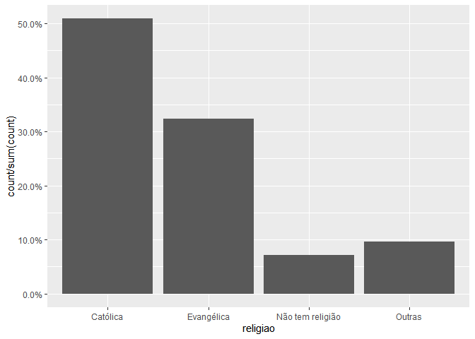
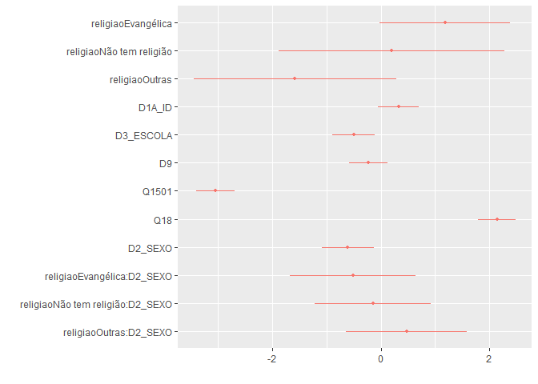
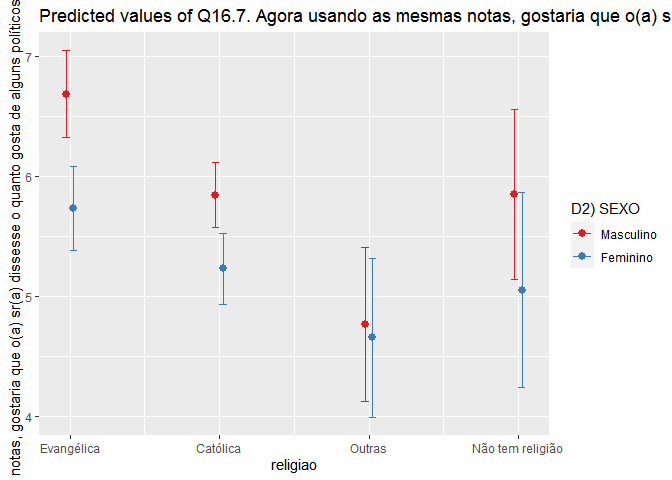

Exercicio 9
================

### Continuaremos com a utilização dos dados do ESEB2018. Carregue o banco da mesma forma que nos exercicios anteriores

``` r
library(tidyverse)
library(haven)
library(scales)


link <- "https://github.com/MartinsRodrigo/Analise-de-dados/blob/master/04622.sav?raw=true"

download.file(link, "04622.sav", mode = "wb")

banco <- read_spss("04622.sav") 

banco <- banco %>%
  mutate(D10 = as_factor(D10)) %>%
  filter(Q1607 < 11, 
         Q18 < 11,
         D9 < 9999998,
         Q1501 < 11)
```

### Crie a mesma variável de religião utilizada no exercício anterior

``` r
Outras <- levels(banco$D10)[-c(3,5,13)]

banco <- banco %>%
  mutate(religiao = case_when(D10 %in% Outras ~ "Outras",
                              D10 == "Católica" ~ "Católica",
                              D10 == "Evangélica" ~ "Evangélica",
                              D10 == "Não tem religião" ~ "Não tem religião"))


ggplot(banco, aes(religiao, ..count../sum(..count..) )) +
  geom_bar() +
  scale_y_continuous(labels = percent)
```

<!-- -->

### Faça uma regressão linear avaliando em que medida as variáveis independentes utilizadas nos exercícios 7 e 8, idade(D1A\_ID), educação (D3\_ESCOLA), renda (D9), nota atribuída ao PT (Q1501), auto-atribuição ideológica (Q18), sexo (D2\_SEXO) e religião (variável criada no passo anterior) explicam a avaliação de Bolsonaro (Q1607), mas com uma interação entre as variáveis religião e sexo. Exiba o resultado da regressão e interprete os valores dos coeficientes \(\beta\)s estimados.

``` r
regressao <- lm(Q1607 ~ religiao + D1A_ID + D3_ESCOLA + D9 + Q1501 + Q18 + D2_SEXO  + religiao * D2_SEXO, banco)

summary(regressao)
```

    ## 
    ## Call:
    ## lm(formula = Q1607 ~ religiao + D1A_ID + D3_ESCOLA + D9 + Q1501 + 
    ##     Q18 + D2_SEXO + religiao * D2_SEXO, data = banco)
    ## 
    ## Residuals:
    ##    Min     1Q Median     3Q    Max 
    ## -8.942 -2.561  0.361  2.303  9.052 
    ## 
    ## Coefficients:
    ##                                    Estimate Std. Error t value Pr(>|t|)    
    ## (Intercept)                       6.114e+00  5.915e-01  10.338   <2e-16 ***
    ## religiaoEvangélica                1.181e+00  6.146e-01   1.921   0.0549 .  
    ## religiaoNão tem religião          1.986e-01  1.059e+00   0.188   0.8512    
    ## religiaoOutras                   -1.583e+00  9.503e-01  -1.666   0.0960 .  
    ## D1A_ID                            1.065e-02  6.255e-03   1.703   0.0888 .  
    ## D3_ESCOLA                        -1.134e-01  4.491e-02  -2.524   0.0117 *  
    ## D9                               -3.632e-05  2.768e-05  -1.312   0.1897    
    ## Q1501                            -3.956e-01  2.370e-02 -16.696   <2e-16 ***
    ## Q18                               3.150e-01  2.607e-02  12.083   <2e-16 ***
    ## D2_SEXO                          -6.115e-01  2.438e-01  -2.508   0.0122 *  
    ## religiaoEvangélica:D2_SEXO       -3.412e-01  3.895e-01  -0.876   0.3812    
    ## religiaoNão tem religião:D2_SEXO -1.889e-01  6.979e-01  -0.271   0.7867    
    ## religiaoOutras:D2_SEXO            5.041e-01  6.067e-01   0.831   0.4062    
    ## ---
    ## Signif. codes:  0 '***' 0.001 '**' 0.01 '*' 0.05 '.' 0.1 ' ' 1
    ## 
    ## Residual standard error: 3.297 on 1449 degrees of freedom
    ## Multiple R-squared:  0.3028, Adjusted R-squared:  0.297 
    ## F-statistic: 52.44 on 12 and 1449 DF,  p-value: < 2.2e-16

Vemos que o R² e o R² ajustado são relativamente razoáveis. Os p-valores
das interações não deram significância estátistica, ficaram bem altos. O
Beta do D2\_SEXO deu negativo, sugerindo que a categoria de referencia é o
sexo masculino. Assim, sendo os homens a categoria de referência, as mulheres
avaliam Bolsonaro, em média, -6.115 a menos do que os homens católicos.
Quando religião for igual a 0 (católica), o D2\_SEXO corresponderá a -6.115 
(feminino e católica) para a avaliação ao governo bolsonaro. Assim, o 0 seria o católico para religiao e
masculino para o D2\_SEXO.  Quando o sexo for igual a 1 (no caso, masculino) a religião terá coeficientes
positivos, com excessão de Outras (sem ser a interação entre as religiões e o sexo). 
Também percebemos que haverá diferença significante comparando o homens católicos com homens evangélicos. 
O coeficiente omitido é o de homens católicos. Assim, podemos interpretar os outros coeficientes da seguinte forma:
para o coeficiente da religião evangélica, seria que há uma pequena significância estátistica comparando com 
os homens de reliigão católica.

### Interprete a significancia estatística dos coeficientes estimados

``` r
library(dotwhisker)

dwplot(regressao)
```

<!-- -->

Vários dos intervalos de confiança se sobrepõem. Vários deles também
detém o 0 em seu intervalo, como: 1) a relação entre a variáveis não
ter religião e o sexo; 2) outras e o sexo; 3) ser evangélico e o sexo;
4) D9; 5) D1A\_ID; 6) não ter religião e 7) outras. Alguns intervalos de
confiança são menores do que outros, como D9, D3\_ESCOLA, D1A\_ID,
sugerindo ter maior confiança no intervalo desses paramêtros
populacionais.

### Faça um gráfico que mostre a interação entre as duas variáveis. Interprete o resultado apresentado

``` r
install.packages("sjPlot", repos = "http://cran.us.r-project.org")
```

    ## package 'sjPlot' successfully unpacked and MD5 sums checked
    ## 
    ## The downloaded binary packages are in
    ##  C:\Users\Pedro Buril\AppData\Local\Temp\RtmpyWlXxM\downloaded_packages

``` r
library(sjPlot)


plot_model(regressao, type = "pred",
           term = c("religiao", "D2_SEXO"),
           ci.lvl = 0.9)
```

<!-- --> Pelo
gráfico, podemos perceber que o sexo só faz diferença na religião
católica e na evangélica, porque são os únicos em que os intervalos de
confiança não se sobrepõem. O tamanho do intervalo de confiança das
Outras e de Não tem religião sugere que o tamanho do intervalo desse
paramêtro para essa população é maior. A amplitude da variação pode ser
maior nesses casos. Entretanto, temos que perceber que essa
representação são de interações que não deram estatisticamente
significante. Por fim, quando comparamos os homens sem religião 
com os homens de outras categorias, percebemos que os intervalos 
de confiança se sobrepõem. Para o sexo feminino, talvez só haja significância
estátistica entre o Outras e as mulheres evangélicas, já que o intervalo 
de confiança não se sobrepõem. Resumidamente, não há tanta significância 
estátistica entre as categorias, seja entre os homens ou entre as mulheres.
